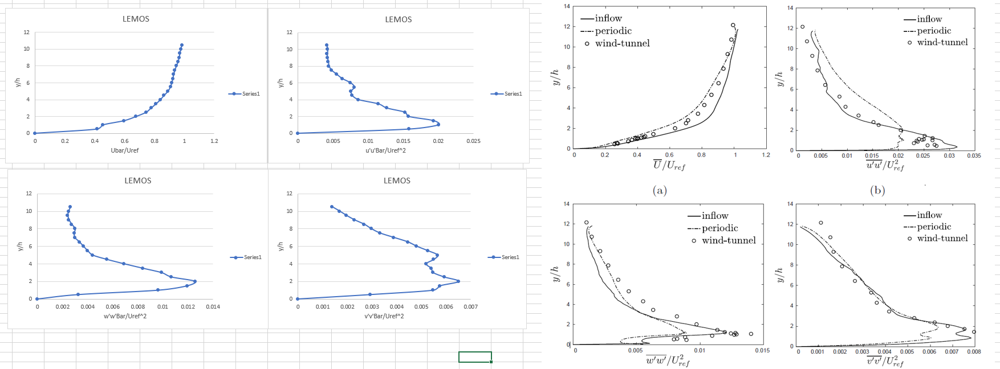

Guitar, Piano, Engineering, CFD. These are the things I have poured blood sweat and tears over.
One of the last bits of work I did before starting my new adventure was validating a OpenFOAM Large Eddy Simulation inflow generator.
This was in the hope that it can be used for future wind assessments. 
I haven't returned to it, I don't plan to, but it is on [github](https://github.com/kiyoMatsui/Inflow-generator-from-ETH-OFTools).

Don't you think my graphs(on the left) match the data quite well?

