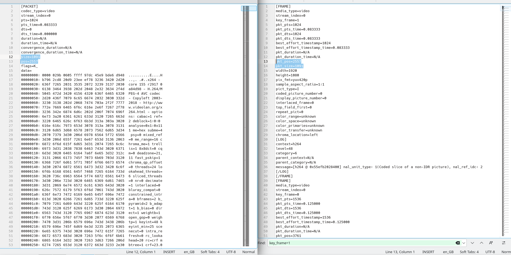
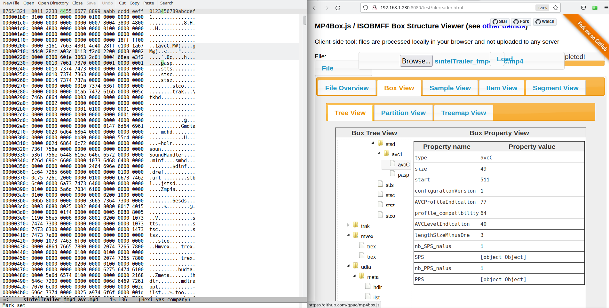
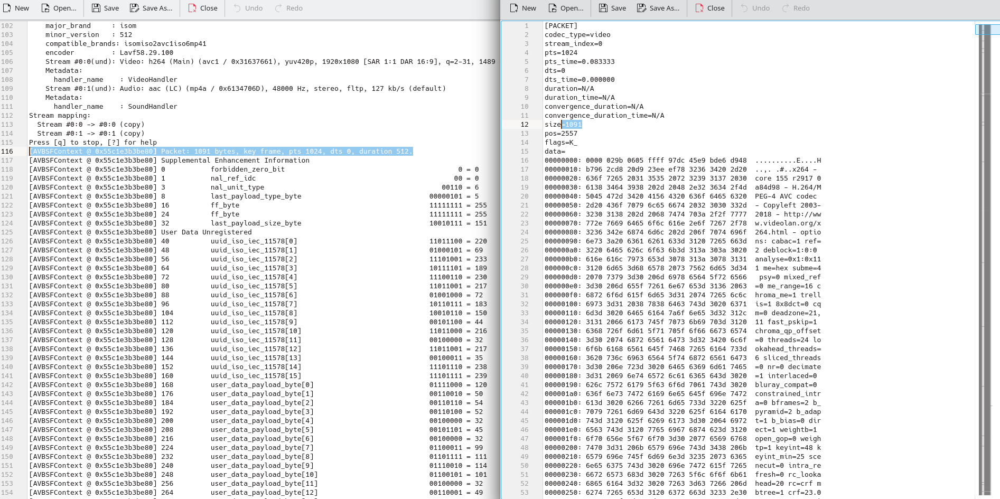
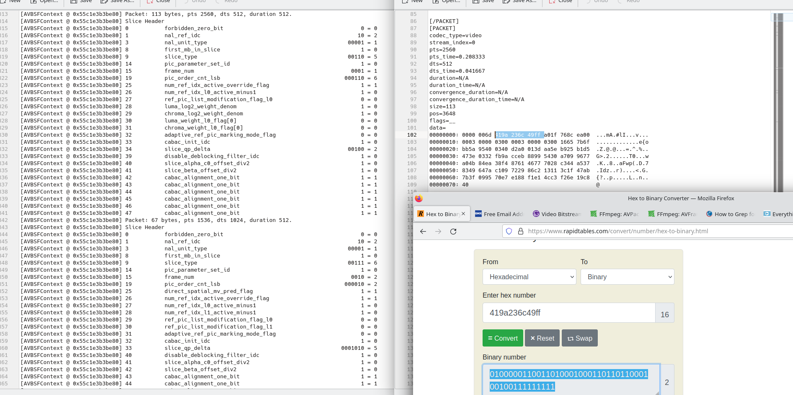

In Part02 we managed to look at, and break apart the video bitstream into ffmpeg [Packets](https://ffmpeg.org/doxygen/4.0/structAVPacket.html).

The next step is to look into each Packet. ffprobe allows us to view each [Frame](https://ffmpeg.org/doxygen/4.0/structAVFrame.html) inside each packet with the following command.

```
ffprobe -read_intervals %+4 -show_frames -show_log 56 -select_streams v ./sintelTrailer_fmp4_avc.mp4 > showFramesTrace56.txt
```

In the above I made sure we only look at the first 4 seconds and output at log level "trace" (code 56).

```
[FRAME]
media_type=video
stream_index=0
key_frame=1
pkt_pts=1024
pkt_pts_time=0.083333
pkt_dts=1024
pkt_dts_time=0.083333
best_effort_timestamp=1024
best_effort_timestamp_time=0.083333
pkt_duration=N/A
pkt_duration_time=N/A
pkt_pos=2557
pkt_size=1091
width=1920
height=1080
pix_fmt=yuv420p
sample_aspect_ratio=1:1
pict_type=I
coded_picture_number=0
display_picture_number=0
interlaced_frame=0
top_field_first=0
repeat_pict=0
color_range=unknown
color_space=unknown
color_primaries=unknown
color_transfer=unknown
chroma_location=left
[LOG]
context=h264
level=48
category=6
parent_context=N/A
parent_category=N/A
message=[h264 @ 0x55efb2028400] nal_unit_type: 1(Coded slice of a non-IDR picture), nal_ref_idc: 2
[/LOG]
[/FRAME]
[FRAME]
media_type=video
stream_index=0
key_frame=0
pkt_pts=1536
pkt_pts_time=0.125000
pkt_dts=1536
pkt_dts_time=0.125000
best_effort_timestamp=1536
best_effort_timestamp_time=0.125000
pkt_duration=N/A
pkt_duration_time=N/A
pkt_pos=3761
pkt_size=67
width=1920
height=1080
pix_fmt=yuv420p
sample_aspect_ratio=1:1
pict_type=B
coded_picture_number=2
display_picture_number=0
interlaced_frame=0
top_field_first=0
repeat_pict=0
color_range=unknown
color_space=unknown
color_primaries=unknown
color_transfer=unknown
chroma_location=left
[LOG]
context=h264
level=48
category=6
parent_context=N/A
parent_category=N/A
message=[h264 @ 0x55efb2028400] nal_unit_type: 1(Coded slice of a non-IDR picture), nal_ref_idc: 0
[/LOG]
[/FRAME]
[FRAME]
media_type=video
stream_index=0
key_frame=0
pkt_pts=2048
pkt_pts_time=0.166667
pkt_dts=2048
pkt_dts_time=0.166667
best_effort_timestamp=2048
best_effort_timestamp_time=0.166667
pkt_duration=N/A
pkt_duration_time=N/A
pkt_pos=3828
pkt_size=66
width=1920
height=1080
pix_fmt=yuv420p
sample_aspect_ratio=1:1
pict_type=B
coded_picture_number=3
display_picture_number=0
interlaced_frame=0
top_field_first=0
repeat_pict=0
color_range=unknown
color_space=unknown
color_primaries=unknown
color_transfer=unknown
chroma_location=left
[LOG]
context=h264
level=48
category=6
parent_context=N/A
parent_category=N/A
message=[h264 @ 0x55efb2028400] nal_unit_type: 1(Coded slice of a non-IDR picture), nal_ref_idc: 2
[/LOG]
[/FRAME]
[FRAME]
media_type=video
stream_index=0
key_frame=0
pkt_pts=2560
pkt_pts_time=0.208333
pkt_dts=2560
pkt_dts_time=0.208333
best_effort_timestamp=2560
best_effort_timestamp_time=0.208333
pkt_duration=N/A
pkt_duration_time=N/A
pkt_pos=3648
pkt_size=113
width=1920
height=1080
pix_fmt=yuv420p
sample_aspect_ratio=1:1
pict_type=P
coded_picture_number=1
display_picture_number=0
interlaced_frame=0
top_field_first=0
repeat_pict=0
color_range=unknown
color_space=unknown
color_primaries=unknown
color_transfer=unknown
chroma_location=left
[LOG]
context=h264
level=48
category=6
parent_context=N/A
parent_category=N/A
message=[h264 @ 0x55efb2028400] nal_unit_type: 1(Coded slice of a non-IDR picture), nal_ref_idc: 2
[/LOG]
[/FRAME]
[FRAME]
media_type=video
stream_index=0
key_frame=0
pkt_pts=3072
pkt_pts_time=0.250000
pkt_dts=3072
pkt_dts_time=0.250000
best_effort_timestamp=3072
best_effort_timestamp_time=0.250000
pkt_duration=N/A
pkt_duration_time=N/A
pkt_pos=3965
pkt_size=68
width=1920
height=1080
pix_fmt=yuv420p
sample_aspect_ratio=1:1
pict_type=B
coded_picture_number=5
display_picture_number=0
interlaced_frame=0
top_field_first=0
repeat_pict=0
color_range=unknown
color_space=unknown
color_primaries=unknown
color_transfer=unknown
chroma_location=left
[LOG]
context=h264
level=48
category=6
parent_context=N/A
parent_category=N/A
message=[h264 @ 0x55efb2028400] nal_unit_type: 1(Coded slice of a non-IDR picture), nal_ref_idc: 0
[/LOG]
[/FRAME]
[FRAME]
media_type=video
```

A lot of the frame information printed is self explanatory, and I won't get into it too much here, what we will find is the lines prefixed with `pkt_*` will tell us which packet each frame came from.
In the above output we see that each `pkt_pos` is associated with a `pos` from the `-show_packets` output in the previous section (click to enlarge).



The frames are not in the same order but you will find each `pkt_pos` and `pkt_size` match the first few packet's `pos` and `size`.
The ordering seems to be due to the `coded_picture_number`, which can be seen with a handy grep on the output file.

```
kiyo@kiyo-prox14amd:~/bistreamTesting$ grep 'coded_picture_number\|key_frame\|pict_type\|FRAME' showFramesTrace56.txt
[FRAME]
key_frame=1
pict_type=I
coded_picture_number=0
[/FRAME]
[FRAME]
key_frame=0
pict_type=B
coded_picture_number=2
[/FRAME]
[FRAME]
key_frame=0
pict_type=B
coded_picture_number=3
[/FRAME]
[FRAME]
key_frame=0
pict_type=P
coded_picture_number=1
[/FRAME]
[FRAME]
key_frame=0
pict_type=B
coded_picture_number=5
[/FRAME]
[FRAME]
key_frame=0
pict_type=B
coded_picture_number=6
[/FRAME]
[FRAME]
key_frame=0
pict_type=P
coded_picture_number=4
[/FRAME]
[FRAME]
key_frame=0
pict_type=B
coded_picture_number=8
[/FRAME]
[FRAME]
key_frame=0
pict_type=B
coded_picture_number=9
[/FRAME]
[FRAME]
key_frame=0
pict_type=P
coded_picture_number=7
[/FRAME]
[FRAME]
key_frame=0
pict_type=B
coded_picture_number=11
[/FRAME]
[FRAME]
key_frame=0
pict_type=B
coded_picture_number=12
[/FRAME]
[FRAME]
key_frame=0
pict_type=P
coded_picture_number=10
[/FRAME]
[FRAME]
key_frame=0
pict_type=B
coded_picture_number=14
[/FRAME]
[FRAME]
key_frame=0
pict_type=B
coded_picture_number=15
[/FRAME]
[FRAME]
key_frame=0
pict_type=P
coded_picture_number=13
[/FRAME]
[FRAME]
key_frame=0
pict_type=B
coded_picture_number=17
[/FRAME]
[FRAME]
key_frame=0
pict_type=B
coded_picture_number=18
[/FRAME]
[FRAME]
key_frame=0
pict_type=P
coded_picture_number=16
[/FRAME]
[FRAME]
key_frame=0
pict_type=B
coded_picture_number=20
[/FRAME]
[FRAME]
key_frame=0
pict_type=B
coded_picture_number=21
[/FRAME]
[FRAME]
key_frame=0
pict_type=P
coded_picture_number=19
[/FRAME]
[FRAME]
key_frame=0
pict_type=B
coded_picture_number=23
[/FRAME]
[FRAME]
key_frame=0
pict_type=P
coded_picture_number=22
[/FRAME]
[FRAME]
key_frame=0
pict_type=B
coded_picture_number=25
[/FRAME]
[FRAME]
key_frame=0
pict_type=B
coded_picture_number=26
[/FRAME]
[FRAME]
key_frame=0
pict_type=P
coded_picture_number=24
[/FRAME]
[FRAME]
key_frame=0
pict_type=B
coded_picture_number=28
[/FRAME]
[FRAME]
key_frame=0
pict_type=B
coded_picture_number=29
[/FRAME]
[FRAME]
key_frame=0
pict_type=P
coded_picture_number=27
[/FRAME]
[FRAME]
key_frame=0
pict_type=B
coded_picture_number=31
[/FRAME]
[FRAME]
key_frame=0
pict_type=B
coded_picture_number=32
[/FRAME]
[FRAME]
key_frame=0
pict_type=P
coded_picture_number=30
[/FRAME]
[FRAME]
key_frame=0
pict_type=B
coded_picture_number=34
[/FRAME]
[FRAME]
key_frame=0
pict_type=B
coded_picture_number=35
[/FRAME]
[FRAME]
key_frame=0
pict_type=P
coded_picture_number=33
[/FRAME]
[FRAME]
key_frame=0
pict_type=B
coded_picture_number=37
[/FRAME]
[FRAME]
key_frame=0
pict_type=B
coded_picture_number=38
[/FRAME]
[FRAME]
key_frame=0
pict_type=P
coded_picture_number=36
[/FRAME]
[FRAME]
key_frame=0
pict_type=B
coded_picture_number=40
[/FRAME]
[FRAME]
key_frame=0
pict_type=B
coded_picture_number=41
[/FRAME]
[FRAME]
key_frame=0
pict_type=P
coded_picture_number=39
[/FRAME]
[FRAME]
key_frame=0
pict_type=B
coded_picture_number=43
[/FRAME]
[FRAME]
key_frame=0
pict_type=B
coded_picture_number=44
[/FRAME]
[FRAME]
key_frame=0
pict_type=P
coded_picture_number=42
[/FRAME]
[FRAME]
key_frame=0
pict_type=B
coded_picture_number=46
[/FRAME]
[FRAME]
key_frame=0
pict_type=B
coded_picture_number=47
[/FRAME]
[FRAME]
key_frame=0
pict_type=P
coded_picture_number=45
[/FRAME]
[FRAME]
key_frame=1
pict_type=I
coded_picture_number=48
[/FRAME]
[FRAME]
key_frame=0
pict_type=B
coded_picture_number=50
[/FRAME]
[FRAME]
key_frame=0
pict_type=B
coded_picture_number=51
[/FRAME]
[FRAME]
key_frame=0
pict_type=P
coded_picture_number=49
[/FRAME]
[FRAME]
key_frame=0
pict_type=B
coded_picture_number=53
[/FRAME]
[FRAME]
key_frame=0
pict_type=B
coded_picture_number=54
[/FRAME]
[FRAME]
key_frame=0
pict_type=P
coded_picture_number=52
[/FRAME]
[FRAME]
key_frame=0
pict_type=B
coded_picture_number=56
[/FRAME]
[FRAME]
key_frame=0
pict_type=B
coded_picture_number=57
[/FRAME]
[FRAME]
key_frame=0
pict_type=P
coded_picture_number=55
[/FRAME]
[FRAME]
key_frame=0
pict_type=B
coded_picture_number=59
[/FRAME]
[FRAME]
key_frame=0
pict_type=B
coded_picture_number=60
[/FRAME]
[FRAME]
key_frame=0
pict_type=P
coded_picture_number=58
[/FRAME]
[FRAME]
key_frame=0
pict_type=B
coded_picture_number=62
[/FRAME]
[FRAME]
key_frame=0
pict_type=B
coded_picture_number=63
[/FRAME]
[FRAME]
key_frame=0
pict_type=P
coded_picture_number=61
[/FRAME]
[FRAME]
key_frame=0
pict_type=B
coded_picture_number=65
[/FRAME]
[FRAME]
key_frame=0
pict_type=B
coded_picture_number=66
[/FRAME]
[FRAME]
key_frame=0
pict_type=P
coded_picture_number=64
[/FRAME]
[FRAME]
key_frame=0
pict_type=B
coded_picture_number=68
[/FRAME]
[FRAME]
key_frame=0
pict_type=B
coded_picture_number=69
[/FRAME]
[FRAME]
key_frame=0
pict_type=P
coded_picture_number=67
[/FRAME]
[FRAME]
key_frame=0
pict_type=B
coded_picture_number=71
[/FRAME]
[FRAME]
key_frame=0
pict_type=B
coded_picture_number=72
[/FRAME]
[FRAME]
key_frame=0
pict_type=P
coded_picture_number=70
[/FRAME]
[FRAME]
key_frame=0
pict_type=B
coded_picture_number=74
[/FRAME]
[FRAME]
key_frame=0
pict_type=B
coded_picture_number=75
[/FRAME]
[FRAME]
key_frame=0
pict_type=P
coded_picture_number=73
[/FRAME]
[FRAME]
key_frame=0
pict_type=B
coded_picture_number=77
[/FRAME]
[FRAME]
key_frame=0
pict_type=B
coded_picture_number=78
[/FRAME]
[FRAME]
key_frame=0
pict_type=P
coded_picture_number=76
[/FRAME]
[FRAME]
key_frame=0
pict_type=B
coded_picture_number=80
[/FRAME]
[FRAME]
key_frame=0
pict_type=B
coded_picture_number=81
[/FRAME]
[FRAME]
key_frame=0
pict_type=P
coded_picture_number=79
[/FRAME]
[FRAME]
key_frame=0
pict_type=B
coded_picture_number=83
[/FRAME]
[FRAME]
key_frame=0
pict_type=B
coded_picture_number=84
[/FRAME]
[FRAME]
key_frame=0
pict_type=P
coded_picture_number=82
[/FRAME]
[FRAME]
key_frame=0
pict_type=B
coded_picture_number=86
[/FRAME]
[FRAME]
key_frame=0
pict_type=B
coded_picture_number=87
[/FRAME]
[FRAME]
key_frame=0
pict_type=P
coded_picture_number=85
[/FRAME]
[FRAME]
key_frame=0
pict_type=B
coded_picture_number=89
[/FRAME]
[FRAME]
key_frame=0
pict_type=B
coded_picture_number=90
[/FRAME]
[FRAME]
key_frame=0
pict_type=P
coded_picture_number=88
[/FRAME]
[FRAME]
key_frame=0
pict_type=B
coded_picture_number=92
[/FRAME]
[FRAME]
key_frame=0
pict_type=B
coded_picture_number=93
[/FRAME]
[FRAME]
key_frame=0
pict_type=P
coded_picture_number=91
[/FRAME]
[FRAME]
key_frame=0
pict_type=B
coded_picture_number=95
[/FRAME]
[FRAME]
key_frame=0
pict_type=P
coded_picture_number=94
[/FRAME]
```

We can go a step further. ffmpeg allows us to `"trace_headers"` which will print some of the nal unit data to output.
Again we are going to only output 4 seconds of the file.

```
ffmpeg -ss 0 -i sintelTrailer_fmp4_avc.mp4 -c copy -bsf:v trace_headers -t 4 -f null - 2> trace_headers4sec.txt
```

A few hundred lines of the output of this has been printed below. It is quite verbose but worth investigating.

```
ffmpeg version 4.2.7-0ubuntu0.1 Copyright (c) 2000-2022 the FFmpeg developers
  built with gcc 9 (Ubuntu 9.4.0-1ubuntu1~20.04.1)
  configuration: --prefix=/usr --extra-version=0ubuntu0.1 --toolchain=hardened --libdir=/usr/lib/x86_64-linux-gnu --incdir=/usr/include/x86_64-linux-gnu --arch=amd64 --enable-gpl --disable-stripping --enable-avresample --disable-filter=resample --enable-avisynth --enable-gnutls --enable-ladspa --enable-libaom --enable-libass --enable-libbluray --enable-libbs2b --enable-libcaca --enable-libcdio --enable-libcodec2 --enable-libflite --enable-libfontconfig --enable-libfreetype --enable-libfribidi --enable-libgme --enable-libgsm --enable-libjack --enable-libmp3lame --enable-libmysofa --enable-libopenjpeg --enable-libopenmpt --enable-libopus --enable-libpulse --enable-librsvg --enable-librubberband --enable-libshine --enable-libsnappy --enable-libsoxr --enable-libspeex --enable-libssh --enable-libtheora --enable-libtwolame --enable-libvidstab --enable-libvorbis --enable-libvpx --enable-libwavpack --enable-libwebp --enable-libx265 --enable-libxml2 --enable-libxvid --enable-libzmq --enable-libzvbi --enable-lv2 --enable-omx --enable-openal --enable-opencl --enable-opengl --enable-sdl2 --enable-libdc1394 --enable-libdrm --enable-libiec61883 --enable-nvenc --enable-chromaprint --enable-frei0r --enable-libx264 --enable-shared
  libavutil      56. 31.100 / 56. 31.100
  libavcodec     58. 54.100 / 58. 54.100
  libavformat    58. 29.100 / 58. 29.100
  libavdevice    58.  8.100 / 58.  8.100
  libavfilter     7. 57.100 /  7. 57.100
  libavresample   4.  0.  0 /  4.  0.  0
  libswscale      5.  5.100 /  5.  5.100
  libswresample   3.  5.100 /  3.  5.100
  libpostproc    55.  5.100 / 55.  5.100
Input #0, mov,mp4,m4a,3gp,3g2,mj2, from 'sintelTrailer_fmp4_avc.mp4':
  Metadata:
    major_brand     : isom
    minor_version   : 512
    compatible_brands: isomiso2avc1iso6mp41
    encoder         : Lavf58.29.100
  Duration: 00:00:52.29, start: 0.000000, bitrate: 1618 kb/s
    Stream #0:0(und): Video: h264 (Main) (avc1 / 0x31637661), yuv420p, 1920x1080 [SAR 1:1 DAR 16:9], 1489 kb/s, 24 fps, 24 tbr, 12288 tbn, 48 tbc (default)
    Metadata:
      handler_name    : VideoHandler
    Stream #0:1(und): Audio: aac (LC) (mp4a / 0x6134706D), 48000 Hz, stereo, fltp, 127 kb/s (default)
    Metadata:
      handler_name    : SoundHandler
[AVBSFContext @ 0x55c1e3b3be80] Extradata
[AVBSFContext @ 0x55c1e3b3be80] Sequence Parameter Set
[AVBSFContext @ 0x55c1e3b3be80] 0           forbidden_zero_bit                                          0 = 0
[AVBSFContext @ 0x55c1e3b3be80] 1           nal_ref_idc                                                11 = 3
[AVBSFContext @ 0x55c1e3b3be80] 3           nal_unit_type                                           00111 = 7
[AVBSFContext @ 0x55c1e3b3be80] 8           profile_idc                                          01001101 = 77
[AVBSFContext @ 0x55c1e3b3be80] 16          constraint_set0_flag                                        0 = 0
[AVBSFContext @ 0x55c1e3b3be80] 17          constraint_set1_flag                                        1 = 1
[AVBSFContext @ 0x55c1e3b3be80] 18          constraint_set2_flag                                        0 = 0
[AVBSFContext @ 0x55c1e3b3be80] 19          constraint_set3_flag                                        0 = 0
[AVBSFContext @ 0x55c1e3b3be80] 20          constraint_set4_flag                                        0 = 0
[AVBSFContext @ 0x55c1e3b3be80] 21          constraint_set5_flag                                        0 = 0
[AVBSFContext @ 0x55c1e3b3be80] 22          reserved_zero_2bits                                        00 = 0
[AVBSFContext @ 0x55c1e3b3be80] 24          level_idc                                            00101000 = 40
[AVBSFContext @ 0x55c1e3b3be80] 32          seq_parameter_set_id                                        1 = 0
[AVBSFContext @ 0x55c1e3b3be80] 33          log2_max_frame_num_minus4                                   1 = 0
[AVBSFContext @ 0x55c1e3b3be80] 34          pic_order_cnt_type                                          1 = 0
[AVBSFContext @ 0x55c1e3b3be80] 35          log2_max_pic_order_cnt_lsb_minus4                         011 = 2
[AVBSFContext @ 0x55c1e3b3be80] 38          max_num_ref_frames                                      00101 = 4
[AVBSFContext @ 0x55c1e3b3be80] 43          gaps_in_frame_num_allowed_flag                              0 = 0
[AVBSFContext @ 0x55c1e3b3be80] 44          pic_width_in_mbs_minus1                         0000001111000 = 119
[AVBSFContext @ 0x55c1e3b3be80] 57          pic_height_in_map_units_minus1                  0000001000100 = 67
[AVBSFContext @ 0x55c1e3b3be80] 70          frame_mbs_only_flag                                         1 = 1
[AVBSFContext @ 0x55c1e3b3be80] 71          direct_8x8_inference_flag                                   1 = 1
[AVBSFContext @ 0x55c1e3b3be80] 72          frame_cropping_flag                                         1 = 1
[AVBSFContext @ 0x55c1e3b3be80] 73          frame_crop_left_offset                                      1 = 0
[AVBSFContext @ 0x55c1e3b3be80] 74          frame_crop_right_offset                                     1 = 0
[AVBSFContext @ 0x55c1e3b3be80] 75          frame_crop_top_offset                                       1 = 0
[AVBSFContext @ 0x55c1e3b3be80] 76          frame_crop_bottom_offset                                00101 = 4
[AVBSFContext @ 0x55c1e3b3be80] 81          vui_parameters_present_flag                                 1 = 1
[AVBSFContext @ 0x55c1e3b3be80] 82          aspect_ratio_info_present_flag                              1 = 1
[AVBSFContext @ 0x55c1e3b3be80] 83          aspect_ratio_idc                                     00000001 = 1
[AVBSFContext @ 0x55c1e3b3be80] 91          overscan_info_present_flag                                  0 = 0
[AVBSFContext @ 0x55c1e3b3be80] 92          video_signal_type_present_flag                              0 = 0
[AVBSFContext @ 0x55c1e3b3be80] 93          chroma_loc_info_present_flag                                0 = 0
[AVBSFContext @ 0x55c1e3b3be80] 94          timing_info_present_flag                                    1 = 1
[AVBSFContext @ 0x55c1e3b3be80] 95          num_units_in_tick            00000000000000000000000000000001 = 1
[AVBSFContext @ 0x55c1e3b3be80] 127         time_scale                   00000000000000000000000000110000 = 48
[AVBSFContext @ 0x55c1e3b3be80] 159         fixed_frame_rate_flag                                       0 = 0
[AVBSFContext @ 0x55c1e3b3be80] 160         nal_hrd_parameters_present_flag                             0 = 0
[AVBSFContext @ 0x55c1e3b3be80] 161         vcl_hrd_parameters_present_flag                             0 = 0
[AVBSFContext @ 0x55c1e3b3be80] 162         pic_struct_present_flag                                     0 = 0
[AVBSFContext @ 0x55c1e3b3be80] 163         bitstream_restriction_flag                                  1 = 1
[AVBSFContext @ 0x55c1e3b3be80] 164         motion_vectors_over_pic_boundaries_flag                     1 = 1
[AVBSFContext @ 0x55c1e3b3be80] 165         max_bytes_per_pic_denom                                     1 = 0
[AVBSFContext @ 0x55c1e3b3be80] 166         max_bits_per_mb_denom                                       1 = 0
[AVBSFContext @ 0x55c1e3b3be80] 167         log2_max_mv_length_horizontal                         0001100 = 11
[AVBSFContext @ 0x55c1e3b3be80] 174         log2_max_mv_length_vertical                           0001100 = 11
[AVBSFContext @ 0x55c1e3b3be80] 181         max_num_reorder_frames                                    011 = 2
[AVBSFContext @ 0x55c1e3b3be80] 184         max_dec_frame_buffering                                 00101 = 4
[AVBSFContext @ 0x55c1e3b3be80] 189         rbsp_stop_one_bit                                           1 = 1
[AVBSFContext @ 0x55c1e3b3be80] 190         rbsp_alignment_zero_bit                                     0 = 0
[AVBSFContext @ 0x55c1e3b3be80] 191         rbsp_alignment_zero_bit                                     0 = 0
[AVBSFContext @ 0x55c1e3b3be80] Picture Parameter Set
[AVBSFContext @ 0x55c1e3b3be80] 0           forbidden_zero_bit                                          0 = 0
[AVBSFContext @ 0x55c1e3b3be80] 1           nal_ref_idc                                                11 = 3
[AVBSFContext @ 0x55c1e3b3be80] 3           nal_unit_type                                           01000 = 8
[AVBSFContext @ 0x55c1e3b3be80] 8           pic_parameter_set_id                                        1 = 0
[AVBSFContext @ 0x55c1e3b3be80] 9           seq_parameter_set_id                                        1 = 0
[AVBSFContext @ 0x55c1e3b3be80] 10          entropy_coding_mode_flag                                    1 = 1
[AVBSFContext @ 0x55c1e3b3be80] 11          bottom_field_pic_order_in_frame_present_flag                0 = 0
[AVBSFContext @ 0x55c1e3b3be80] 12          num_slice_groups_minus1                                     1 = 0
[AVBSFContext @ 0x55c1e3b3be80] 13          num_ref_idx_l0_default_active_minus1                      010 = 1
[AVBSFContext @ 0x55c1e3b3be80] 16          num_ref_idx_l1_default_active_minus1                        1 = 0
[AVBSFContext @ 0x55c1e3b3be80] 17          weighted_pred_flag                                          1 = 1
[AVBSFContext @ 0x55c1e3b3be80] 18          weighted_bipred_idc                                        10 = 2
[AVBSFContext @ 0x55c1e3b3be80] 20          pic_init_qp_minus26                                     00111 = -3
[AVBSFContext @ 0x55c1e3b3be80] 25          pic_init_qs_minus26                                         1 = 0
[AVBSFContext @ 0x55c1e3b3be80] 26          chroma_qp_index_offset                                      1 = 0
[AVBSFContext @ 0x55c1e3b3be80] 27          deblocking_filter_control_present_flag                      1 = 1
[AVBSFContext @ 0x55c1e3b3be80] 28          constrained_intra_pred_flag                                 0 = 0
[AVBSFContext @ 0x55c1e3b3be80] 29          redundant_pic_cnt_present_flag                              0 = 0
[AVBSFContext @ 0x55c1e3b3be80] 30          rbsp_stop_one_bit                                           1 = 1
[AVBSFContext @ 0x55c1e3b3be80] 31          rbsp_alignment_zero_bit                                     0 = 0
Output #0, null, to 'pipe:':
  Metadata:
    major_brand     : isom
    minor_version   : 512
    compatible_brands: isomiso2avc1iso6mp41
    encoder         : Lavf58.29.100
    Stream #0:0(und): Video: h264 (Main) (avc1 / 0x31637661), yuv420p, 1920x1080 [SAR 1:1 DAR 16:9], q=2-31, 1489 kb/s, 24 fps, 24 tbr, 12288 tbn, 12288 tbc (default)
    Metadata:
      handler_name    : VideoHandler
    Stream #0:1(und): Audio: aac (LC) (mp4a / 0x6134706D), 48000 Hz, stereo, fltp, 127 kb/s (default)
    Metadata:
      handler_name    : SoundHandler
Stream mapping:
  Stream #0:0 -> #0:0 (copy)
  Stream #0:1 -> #0:1 (copy)
Press [q] to stop, [?] for help
[AVBSFContext @ 0x55c1e3b3be80] Packet: 1091 bytes, key frame, pts 1024, dts 0, duration 512.
[AVBSFContext @ 0x55c1e3b3be80] Supplemental Enhancement Information
[AVBSFContext @ 0x55c1e3b3be80] 0           forbidden_zero_bit                                          0 = 0
[AVBSFContext @ 0x55c1e3b3be80] 1           nal_ref_idc                                                00 = 0
[AVBSFContext @ 0x55c1e3b3be80] 3           nal_unit_type                                           00110 = 6
[AVBSFContext @ 0x55c1e3b3be80] 8           last_payload_type_byte                               00000101 = 5
[AVBSFContext @ 0x55c1e3b3be80] 16          ff_byte                                              11111111 = 255
[AVBSFContext @ 0x55c1e3b3be80] 24          ff_byte                                              11111111 = 255
[AVBSFContext @ 0x55c1e3b3be80] 32          last_payload_size_byte                               10010111 = 151
[AVBSFContext @ 0x55c1e3b3be80] User Data Unregistered
[AVBSFContext @ 0x55c1e3b3be80] 40          uuid_iso_iec_11578[0]                                11011100 = 220
[AVBSFContext @ 0x55c1e3b3be80] 48          uuid_iso_iec_11578[1]                                01000101 = 69
[AVBSFContext @ 0x55c1e3b3be80] 56          uuid_iso_iec_11578[2]                                11101001 = 233
[AVBSFContext @ 0x55c1e3b3be80] 64          uuid_iso_iec_11578[3]                                10111101 = 189
[AVBSFContext @ 0x55c1e3b3be80] 72          uuid_iso_iec_11578[4]                                11100110 = 230
[AVBSFContext @ 0x55c1e3b3be80] 80          uuid_iso_iec_11578[5]                                11011001 = 217
[AVBSFContext @ 0x55c1e3b3be80] 88          uuid_iso_iec_11578[6]                                01001000 = 72
[AVBSFContext @ 0x55c1e3b3be80] 96          uuid_iso_iec_11578[7]                                10110111 = 183
[AVBSFContext @ 0x55c1e3b3be80] 104         uuid_iso_iec_11578[8]                                10010110 = 150
[AVBSFContext @ 0x55c1e3b3be80] 112         uuid_iso_iec_11578[9]                                00101100 = 44
[AVBSFContext @ 0x55c1e3b3be80] 120         uuid_iso_iec_11578[10]                               11011000 = 216
[AVBSFContext @ 0x55c1e3b3be80] 128         uuid_iso_iec_11578[11]                               00100000 = 32
[AVBSFContext @ 0x55c1e3b3be80] 136         uuid_iso_iec_11578[12]                               11011001 = 217
[AVBSFContext @ 0x55c1e3b3be80] 144         uuid_iso_iec_11578[13]                               00100011 = 35
[AVBSFContext @ 0x55c1e3b3be80] 152         uuid_iso_iec_11578[14]                               11101110 = 238
[AVBSFContext @ 0x55c1e3b3be80] 160         uuid_iso_iec_11578[15]                               11101111 = 239
[AVBSFContext @ 0x55c1e3b3be80] 168         user_data_payload_byte[0]                            01111000 = 120
[AVBSFContext @ 0x55c1e3b3be80] 176         user_data_payload_byte[1]                            00110010 = 50
[AVBSFContext @ 0x55c1e3b3be80] 184         user_data_payload_byte[2]                            00110110 = 54
[AVBSFContext @ 0x55c1e3b3be80] 192         user_data_payload_byte[3]                            00110100 = 52
[AVBSFContext @ 0x55c1e3b3be80] 200         user_data_payload_byte[4]                            00100000 = 32
[AVBSFContext @ 0x55c1e3b3be80] 208         user_data_payload_byte[5]                            00101101 = 45
[AVBSFContext @ 0x55c1e3b3be80] 216         user_data_payload_byte[6]                            00100000 = 32
[AVBSFContext @ 0x55c1e3b3be80] 224         user_data_payload_byte[7]                            01100011 = 99
[AVBSFContext @ 0x55c1e3b3be80] 232         user_data_payload_byte[8]                            01101111 = 111
[AVBSFContext @ 0x55c1e3b3be80] 240         user_data_payload_byte[9]                            01110010 = 114
[AVBSFContext @ 0x55c1e3b3be80] 248         user_data_payload_byte[10]                           01100101 = 101
[AVBSFContext @ 0x55c1e3b3be80] 256         user_data_payload_byte[11]                           00100000 = 32
[AVBSFContext @ 0x55c1e3b3be80] 264         user_data_payload_byte[12]                           00110001 = 49
[AVBSFContext @ 0x55c1e3b3be80] 272         user_data_payload_byte[13]                           00110101 = 53
[AVBSFContext @ 0x55c1e3b3be80] 280         user_data_payload_byte[14]                           00110101 = 53
[AVBSFContext @ 0x55c1e3b3be80] 288         user_data_payload_byte[15]                           00100000 = 32
[AVBSFContext @ 0x55c1e3b3be80] 296         user_data_payload_byte[16]                           01110010 = 114
[AVBSFContext @ 0x55c1e3b3be80] 304         user_data_payload_byte[17]                           00110010 = 50
[AVBSFContext @ 0x55c1e3b3be80] 312         user_data_payload_byte[18]                           00111001 = 57
[AVBSFContext @ 0x55c1e3b3be80] 320         user_data_payload_byte[19]                           00110001 = 49
[AVBSFContext @ 0x55c1e3b3be80] 328         user_data_payload_byte[20]                           00110111 = 55
[AVBSFContext @ 0x55c1e3b3be80] 336         user_data_payload_byte[21]                           00100000 = 32
[AVBSFContext @ 0x55c1e3b3be80] 344         user_data_payload_byte[22]                           00110000 = 48
[AVBSFContext @ 0x55c1e3b3be80] 352         user_data_payload_byte[23]                           01100001 = 97
[AVBSFContext @ 0x55c1e3b3be80] 360         user_data_payload_byte[24]                           00111000 = 56
[AVBSFContext @ 0x55c1e3b3be80] 368         user_data_payload_byte[25]                           00110100 = 52
[AVBSFContext @ 0x55c1e3b3be80] 376         user_data_payload_byte[26]                           01100100 = 100
[AVBSFContext @ 0x55c1e3b3be80] 384         user_data_payload_byte[27]                           00111001 = 57
[AVBSFContext @ 0x55c1e3b3be80] 392         user_data_payload_byte[28]                           00111000 = 56
[AVBSFContext @ 0x55c1e3b3be80] 400         user_data_payload_byte[29]                           00100000 = 32
[AVBSFContext @ 0x55c1e3b3be80] 408         user_data_payload_byte[30]                           00101101 = 45
[AVBSFContext @ 0x55c1e3b3be80] 416         user_data_payload_byte[31]                           00100000 = 32
[AVBSFContext @ 0x55c1e3b3be80] 424         user_data_payload_byte[32]                           01001000 = 72
[AVBSFContext @ 0x55c1e3b3be80] 432         user_data_payload_byte[33]                           00101110 = 46
[AVBSFContext @ 0x55c1e3b3be80] 440         user_data_payload_byte[34]                           00110010 = 50
[AVBSFContext @ 0x55c1e3b3be80] 448         user_data_payload_byte[35]                           00110110 = 54
[AVBSFContext @ 0x55c1e3b3be80] 456         user_data_payload_byte[36]                           00110100 = 52
[AVBSFContext @ 0x55c1e3b3be80] 464         user_data_payload_byte[37]                           00101111 = 47
[AVBSFContext @ 0x55c1e3b3be80] 472         user_data_payload_byte[38]                           01001101 = 77
[AVBSFContext @ 0x55c1e3b3be80] 480         user_data_payload_byte[39]                           01010000 = 80
[AVBSFContext @ 0x55c1e3b3be80] 488         user_data_payload_byte[40]                           01000101 = 69
[AVBSFContext @ 0x55c1e3b3be80] 496         user_data_payload_byte[41]                           01000111 = 71
[AVBSFContext @ 0x55c1e3b3be80] 504         user_data_payload_byte[42]                           00101101 = 45
[AVBSFContext @ 0x55c1e3b3be80] 512         user_data_payload_byte[43]                           00110100 = 52
[AVBSFContext @ 0x55c1e3b3be80] 520         user_data_payload_byte[44]                           00100000 = 32
[AVBSFContext @ 0x55c1e3b3be80] 528         user_data_payload_byte[45]                           01000001 = 65
[AVBSFContext @ 0x55c1e3b3be80] 536         user_data_payload_byte[46]                           01010110 = 86
[AVBSFContext @ 0x55c1e3b3be80] 544         user_data_payload_byte[47]                           01000011 = 67
[AVBSFContext @ 0x55c1e3b3be80] 552         user_data_payload_byte[48]                           00100000 = 32
[AVBSFContext @ 0x55c1e3b3be80] 560         user_data_payload_byte[49]                           01100011 = 99
[AVBSFContext @ 0x55c1e3b3be80] 568         user_data_payload_byte[50]                           01101111 = 111
[AVBSFContext @ 0x55c1e3b3be80] 576         user_data_payload_byte[51]                           01100100 = 100
[AVBSFContext @ 0x55c1e3b3be80] 584         user_data_payload_byte[52]                           01100101 = 101
[AVBSFContext @ 0x55c1e3b3be80] 592         user_data_payload_byte[53]                           01100011 = 99
[AVBSFContext @ 0x55c1e3b3be80] 600         user_data_payload_byte[54]                           00100000 = 32
[AVBSFContext @ 0x55c1e3b3be80] 608         user_data_payload_byte[55]                           00101101 = 45
[AVBSFContext @ 0x55c1e3b3be80] 616         user_data_payload_byte[56]                           00100000 = 32
[AVBSFContext @ 0x55c1e3b3be80] 624         user_data_payload_byte[57]                           01000011 = 67
[AVBSFContext @ 0x55c1e3b3be80] 632         user_data_payload_byte[58]                           01101111 = 111
[AVBSFContext @ 0x55c1e3b3be80] 640         user_data_payload_byte[59]                           01110000 = 112
[AVBSFContext @ 0x55c1e3b3be80] 648         user_data_payload_byte[60]                           01111001 = 121
[AVBSFContext @ 0x55c1e3b3be80] 656         user_data_payload_byte[61]                           01101100 = 108
[AVBSFContext @ 0x55c1e3b3be80] 664         user_data_payload_byte[62]                           01100101 = 101
[AVBSFContext @ 0x55c1e3b3be80] 672         user_data_payload_byte[63]                           01100110 = 102
[AVBSFContext @ 0x55c1e3b3be80] 680         user_data_payload_byte[64]                           01110100 = 116
[AVBSFContext @ 0x55c1e3b3be80] 688         user_data_payload_byte[65]                           00100000 = 32
[AVBSFContext @ 0x55c1e3b3be80] 696         user_data_payload_byte[66]                           00110010 = 50
[AVBSFContext @ 0x55c1e3b3be80] 704         user_data_payload_byte[67]                           00110000 = 48
[AVBSFContext @ 0x55c1e3b3be80] 712         user_data_payload_byte[68]                           00110000 = 48
[AVBSFContext @ 0x55c1e3b3be80] 720         user_data_payload_byte[69]                           00110011 = 51
[AVBSFContext @ 0x55c1e3b3be80] 728         user_data_payload_byte[70]                           00101101 = 45
[AVBSFContext @ 0x55c1e3b3be80] 736         user_data_payload_byte[71]                           00110010 = 50
[AVBSFContext @ 0x55c1e3b3be80] 744         user_data_payload_byte[72]                           00110000 = 48
[AVBSFContext @ 0x55c1e3b3be80] 752         user_data_payload_byte[73]                           00110001 = 49
[AVBSFContext @ 0x55c1e3b3be80] 760         user_data_payload_byte[74]                           00111000 = 56
[AVBSFContext @ 0x55c1e3b3be80] 768         user_data_payload_byte[75]                           00100000 = 32
[AVBSFContext @ 0x55c1e3b3be80] 776         user_data_payload_byte[76]                           00101101 = 45
[AVBSFContext @ 0x55c1e3b3be80] 784         user_data_payload_byte[77]                           00100000 = 32
[AVBSFContext @ 0x55c1e3b3be80] 792         user_data_payload_byte[78]                           01101000 = 104
[AVBSFContext @ 0x55c1e3b3be80] 800         user_data_payload_byte[79]                           01110100 = 116
[AVBSFContext @ 0x55c1e3b3be80] 808         user_data_payload_byte[80]                           01110100 = 116
[AVBSFContext @ 0x55c1e3b3be80] 816         user_data_payload_byte[81]                           01110000 = 112
[AVBSFContext @ 0x55c1e3b3be80] 824         user_data_payload_byte[82]                           00111010 = 58
[AVBSFContext @ 0x55c1e3b3be80] 832         user_data_payload_byte[83]                           00101111 = 47
[AVBSFContext @ 0x55c1e3b3be80] 840         user_data_payload_byte[84]                           00101111 = 47
[AVBSFContext @ 0x55c1e3b3be80] 848         user_data_payload_byte[85]                           01110111 = 119
[AVBSFContext @ 0x55c1e3b3be80] 856         user_data_payload_byte[86]                           01110111 = 119
[AVBSFContext @ 0x55c1e3b3be80] 864         user_data_payload_byte[87]                           01110111 = 119
[AVBSFContext @ 0x55c1e3b3be80] 872         user_data_payload_byte[88]                           00101110 = 46
[AVBSFContext @ 0x55c1e3b3be80] 880         user_data_payload_byte[89]                           01110110 = 118
[AVBSFContext @ 0x55c1e3b3be80] 888         user_data_payload_byte[90]                           01101001 = 105
[AVBSFContext @ 0x55c1e3b3be80] 896         user_data_payload_byte[91]                           01100100 = 100
[AVBSFContext @ 0x55c1e3b3be80] 904         user_data_payload_byte[92]                           01100101 = 101
[AVBSFContext @ 0x55c1e3b3be80] 912         user_data_payload_byte[93]                           01101111 = 111
[AVBSFContext @ 0x55c1e3b3be80] 920         user_data_payload_byte[94]                           01101100 = 108
[AVBSFContext @ 0x55c1e3b3be80] 928         user_data_payload_byte[95]                           01100001 = 97
[AVBSFContext @ 0x55c1e3b3be80] 936         user_data_payload_byte[96]                           01101110 = 110
[AVBSFContext @ 0x55c1e3b3be80] 944         user_data_payload_byte[97]                           00101110 = 46
[AVBSFContext @ 0x55c1e3b3be80] 952         user_data_payload_byte[98]                           01101111 = 111
[AVBSFContext @ 0x55c1e3b3be80] 960         user_data_payload_byte[99]                           01110010 = 114
[AVBSFContext @ 0x55c1e3b3be80] 968         user_data_payload_byte[100]                          01100111 = 103
[AVBSFContext @ 0x55c1e3b3be80] 976         user_data_payload_byte[101]                          00101111 = 47
[AVBSFContext @ 0x55c1e3b3be80] 984         user_data_payload_byte[102]                          01111000 = 120
[AVBSFContext @ 0x55c1e3b3be80] 992         user_data_payload_byte[103]                          00110010 = 50
[AVBSFContext @ 0x55c1e3b3be80] 1000        user_data_payload_byte[104]                          00110110 = 54
[AVBSFContext @ 0x55c1e3b3be80] 1008        user_data_payload_byte[105]                          00110100 = 52
[AVBSFContext @ 0x55c1e3b3be80] 1016        user_data_payload_byte[106]                          00101110 = 46
[AVBSFContext @ 0x55c1e3b3be80] 1024        user_data_payload_byte[107]                          01101000 = 104
[AVBSFContext @ 0x55c1e3b3be80] 1032        user_data_payload_byte[108]                          01110100 = 116
[AVBSFContext @ 0x55c1e3b3be80] 1040        user_data_payload_byte[109]                          01101101 = 109
[AVBSFContext @ 0x55c1e3b3be80] 1048        user_data_payload_byte[110]                          01101100 = 108
[AVBSFContext @ 0x55c1e3b3be80] 1056        user_data_payload_byte[111]                          00100000 = 32
[AVBSFContext @ 0x55c1e3b3be80] 1064        user_data_payload_byte[112]                          00101101 = 45
[AVBSFContext @ 0x55c1e3b3be80] 1072        user_data_payload_byte[113]                          00100000 = 32
[AVBSFContext @ 0x55c1e3b3be80] 1080        user_data_payload_byte[114]                          01101111 = 111
[AVBSFContext @ 0x55c1e3b3be80] 1088        user_data_payload_byte[115]                          01110000 = 112
[AVBSFContext @ 0x55c1e3b3be80] 1096        user_data_payload_byte[116]                          01110100 = 116
[AVBSFContext @ 0x55c1e3b3be80] 1104        user_data_payload_byte[117]                          01101001 = 105
[AVBSFContext @ 0x55c1e3b3be80] 1112        user_data_payload_byte[118]                          01101111 = 111
[AVBSFContext @ 0x55c1e3b3be80] 1120        user_data_payload_byte[119]                          01101110 = 110
[AVBSFContext @ 0x55c1e3b3be80] 1128        user_data_payload_byte[120]                          01110011 = 115
[AVBSFContext @ 0x55c1e3b3be80] 1136        user_data_payload_byte[121]                          00111010 = 58
[AVBSFContext @ 0x55c1e3b3be80] 1144        user_data_payload_byte[122]                          00100000 = 32
[AVBSFContext @ 0x55c1e3b3be80] 1152        user_data_payload_byte[123]                          01100011 = 99
[AVBSFContext @ 0x55c1e3b3be80] 1160        user_data_payload_byte[124]                          01100001 = 97
[AVBSFContext @ 0x55c1e3b3be80] 1168        user_data_payload_byte[125]                          01100010 = 98
[AVBSFContext @ 0x55c1e3b3be80] 1176        user_data_payload_byte[126]                          01100001 = 97
[AVBSFContext @ 0x55c1e3b3be80] 1184        user_data_payload_byte[127]                          01100011 = 99
[AVBSFContext @ 0x55c1e3b3be80] 1192        user_data_payload_byte[128]                          00111101 = 61
[AVBSFContext @ 0x55c1e3b3be80] 1200        user_data_payload_byte[129]                          00110001 = 49
[AVBSFContext @ 0x55c1e3b3be80] 1208        user_data_payload_byte[130]                          00100000 = 32
[AVBSFContext @ 0x55c1e3b3be80] 1216        user_data_payload_byte[131]                          01110010 = 114
[AVBSFContext @ 0x55c1e3b3be80] 1224        user_data_payload_byte[132]                          01100101 = 101
[AVBSFContext @ 0x55c1e3b3be80] 1232        user_data_payload_byte[133]                          01100110 = 102
[AVBSFContext @ 0x55c1e3b3be80] 1240        user_data_payload_byte[134]                          00111101 = 61
[AVBSFContext @ 0x55c1e3b3be80] 1248        user_data_payload_byte[135]                          00110010 = 50
[AVBSFContext @ 0x55c1e3b3be80] 1256        user_data_payload_byte[136]                          00100000 = 32
[AVBSFContext @ 0x55c1e3b3be80] 1264        user_data_payload_byte[137]                          01100100 = 100
[AVBSFContext @ 0x55c1e3b3be80] 1272        user_data_payload_byte[138]                          01100101 = 101
[AVBSFContext @ 0x55c1e3b3be80] 1280        user_data_payload_byte[139]                          01100010 = 98
[AVBSFContext @ 0x55c1e3b3be80] 1288        user_data_payload_byte[140]                          01101100 = 108
[AVBSFContext @ 0x55c1e3b3be80] 1296        user_data_payload_byte[141]                          01101111 = 111
[AVBSFContext @ 0x55c1e3b3be80] 1304        user_data_payload_byte[142]                          01100011 = 99
[AVBSFContext @ 0x55c1e3b3be80] 1312        user_data_payload_byte[143]                          01101011 = 107
[AVBSFContext @ 0x55c1e3b3be80] 1320        user_data_payload_byte[144]                          00111101 = 61
[AVBSFContext @ 0x55c1e3b3be80] 1328        user_data_payload_byte[145]                          00110001 = 49
[AVBSFContext @ 0x55c1e3b3be80] 1336        user_data_payload_byte[146]                          00111010 = 58
[AVBSFContext @ 0x55c1e3b3be80] 1344        user_data_payload_byte[147]                          00110000 = 48
[AVBSFContext @ 0x55c1e3b3be80] 1352        user_data_payload_byte[148]                          00111010 = 58
[AVBSFContext @ 0x55c1e3b3be80] 1360        user_data_payload_byte[149]                          00110000 = 48
[AVBSFContext @ 0x55c1e3b3be80] 1368        user_data_payload_byte[150]                          00100000 = 32
[AVBSFContext @ 0x55c1e3b3be80] 1376        user_data_payload_byte[151]                          01100001 = 97
[AVBSFContext @ 0x55c1e3b3be80] 1384        user_data_payload_byte[152]                          01101110 = 110
[AVBSFContext @ 0x55c1e3b3be80] 1392        user_data_payload_byte[153]                          01100001 = 97
[AVBSFContext @ 0x55c1e3b3be80] 1400        user_data_payload_byte[154]                          01101100 = 108
[AVBSFContext @ 0x55c1e3b3be80] 1408        user_data_payload_byte[155]                          01111001 = 121
[AVBSFContext @ 0x55c1e3b3be80] 1416        user_data_payload_byte[156]                          01110011 = 115
[AVBSFContext @ 0x55c1e3b3be80] 1424        user_data_payload_byte[157]                          01100101 = 101
[AVBSFContext @ 0x55c1e3b3be80] 1432        user_data_payload_byte[158]                          00111101 = 61
[AVBSFContext @ 0x55c1e3b3be80] 1440        user_data_payload_byte[159]                          00110000 = 48
[AVBSFContext @ 0x55c1e3b3be80] 1448        user_data_payload_byte[160]                          01111000 = 120
[AVBSFContext @ 0x55c1e3b3be80] 1456        user_data_payload_byte[161]                          00110001 = 49
[AVBSFContext @ 0x55c1e3b3be80] 1464        user_data_payload_byte[162]                          00111010 = 58
[AVBSFContext @ 0x55c1e3b3be80] 1472        user_data_payload_byte[163]                          00110000 = 48
[AVBSFContext @ 0x55c1e3b3be80] 1480        user_data_payload_byte[164]                          01111000 = 120
[AVBSFContext @ 0x55c1e3b3be80] 1488        user_data_payload_byte[165]                          00110001 = 49
[AVBSFContext @ 0x55c1e3b3be80] 1496        user_data_payload_byte[166]                          00110001 = 49
[AVBSFContext @ 0x55c1e3b3be80] 1504        user_data_payload_byte[167]                          00110001 = 49
[AVBSFContext @ 0x55c1e3b3be80] 1512        user_data_payload_byte[168]                          00100000 = 32
[AVBSFContext @ 0x55c1e3b3be80] 1520        user_data_payload_byte[169]                          01101101 = 109
[AVBSFContext @ 0x55c1e3b3be80] 1528        user_data_payload_byte[170]                          01100101 = 101
[AVBSFContext @ 0x55c1e3b3be80] 1536        user_data_payload_byte[171]                          00111101 = 61
[AVBSFContext @ 0x55c1e3b3be80] 1544        user_data_payload_byte[172]                          01101000 = 104
[AVBSFContext @ 0x55c1e3b3be80] 1552        user_data_payload_byte[173]                          01100101 = 101
[AVBSFContext @ 0x55c1e3b3be80] 1560        user_data_payload_byte[174]                          01111000 = 120
[AVBSFContext @ 0x55c1e3b3be80] 1568        user_data_payload_byte[175]                          00100000 = 32
[AVBSFContext @ 0x55c1e3b3be80] 1576        user_data_payload_byte[176]                          01110011 = 115
[AVBSFContext @ 0x55c1e3b3be80] 1584        user_data_payload_byte[177]                          01110101 = 117
[AVBSFContext @ 0x55c1e3b3be80] 1592        user_data_payload_byte[178]                          01100010 = 98
[AVBSFContext @ 0x55c1e3b3be80] 1600        user_data_payload_byte[179]                          01101101 = 109
[AVBSFContext @ 0x55c1e3b3be80] 1608        user_data_payload_byte[180]                          01100101 = 101
[AVBSFContext @ 0x55c1e3b3be80] 1616        user_data_payload_byte[181]                          00111101 = 61
[AVBSFContext @ 0x55c1e3b3be80] 1624        user_data_payload_byte[182]                          00110100 = 52
[AVBSFContext @ 0x55c1e3b3be80] 1632        user_data_payload_byte[183]                          00100000 = 32
[AVBSFContext @ 0x55c1e3b3be80] 1640        user_data_payload_byte[184]                          01110000 = 112
[AVBSFContext @ 0x55c1e3b3be80] 1648        user_data_payload_byte[185]                          01110011 = 115
[AVBSFContext @ 0x55c1e3b3be80] 1656        user_data_payload_byte[186]                          01111001 = 121
[AVBSFContext @ 0x55c1e3b3be80] 1664        user_data_payload_byte[187]                          00111101 = 61
[AVBSFContext @ 0x55c1e3b3be80] 1672        user_data_payload_byte[188]                          00110000 = 48
[AVBSFContext @ 0x55c1e3b3be80] 1680        user_data_payload_byte[189]                          00100000 = 32
[AVBSFContext @ 0x55c1e3b3be80] 1688        user_data_payload_byte[190]                          01101101 = 109
[AVBSFContext @ 0x55c1e3b3be80] 1696        user_data_payload_byte[191]                          01101001 = 105
[AVBSFContext @ 0x55c1e3b3be80] 1704        user_data_payload_byte[192]                          01111000 = 120
[AVBSFContext @ 0x55c1e3b3be80] 1712        user_data_payload_byte[193]                          01100101 = 101
[AVBSFContext @ 0x55c1e3b3be80] 1720        user_data_payload_byte[194]                          01100100 = 100
[AVBSFContext @ 0x55c1e3b3be80] 1728        user_data_payload_byte[195]                          01011111 = 95
[AVBSFContext @ 0x55c1e3b3be80] 1736        user_data_payload_byte[196]                          01110010 = 114
[AVBSFContext @ 0x55c1e3b3be80] 1744        user_data_payload_byte[197]                          01100101 = 101
[AVBSFContext @ 0x55c1e3b3be80] 1752        user_data_payload_byte[198]                          01100110 = 102
[AVBSFContext @ 0x55c1e3b3be80] 1760        user_data_payload_byte[199]                          00111101 = 61
[AVBSFContext @ 0x55c1e3b3be80] 1768        user_data_payload_byte[200]                          00110000 = 48
[AVBSFContext @ 0x55c1e3b3be80] 1776        user_data_payload_byte[201]                          00100000 = 32
[AVBSFContext @ 0x55c1e3b3be80] 1784        user_data_payload_byte[202]                          01101101 = 109
[AVBSFContext @ 0x55c1e3b3be80] 1792        user_data_payload_byte[203]                          01100101 = 101
[AVBSFContext @ 0x55c1e3b3be80] 1800        user_data_payload_byte[204]                          01011111 = 95
[AVBSFContext @ 0x55c1e3b3be80] 1808        user_data_payload_byte[205]                          01110010 = 114
[AVBSFContext @ 0x55c1e3b3be80] 1816        user_data_payload_byte[206]                          01100001 = 97
[AVBSFContext @ 0x55c1e3b3be80] 1824        user_data_payload_byte[207]                          01101110 = 110
[AVBSFContext @ 0x55c1e3b3be80] 1832        user_data_payload_byte[208]                          01100111 = 103
[AVBSFContext @ 0x55c1e3b3be80] 1840        user_data_payload_byte[209]                          01100101 = 101
[AVBSFContext @ 0x55c1e3b3be80] 1848        user_data_payload_byte[210]                          00111101 = 61
[AVBSFContext @ 0x55c1e3b3be80] 1856        user_data_payload_byte[211]                          00110001 = 49
[AVBSFContext @ 0x55c1e3b3be80] 1864        user_data_payload_byte[212]                          00110110 = 54
[AVBSFContext @ 0x55c1e3b3be80] 1872        user_data_payload_byte[213]                          00100000 = 32
[AVBSFContext @ 0x55c1e3b3be80] 1880        user_data_payload_byte[214]                          01100011 = 99
[AVBSFContext @ 0x55c1e3b3be80] 1888        user_data_payload_byte[215]                          01101000 = 104
[AVBSFContext @ 0x55c1e3b3be80] 1896        user_data_payload_byte[216]                          01110010 = 114
[AVBSFContext @ 0x55c1e3b3be80] 1904        user_data_payload_byte[217]                          01101111 = 111
[AVBSFContext @ 0x55c1e3b3be80] 1912        user_data_payload_byte[218]                          01101101 = 109
[AVBSFContext @ 0x55c1e3b3be80] 1920        user_data_payload_byte[219]                          01100001 = 97
[AVBSFContext @ 0x55c1e3b3be80] 1928        user_data_payload_byte[220]                          01011111 = 95
[AVBSFContext @ 0x55c1e3b3be80] 1936        user_data_payload_byte[221]                          01101101 = 109
[AVBSFContext @ 0x55c1e3b3be80] 1944        user_data_payload_byte[222]                          01100101 = 101
[AVBSFContext @ 0x55c1e3b3be80] 1952        user_data_payload_byte[223]                          00111101 = 61
[AVBSFContext @ 0x55c1e3b3be80] 1960        user_data_payload_byte[224]                          00110001 = 49
[AVBSFContext @ 0x55c1e3b3be80] 1968        user_data_payload_byte[225]                          00100000 = 32
[AVBSFContext @ 0x55c1e3b3be80] 1976        user_data_payload_byte[226]                          01110100 = 116
[AVBSFContext @ 0x55c1e3b3be80] 1984        user_data_payload_byte[227]                          01110010 = 114
[AVBSFContext @ 0x55c1e3b3be80] 1992        user_data_payload_byte[228]                          01100101 = 101
[AVBSFContext @ 0x55c1e3b3be80] 2000        user_data_payload_byte[229]                          01101100 = 108
[AVBSFContext @ 0x55c1e3b3be80] 2008        user_data_payload_byte[230]                          01101100 = 108
[AVBSFContext @ 0x55c1e3b3be80] 2016        user_data_payload_byte[231]                          01101001 = 105
[AVBSFContext @ 0x55c1e3b3be80] 2024        user_data_payload_byte[232]                          01110011 = 115
[AVBSFContext @ 0x55c1e3b3be80] 2032        user_data_payload_byte[233]                          00111101 = 61
[AVBSFContext @ 0x55c1e3b3be80] 2040        user_data_payload_byte[234]                          00110001 = 49
[AVBSFContext @ 0x55c1e3b3be80] 2048        user_data_payload_byte[235]                          00100000 = 32
[AVBSFContext @ 0x55c1e3b3be80] 2056        user_data_payload_byte[236]                          00111000 = 56
[AVBSFContext @ 0x55c1e3b3be80] 2064        user_data_payload_byte[237]                          01111000 = 120
[AVBSFContext @ 0x55c1e3b3be80] 2072        user_data_payload_byte[238]                          00111000 = 56
[AVBSFContext @ 0x55c1e3b3be80] 2080        user_data_payload_byte[239]                          01100100 = 100
[AVBSFContext @ 0x55c1e3b3be80] 2088        user_data_payload_byte[240]                          01100011 = 99
[AVBSFContext @ 0x55c1e3b3be80] 2096        user_data_payload_byte[241]                          01110100 = 116
[AVBSFContext @ 0x55c1e3b3be80] 2104        user_data_payload_byte[242]                          00111101 = 61
[AVBSFContext @ 0x55c1e3b3be80] 2112        user_data_payload_byte[243]                          00110000 = 48
[AVBSFContext @ 0x55c1e3b3be80] 2120        user_data_payload_byte[244]                          00100000 = 32
[AVBSFContext @ 0x55c1e3b3be80] 2128        user_data_payload_byte[245]                          01100011 = 99
[AVBSFContext @ 0x55c1e3b3be80] 2136        user_data_payload_byte[246]                          01110001 = 113
[AVBSFContext @ 0x55c1e3b3be80] 2144        user_data_payload_byte[247]                          01101101 = 109
[AVBSFContext @ 0x55c1e3b3be80] 2152        user_data_payload_byte[248]                          00111101 = 61
[AVBSFContext @ 0x55c1e3b3be80] 2160        user_data_payload_byte[249]                          00110000 = 48
[AVBSFContext @ 0x55c1e3b3be80] 2168        user_data_payload_byte[250]                          00100000 = 32
[AVBSFContext @ 0x55c1e3b3be80] 2176        user_data_payload_byte[251]                          01100100 = 100
[AVBSFContext @ 0x55c1e3b3be80] 2184        user_data_payload_byte[252]                          01100101 = 101
[AVBSFContext @ 0x55c1e3b3be80] 2192        user_data_payload_byte[253]                          01100001 = 97
[AVBSFContext @ 0x55c1e3b3be80] 2200        user_data_payload_byte[254]                          01100100 = 100
[AVBSFContext @ 0x55c1e3b3be80] 2208        user_data_payload_byte[255]                          01111010 = 122
[AVBSFContext @ 0x55c1e3b3be80] 2216        user_data_payload_byte[256]                          01101111 = 111
[AVBSFContext @ 0x55c1e3b3be80] 2224        user_data_payload_byte[257]                          01101110 = 110
[AVBSFContext @ 0x55c1e3b3be80] 2232        user_data_payload_byte[258]                          01100101 = 101
[AVBSFContext @ 0x55c1e3b3be80] 2240        user_data_payload_byte[259]                          00111101 = 61
[AVBSFContext @ 0x55c1e3b3be80] 2248        user_data_payload_byte[260]                          00110010 = 50
[AVBSFContext @ 0x55c1e3b3be80] 2256        user_data_payload_byte[261]                          00110001 = 49
[AVBSFContext @ 0x55c1e3b3be80] 2264        user_data_payload_byte[262]                          00101100 = 44
[AVBSFContext @ 0x55c1e3b3be80] 2272        user_data_payload_byte[263]                          00110001 = 49
[AVBSFContext @ 0x55c1e3b3be80] 2280        user_data_payload_byte[264]                          00110001 = 49
[AVBSFContext @ 0x55c1e3b3be80] 2288        user_data_payload_byte[265]                          00100000 = 32
[AVBSFContext @ 0x55c1e3b3be80] 2296        user_data_payload_byte[266]                          01100110 = 102
[AVBSFContext @ 0x55c1e3b3be80] 2304        user_data_payload_byte[267]                          01100001 = 97
[AVBSFContext @ 0x55c1e3b3be80] 2312        user_data_payload_byte[268]                          01110011 = 115
[AVBSFContext @ 0x55c1e3b3be80] 2320        user_data_payload_byte[269]                          01110100 = 116
[AVBSFContext @ 0x55c1e3b3be80] 2328        user_data_payload_byte[270]                          01011111 = 95
[AVBSFContext @ 0x55c1e3b3be80] 2336        user_data_payload_byte[271]                          01110000 = 112
[AVBSFContext @ 0x55c1e3b3be80] 2344        user_data_payload_byte[272]                          01110011 = 115
[AVBSFContext @ 0x55c1e3b3be80] 2352        user_data_payload_byte[273]                          01101011 = 107
[AVBSFContext @ 0x55c1e3b3be80] 2360        user_data_payload_byte[274]                          01101001 = 105
[AVBSFContext @ 0x55c1e3b3be80] 2368        user_data_payload_byte[275]                          01110000 = 112
[AVBSFContext @ 0x55c1e3b3be80] 2376        user_data_payload_byte[276]                          00111101 = 61
[AVBSFContext @ 0x55c1e3b3be80] 2384        user_data_payload_byte[277]                          00110001 = 49
[AVBSFContext @ 0x55c1e3b3be80] 2392        user_data_payload_byte[278]                          00100000 = 32
[AVBSFContext @ 0x55c1e3b3be80] 2400        user_data_payload_byte[279]                          01100011 = 99
[AVBSFContext @ 0x55c1e3b3be80] 2408        user_data_payload_byte[280]                          01101000 = 104
[AVBSFContext @ 0x55c1e3b3be80] 2416        user_data_payload_byte[281]                          01110010 = 114
[AVBSFContext @ 0x55c1e3b3be80] 2424        user_data_payload_byte[282]                          01101111 = 111
[AVBSFContext @ 0x55c1e3b3be80] 2432        user_data_payload_byte[283]                          01101101 = 109
[AVBSFContext @ 0x55c1e3b3be80] 2440        user_data_payload_byte[284]                          01100001 = 97
[AVBSFContext @ 0x55c1e3b3be80] 2448        user_data_payload_byte[285]                          01011111 = 95
[AVBSFContext @ 0x55c1e3b3be80] 2456        user_data_payload_byte[286]                          01110001 = 113
[AVBSFContext @ 0x55c1e3b3be80] 2464        user_data_payload_byte[287]                          01110000 = 112
[AVBSFContext @ 0x55c1e3b3be80] 2472        user_data_payload_byte[288]                          01011111 = 95
[AVBSFContext @ 0x55c1e3b3be80] 2480        user_data_payload_byte[289]                          01101111 = 111
[AVBSFContext @ 0x55c1e3b3be80] 2488        user_data_payload_byte[290]                          01100110 = 102
[AVBSFContext @ 0x55c1e3b3be80] 2496        user_data_payload_byte[291]                          01100110 = 102
[AVBSFContext @ 0x55c1e3b3be80] 2504        user_data_payload_byte[292]                          01110011 = 115
[AVBSFContext @ 0x55c1e3b3be80] 2512        user_data_payload_byte[293]                          01100101 = 101
[AVBSFContext @ 0x55c1e3b3be80] 2520        user_data_payload_byte[294]                          01110100 = 116
[AVBSFContext @ 0x55c1e3b3be80] 2528        user_data_payload_byte[295]                          00111101 = 61
[AVBSFContext @ 0x55c1e3b3be80] 2536        user_data_payload_byte[296]                          00110000 = 48
[AVBSFContext @ 0x55c1e3b3be80] 2544        user_data_payload_byte[297]                          00100000 = 32
[AVBSFContext @ 0x55c1e3b3be80] 2552        user_data_payload_byte[298]                          01110100 = 116
[AVBSFContext @ 0x55c1e3b3be80] 2560        user_data_payload_byte[299]                          01101000 = 104
[AVBSFContext @ 0x55c1e3b3be80] 2568        user_data_payload_byte[300]                          01110010 = 114
[AVBSFContext @ 0x55c1e3b3be80] 2576        user_data_payload_byte[301]                          01100101 = 101
[AVBSFContext @ 0x55c1e3b3be80] 2584        user_data_payload_byte[302]                          01100001 = 97
[AVBSFContext @ 0x55c1e3b3be80] 2592        user_data_payload_byte[303]                          01100100 = 100
[AVBSFContext @ 0x55c1e3b3be80] 2600        user_data_payload_byte[304]                          01110011 = 115
[AVBSFContext @ 0x55c1e3b3be80] 2608        user_data_payload_byte[305]                          00111101 = 61
[AVBSFContext @ 0x55c1e3b3be80] 2616        user_data_payload_byte[306]                          00110010 = 50
[AVBSFContext @ 0x55c1e3b3be80] 2624        user_data_payload_byte[307]                          00110100 = 52
[AVBSFContext @ 0x55c1e3b3be80] 2632        user_data_payload_byte[308]                          00100000 = 32
[AVBSFContext @ 0x55c1e3b3be80] 2640        user_data_payload_byte[309]                          01101100 = 108
[AVBSFContext @ 0x55c1e3b3be80] 2648        user_data_payload_byte[310]                          01101111 = 111
[AVBSFContext @ 0x55c1e3b3be80] 2656        user_data_payload_byte[311]                          01101111 = 111
[AVBSFContext @ 0x55c1e3b3be80] 2664        user_data_payload_byte[312]                          01101011 = 107
[AVBSFContext @ 0x55c1e3b3be80] 2672        user_data_payload_byte[313]                          01100001 = 97
[AVBSFContext @ 0x55c1e3b3be80] 2680        user_data_payload_byte[314]                          01101000 = 104
[AVBSFContext @ 0x55c1e3b3be80] 2688        user_data_payload_byte[315]                          01100101 = 101
[AVBSFContext @ 0x55c1e3b3be80] 2696        user_data_payload_byte[316]                          01100001 = 97
[AVBSFContext @ 0x55c1e3b3be80] 2704        user_data_payload_byte[317]                          01100100 = 100
[AVBSFContext @ 0x55c1e3b3be80] 2712        user_data_payload_byte[318]                          01011111 = 95
[AVBSFContext @ 0x55c1e3b3be80] 2720        user_data_payload_byte[319]                          01110100 = 116
[AVBSFContext @ 0x55c1e3b3be80] 2728        user_data_payload_byte[320]                          01101000 = 104
[AVBSFContext @ 0x55c1e3b3be80] 2736        user_data_payload_byte[321]                          01110010 = 114
[AVBSFContext @ 0x55c1e3b3be80] 2744        user_data_payload_byte[322]                          01100101 = 101
[AVBSFContext @ 0x55c1e3b3be80] 2752        user_data_payload_byte[323]                          01100001 = 97
[AVBSFContext @ 0x55c1e3b3be80] 2760        user_data_payload_byte[324]                          01100100 = 100
[AVBSFContext @ 0x55c1e3b3be80] 2768        user_data_payload_byte[325]                          01110011 = 115
[AVBSFContext @ 0x55c1e3b3be80] 2776        user_data_payload_byte[326]                          00111101 = 61
[AVBSFContext @ 0x55c1e3b3be80] 2784        user_data_payload_byte[327]                          00110110 = 54
[AVBSFContext @ 0x55c1e3b3be80] 2792        user_data_payload_byte[328]                          00100000 = 32
[AVBSFContext @ 0x55c1e3b3be80] 2800        user_data_payload_byte[329]                          01110011 = 115
[AVBSFContext @ 0x55c1e3b3be80] 2808        user_data_payload_byte[330]                          01101100 = 108
[AVBSFContext @ 0x55c1e3b3be80] 2816        user_data_payload_byte[331]                          01101001 = 105
[AVBSFContext @ 0x55c1e3b3be80] 2824        user_data_payload_byte[332]                          01100011 = 99
[AVBSFContext @ 0x55c1e3b3be80] 2832        user_data_payload_byte[333]                          01100101 = 101
[AVBSFContext @ 0x55c1e3b3be80] 2840        user_data_payload_byte[334]                          01100100 = 100
[AVBSFContext @ 0x55c1e3b3be80] 2848        user_data_payload_byte[335]                          01011111 = 95
[AVBSFContext @ 0x55c1e3b3be80] 2856        user_data_payload_byte[336]                          01110100 = 116
[AVBSFContext @ 0x55c1e3b3be80] 2864        user_data_payload_byte[337]                          01101000 = 104
[AVBSFContext @ 0x55c1e3b3be80] 2872        user_data_payload_byte[338]                          01110010 = 114
[AVBSFContext @ 0x55c1e3b3be80] 2880        user_data_payload_byte[339]                          01100101 = 101
[AVBSFContext @ 0x55c1e3b3be80] 2888        user_data_payload_byte[340]                          01100001 = 97
[AVBSFContext @ 0x55c1e3b3be80] 2896        user_data_payload_byte[341]                          01100100 = 100
[AVBSFContext @ 0x55c1e3b3be80] 2904        user_data_payload_byte[342]                          01110011 = 115
[AVBSFContext @ 0x55c1e3b3be80] 2912        user_data_payload_byte[343]                          00111101 = 61
[AVBSFContext @ 0x55c1e3b3be80] 2920        user_data_payload_byte[344]                          00110000 = 48
[AVBSFContext @ 0x55c1e3b3be80] 2928        user_data_payload_byte[345]                          00100000 = 32
[AVBSFContext @ 0x55c1e3b3be80] 2936        user_data_payload_byte[346]                          01101110 = 110
[AVBSFContext @ 0x55c1e3b3be80] 2944        user_data_payload_byte[347]                          01110010 = 114
[AVBSFContext @ 0x55c1e3b3be80] 2952        user_data_payload_byte[348]                          00111101 = 61
[AVBSFContext @ 0x55c1e3b3be80] 2960        user_data_payload_byte[349]                          00110000 = 48
[AVBSFContext @ 0x55c1e3b3be80] 2968        user_data_payload_byte[350]                          00100000 = 32
[AVBSFContext @ 0x55c1e3b3be80] 2976        user_data_payload_byte[351]                          01100100 = 100
[AVBSFContext @ 0x55c1e3b3be80] 2984        user_data_payload_byte[352]                          01100101 = 101
[AVBSFContext @ 0x55c1e3b3be80] 2992        user_data_payload_byte[353]                          01100011 = 99
[AVBSFContext @ 0x55c1e3b3be80] 3000        user_data_payload_byte[354]                          01101001 = 105
[AVBSFContext @ 0x55c1e3b3be80] 3008        user_data_payload_byte[355]                          01101101 = 109
[AVBSFContext @ 0x55c1e3b3be80] 3016        user_data_payload_byte[356]                          01100001 = 97
[AVBSFContext @ 0x55c1e3b3be80] 3024        user_data_payload_byte[357]                          01110100 = 116
[AVBSFContext @ 0x55c1e3b3be80] 3032        user_data_payload_byte[358]                          01100101 = 101
[AVBSFContext @ 0x55c1e3b3be80] 3040        user_data_payload_byte[359]                          00111101 = 61
[AVBSFContext @ 0x55c1e3b3be80] 3048        user_data_payload_byte[360]                          00110001 = 49
[AVBSFContext @ 0x55c1e3b3be80] 3056        user_data_payload_byte[361]                          00100000 = 32
[AVBSFContext @ 0x55c1e3b3be80] 3064        user_data_payload_byte[362]                          01101001 = 105
[AVBSFContext @ 0x55c1e3b3be80] 3072        user_data_payload_byte[363]                          01101110 = 110
[AVBSFContext @ 0x55c1e3b3be80] 3080        user_data_payload_byte[364]                          01110100 = 116
[AVBSFContext @ 0x55c1e3b3be80] 3088        user_data_payload_byte[365]                          01100101 = 101
[AVBSFContext @ 0x55c1e3b3be80] 3096        user_data_payload_byte[366]                          01110010 = 114
[AVBSFContext @ 0x55c1e3b3be80] 3104        user_data_payload_byte[367]                          01101100 = 108
[AVBSFContext @ 0x55c1e3b3be80] 3112        user_data_payload_byte[368]                          01100001 = 97
[AVBSFContext @ 0x55c1e3b3be80] 3120        user_data_payload_byte[369]                          01100011 = 99
[AVBSFContext @ 0x55c1e3b3be80] 3128        user_data_payload_byte[370]                          01100101 = 101
[AVBSFContext @ 0x55c1e3b3be80] 3136        user_data_payload_byte[371]                          01100100 = 100
[AVBSFContext @ 0x55c1e3b3be80] 3144        user_data_payload_byte[372]                          00111101 = 61
[AVBSFContext @ 0x55c1e3b3be80] 3152        user_data_payload_byte[373]                          00110000 = 48
[AVBSFContext @ 0x55c1e3b3be80] 3160        user_data_payload_byte[374]                          00100000 = 32
[AVBSFContext @ 0x55c1e3b3be80] 3168        user_data_payload_byte[375]                          01100010 = 98
[AVBSFContext @ 0x55c1e3b3be80] 3176        user_data_payload_byte[376]                          01101100 = 108
[AVBSFContext @ 0x55c1e3b3be80] 3184        user_data_payload_byte[377]                          01110101 = 117
[AVBSFContext @ 0x55c1e3b3be80] 3192        user_data_payload_byte[378]                          01110010 = 114
[AVBSFContext @ 0x55c1e3b3be80] 3200        user_data_payload_byte[379]                          01100001 = 97
[AVBSFContext @ 0x55c1e3b3be80] 3208        user_data_payload_byte[380]                          01111001 = 121
[AVBSFContext @ 0x55c1e3b3be80] 3216        user_data_payload_byte[381]                          01011111 = 95
[AVBSFContext @ 0x55c1e3b3be80] 3224        user_data_payload_byte[382]                          01100011 = 99
[AVBSFContext @ 0x55c1e3b3be80] 3232        user_data_payload_byte[383]                          01101111 = 111
[AVBSFContext @ 0x55c1e3b3be80] 3240        user_data_payload_byte[384]                          01101101 = 109
[AVBSFContext @ 0x55c1e3b3be80] 3248        user_data_payload_byte[385]                          01110000 = 112
[AVBSFContext @ 0x55c1e3b3be80] 3256        user_data_payload_byte[386]                          01100001 = 97
[AVBSFContext @ 0x55c1e3b3be80] 3264        user_data_payload_byte[387]                          01110100 = 116
[AVBSFContext @ 0x55c1e3b3be80] 3272        user_data_payload_byte[388]                          00111101 = 61
[AVBSFContext @ 0x55c1e3b3be80] 3280        user_data_payload_byte[389]                          00110000 = 48
[AVBSFContext @ 0x55c1e3b3be80] 3288        user_data_payload_byte[390]                          00100000 = 32
[AVBSFContext @ 0x55c1e3b3be80] 3296        user_data_payload_byte[391]                          01100011 = 99
[AVBSFContext @ 0x55c1e3b3be80] 3304        user_data_payload_byte[392]                          01101111 = 111
[AVBSFContext @ 0x55c1e3b3be80] 3312        user_data_payload_byte[393]                          01101110 = 110
[AVBSFContext @ 0x55c1e3b3be80] 3320        user_data_payload_byte[394]                          01110011 = 115
[AVBSFContext @ 0x55c1e3b3be80] 3328        user_data_payload_byte[395]                          01110100 = 116
[AVBSFContext @ 0x55c1e3b3be80] 3336        user_data_payload_byte[396]                          01110010 = 114
[AVBSFContext @ 0x55c1e3b3be80] 3344        user_data_payload_byte[397]                          01100001 = 97
[AVBSFContext @ 0x55c1e3b3be80] 3352        user_data_payload_byte[398]                          01101001 = 105
[AVBSFContext @ 0x55c1e3b3be80] 3360        user_data_payload_byte[399]                          01101110 = 110
[AVBSFContext @ 0x55c1e3b3be80] 3368        user_data_payload_byte[400]                          01100101 = 101
[AVBSFContext @ 0x55c1e3b3be80] 3376        user_data_payload_byte[401]                          01100100 = 100
[AVBSFContext @ 0x55c1e3b3be80] 3384        user_data_payload_byte[402]                          01011111 = 95
[AVBSFContext @ 0x55c1e3b3be80] 3392        user_data_payload_byte[403]                          01101001 = 105
[AVBSFContext @ 0x55c1e3b3be80] 3400        user_data_payload_byte[404]                          01101110 = 110
[AVBSFContext @ 0x55c1e3b3be80] 3408        user_data_payload_byte[405]                          01110100 = 116
[AVBSFContext @ 0x55c1e3b3be80] 3416        user_data_payload_byte[406]                          01110010 = 114
[AVBSFContext @ 0x55c1e3b3be80] 3424        user_data_payload_byte[407]                          01100001 = 97
[AVBSFContext @ 0x55c1e3b3be80] 3432        user_data_payload_byte[408]                          00111101 = 61
[AVBSFContext @ 0x55c1e3b3be80] 3440        user_data_payload_byte[409]                          00110000 = 48
[AVBSFContext @ 0x55c1e3b3be80] 3448        user_data_payload_byte[410]                          00100000 = 32
[AVBSFContext @ 0x55c1e3b3be80] 3456        user_data_payload_byte[411]                          01100010 = 98
[AVBSFContext @ 0x55c1e3b3be80] 3464        user_data_payload_byte[412]                          01100110 = 102
[AVBSFContext @ 0x55c1e3b3be80] 3472        user_data_payload_byte[413]                          01110010 = 114
[AVBSFContext @ 0x55c1e3b3be80] 3480        user_data_payload_byte[414]                          01100001 = 97
[AVBSFContext @ 0x55c1e3b3be80] 3488        user_data_payload_byte[415]                          01101101 = 109
[AVBSFContext @ 0x55c1e3b3be80] 3496        user_data_payload_byte[416]                          01100101 = 101
[AVBSFContext @ 0x55c1e3b3be80] 3504        user_data_payload_byte[417]                          01110011 = 115
[AVBSFContext @ 0x55c1e3b3be80] 3512        user_data_payload_byte[418]                          00111101 = 61
[AVBSFContext @ 0x55c1e3b3be80] 3520        user_data_payload_byte[419]                          00110010 = 50
[AVBSFContext @ 0x55c1e3b3be80] 3528        user_data_payload_byte[420]                          00100000 = 32
[AVBSFContext @ 0x55c1e3b3be80] 3536        user_data_payload_byte[421]                          01100010 = 98
[AVBSFContext @ 0x55c1e3b3be80] 3544        user_data_payload_byte[422]                          01011111 = 95
[AVBSFContext @ 0x55c1e3b3be80] 3552        user_data_payload_byte[423]                          01110000 = 112
[AVBSFContext @ 0x55c1e3b3be80] 3560        user_data_payload_byte[424]                          01111001 = 121
[AVBSFContext @ 0x55c1e3b3be80] 3568        user_data_payload_byte[425]                          01110010 = 114
[AVBSFContext @ 0x55c1e3b3be80] 3576        user_data_payload_byte[426]                          01100001 = 97
[AVBSFContext @ 0x55c1e3b3be80] 3584        user_data_payload_byte[427]                          01101101 = 109
[AVBSFContext @ 0x55c1e3b3be80] 3592        user_data_payload_byte[428]                          01101001 = 105
[AVBSFContext @ 0x55c1e3b3be80] 3600        user_data_payload_byte[429]                          01100100 = 100
[AVBSFContext @ 0x55c1e3b3be80] 3608        user_data_payload_byte[430]                          00111101 = 61
[AVBSFContext @ 0x55c1e3b3be80] 3616        user_data_payload_byte[431]                          00110010 = 50
[AVBSFContext @ 0x55c1e3b3be80] 3624        user_data_payload_byte[432]                          00100000 = 32
[AVBSFContext @ 0x55c1e3b3be80] 3632        user_data_payload_byte[433]                          01100010 = 98
[AVBSFContext @ 0x55c1e3b3be80] 3640        user_data_payload_byte[434]                          01011111 = 95
[AVBSFContext @ 0x55c1e3b3be80] 3648        user_data_payload_byte[435]                          01100001 = 97
[AVBSFContext @ 0x55c1e3b3be80] 3656        user_data_payload_byte[436]                          01100100 = 100
[AVBSFContext @ 0x55c1e3b3be80] 3664        user_data_payload_byte[437]                          01100001 = 97
[AVBSFContext @ 0x55c1e3b3be80] 3672        user_data_payload_byte[438]                          01110000 = 112
[AVBSFContext @ 0x55c1e3b3be80] 3680        user_data_payload_byte[439]                          01110100 = 116
[AVBSFContext @ 0x55c1e3b3be80] 3688        user_data_payload_byte[440]                          00111101 = 61
[AVBSFContext @ 0x55c1e3b3be80] 3696        user_data_payload_byte[441]                          00110001 = 49
[AVBSFContext @ 0x55c1e3b3be80] 3704        user_data_payload_byte[442]                          00100000 = 32
[AVBSFContext @ 0x55c1e3b3be80] 3712        user_data_payload_byte[443]                          01100010 = 98
[AVBSFContext @ 0x55c1e3b3be80] 3720        user_data_payload_byte[444]                          01011111 = 95
[AVBSFContext @ 0x55c1e3b3be80] 3728        user_data_payload_byte[445]                          01100010 = 98
[AVBSFContext @ 0x55c1e3b3be80] 3736        user_data_payload_byte[446]                          01101001 = 105
[AVBSFContext @ 0x55c1e3b3be80] 3744        user_data_payload_byte[447]                          01100001 = 97
[AVBSFContext @ 0x55c1e3b3be80] 3752        user_data_payload_byte[448]                          01110011 = 115
[AVBSFContext @ 0x55c1e3b3be80] 3760        user_data_payload_byte[449]                          00111101 = 61
[AVBSFContext @ 0x55c1e3b3be80] 3768        user_data_payload_byte[450]                          00110000 = 48
[AVBSFContext @ 0x55c1e3b3be80] 3776        user_data_payload_byte[451]                          00100000 = 32
[AVBSFContext @ 0x55c1e3b3be80] 3784        user_data_payload_byte[452]                          01100100 = 100
[AVBSFContext @ 0x55c1e3b3be80] 3792        user_data_payload_byte[453]                          01101001 = 105
[AVBSFContext @ 0x55c1e3b3be80] 3800        user_data_payload_byte[454]                          01110010 = 114
[AVBSFContext @ 0x55c1e3b3be80] 3808        user_data_payload_byte[455]                          01100101 = 101
[AVBSFContext @ 0x55c1e3b3be80] 3816        user_data_payload_byte[456]                          01100011 = 99
[AVBSFContext @ 0x55c1e3b3be80] 3824        user_data_payload_byte[457]                          01110100 = 116
[AVBSFContext @ 0x55c1e3b3be80] 3832        user_data_payload_byte[458]                          00111101 = 61
[AVBSFContext @ 0x55c1e3b3be80] 3840        user_data_payload_byte[459]                          00110001 = 49
[AVBSFContext @ 0x55c1e3b3be80] 3848        user_data_payload_byte[460]                          00100000 = 32
[AVBSFContext @ 0x55c1e3b3be80] 3856        user_data_payload_byte[461]                          01110111 = 119
[AVBSFContext @ 0x55c1e3b3be80] 3864        user_data_payload_byte[462]                          01100101 = 101
[AVBSFContext @ 0x55c1e3b3be80] 3872        user_data_payload_byte[463]                          01101001 = 105
[AVBSFContext @ 0x55c1e3b3be80] 3880        user_data_payload_byte[464]                          01100111 = 103
[AVBSFContext @ 0x55c1e3b3be80] 3888        user_data_payload_byte[465]                          01101000 = 104
[AVBSFContext @ 0x55c1e3b3be80] 3896        user_data_payload_byte[466]                          01110100 = 116
[AVBSFContext @ 0x55c1e3b3be80] 3904        user_data_payload_byte[467]                          01100010 = 98
[AVBSFContext @ 0x55c1e3b3be80] 3912        user_data_payload_byte[468]                          00111101 = 61
[AVBSFContext @ 0x55c1e3b3be80] 3920        user_data_payload_byte[469]                          00110001 = 49
[AVBSFContext @ 0x55c1e3b3be80] 3928        user_data_payload_byte[470]                          00100000 = 32
[AVBSFContext @ 0x55c1e3b3be80] 3936        user_data_payload_byte[471]                          01101111 = 111
[AVBSFContext @ 0x55c1e3b3be80] 3944        user_data_payload_byte[472]                          01110000 = 112
[AVBSFContext @ 0x55c1e3b3be80] 3952        user_data_payload_byte[473]                          01100101 = 101
[AVBSFContext @ 0x55c1e3b3be80] 3960        user_data_payload_byte[474]                          01101110 = 110
[AVBSFContext @ 0x55c1e3b3be80] 3968        user_data_payload_byte[475]                          01011111 = 95
[AVBSFContext @ 0x55c1e3b3be80] 3976        user_data_payload_byte[476]                          01100111 = 103
[AVBSFContext @ 0x55c1e3b3be80] 3984        user_data_payload_byte[477]                          01101111 = 111
[AVBSFContext @ 0x55c1e3b3be80] 3992        user_data_payload_byte[478]                          01110000 = 112
[AVBSFContext @ 0x55c1e3b3be80] 4000        user_data_payload_byte[479]                          00111101 = 61
[AVBSFContext @ 0x55c1e3b3be80] 4008        user_data_payload_byte[480]                          00110000 = 48
[AVBSFContext @ 0x55c1e3b3be80] 4016        user_data_payload_byte[481]                          00100000 = 32
[AVBSFContext @ 0x55c1e3b3be80] 4024        user_data_payload_byte[482]                          01110111 = 119
[AVBSFContext @ 0x55c1e3b3be80] 4032        user_data_payload_byte[483]                          01100101 = 101
[AVBSFContext @ 0x55c1e3b3be80] 4040        user_data_payload_byte[484]                          01101001 = 105
[AVBSFContext @ 0x55c1e3b3be80] 4048        user_data_payload_byte[485]                          01100111 = 103
[AVBSFContext @ 0x55c1e3b3be80] 4056        user_data_payload_byte[486]                          01101000 = 104
[AVBSFContext @ 0x55c1e3b3be80] 4064        user_data_payload_byte[487]                          01110100 = 116
[AVBSFContext @ 0x55c1e3b3be80] 4072        user_data_payload_byte[488]                          01110000 = 112
[AVBSFContext @ 0x55c1e3b3be80] 4080        user_data_payload_byte[489]                          00111101 = 61
[AVBSFContext @ 0x55c1e3b3be80] 4088        user_data_payload_byte[490]                          00110001 = 49
[AVBSFContext @ 0x55c1e3b3be80] 4096        user_data_payload_byte[491]                          00100000 = 32
[AVBSFContext @ 0x55c1e3b3be80] 4104        user_data_payload_byte[492]                          01101011 = 107
[AVBSFContext @ 0x55c1e3b3be80] 4112        user_data_payload_byte[493]                          01100101 = 101
[AVBSFContext @ 0x55c1e3b3be80] 4120        user_data_payload_byte[494]                          01111001 = 121
[AVBSFContext @ 0x55c1e3b3be80] 4128        user_data_payload_byte[495]                          01101001 = 105
[AVBSFContext @ 0x55c1e3b3be80] 4136        user_data_payload_byte[496]                          01101110 = 110
[AVBSFContext @ 0x55c1e3b3be80] 4144        user_data_payload_byte[497]                          01110100 = 116
[AVBSFContext @ 0x55c1e3b3be80] 4152        user_data_payload_byte[498]                          00111101 = 61
[AVBSFContext @ 0x55c1e3b3be80] 4160        user_data_payload_byte[499]                          00110100 = 52
[AVBSFContext @ 0x55c1e3b3be80] 4168        user_data_payload_byte[500]                          00111000 = 56
[AVBSFContext @ 0x55c1e3b3be80] 4176        user_data_payload_byte[501]                          00100000 = 32
[AVBSFContext @ 0x55c1e3b3be80] 4184        user_data_payload_byte[502]                          01101011 = 107
[AVBSFContext @ 0x55c1e3b3be80] 4192        user_data_payload_byte[503]                          01100101 = 101
[AVBSFContext @ 0x55c1e3b3be80] 4200        user_data_payload_byte[504]                          01111001 = 121
[AVBSFContext @ 0x55c1e3b3be80] 4208        user_data_payload_byte[505]                          01101001 = 105
[AVBSFContext @ 0x55c1e3b3be80] 4216        user_data_payload_byte[506]                          01101110 = 110
[AVBSFContext @ 0x55c1e3b3be80] 4224        user_data_payload_byte[507]                          01110100 = 116
[AVBSFContext @ 0x55c1e3b3be80] 4232        user_data_payload_byte[508]                          01011111 = 95
[AVBSFContext @ 0x55c1e3b3be80] 4240        user_data_payload_byte[509]                          01101101 = 109
[AVBSFContext @ 0x55c1e3b3be80] 4248        user_data_payload_byte[510]                          01101001 = 105
[AVBSFContext @ 0x55c1e3b3be80] 4256        user_data_payload_byte[511]                          01101110 = 110
[AVBSFContext @ 0x55c1e3b3be80] 4264        user_data_payload_byte[512]                          00111101 = 61
[AVBSFContext @ 0x55c1e3b3be80] 4272        user_data_payload_byte[513]                          00110010 = 50
[AVBSFContext @ 0x55c1e3b3be80] 4280        user_data_payload_byte[514]                          00110101 = 53
[AVBSFContext @ 0x55c1e3b3be80] 4288        user_data_payload_byte[515]                          00100000 = 32
[AVBSFContext @ 0x55c1e3b3be80] 4296        user_data_payload_byte[516]                          01110011 = 115
[AVBSFContext @ 0x55c1e3b3be80] 4304        user_data_payload_byte[517]                          01100011 = 99
[AVBSFContext @ 0x55c1e3b3be80] 4312        user_data_payload_byte[518]                          01100101 = 101
[AVBSFContext @ 0x55c1e3b3be80] 4320        user_data_payload_byte[519]                          01101110 = 110
[AVBSFContext @ 0x55c1e3b3be80] 4328        user_data_payload_byte[520]                          01100101 = 101
[AVBSFContext @ 0x55c1e3b3be80] 4336        user_data_payload_byte[521]                          01100011 = 99
[AVBSFContext @ 0x55c1e3b3be80] 4344        user_data_payload_byte[522]                          01110101 = 117
[AVBSFContext @ 0x55c1e3b3be80] 4352        user_data_payload_byte[523]                          01110100 = 116
[AVBSFContext @ 0x55c1e3b3be80] 4360        user_data_payload_byte[524]                          00111101 = 61
[AVBSFContext @ 0x55c1e3b3be80] 4368        user_data_payload_byte[525]                          00110000 = 48
[AVBSFContext @ 0x55c1e3b3be80] 4376        user_data_payload_byte[526]                          00100000 = 32
[AVBSFContext @ 0x55c1e3b3be80] 4384        user_data_payload_byte[527]                          01101001 = 105
[AVBSFContext @ 0x55c1e3b3be80] 4392        user_data_payload_byte[528]                          01101110 = 110
[AVBSFContext @ 0x55c1e3b3be80] 4400        user_data_payload_byte[529]                          01110100 = 116
[AVBSFContext @ 0x55c1e3b3be80] 4408        user_data_payload_byte[530]                          01110010 = 114
[AVBSFContext @ 0x55c1e3b3be80] 4416        user_data_payload_byte[531]                          01100001 = 97
[AVBSFContext @ 0x55c1e3b3be80] 4424        user_data_payload_byte[532]                          01011111 = 95
[AVBSFContext @ 0x55c1e3b3be80] 4432        user_data_payload_byte[533]                          01110010 = 114
[AVBSFContext @ 0x55c1e3b3be80] 4440        user_data_payload_byte[534]                          01100101 = 101
[AVBSFContext @ 0x55c1e3b3be80] 4448        user_data_payload_byte[535]                          01100110 = 102
[AVBSFContext @ 0x55c1e3b3be80] 4456        user_data_payload_byte[536]                          01110010 = 114
[AVBSFContext @ 0x55c1e3b3be80] 4464        user_data_payload_byte[537]                          01100101 = 101
[AVBSFContext @ 0x55c1e3b3be80] 4472        user_data_payload_byte[538]                          01110011 = 115
[AVBSFContext @ 0x55c1e3b3be80] 4480        user_data_payload_byte[539]                          01101000 = 104
[AVBSFContext @ 0x55c1e3b3be80] 4488        user_data_payload_byte[540]                          00111101 = 61
[AVBSFContext @ 0x55c1e3b3be80] 4496        user_data_payload_byte[541]                          00110000 = 48
[AVBSFContext @ 0x55c1e3b3be80] 4504        user_data_payload_byte[542]                          00100000 = 32
[AVBSFContext @ 0x55c1e3b3be80] 4512        user_data_payload_byte[543]                          01110010 = 114
[AVBSFContext @ 0x55c1e3b3be80] 4520        user_data_payload_byte[544]                          01100011 = 99
[AVBSFContext @ 0x55c1e3b3be80] 4528        user_data_payload_byte[545]                          01011111 = 95
[AVBSFContext @ 0x55c1e3b3be80] 4536        user_data_payload_byte[546]                          01101100 = 108
[AVBSFContext @ 0x55c1e3b3be80] 4544        user_data_payload_byte[547]                          01101111 = 111
[AVBSFContext @ 0x55c1e3b3be80] 4552        user_data_payload_byte[548]                          01101111 = 111
[AVBSFContext @ 0x55c1e3b3be80] 4560        user_data_payload_byte[549]                          01101011 = 107
[AVBSFContext @ 0x55c1e3b3be80] 4568        user_data_payload_byte[550]                          01100001 = 97
[AVBSFContext @ 0x55c1e3b3be80] 4576        user_data_payload_byte[551]                          01101000 = 104
[AVBSFContext @ 0x55c1e3b3be80] 4584        user_data_payload_byte[552]                          01100101 = 101
[AVBSFContext @ 0x55c1e3b3be80] 4592        user_data_payload_byte[553]                          01100001 = 97
[AVBSFContext @ 0x55c1e3b3be80] 4600        user_data_payload_byte[554]                          01100100 = 100
[AVBSFContext @ 0x55c1e3b3be80] 4608        user_data_payload_byte[555]                          00111101 = 61
[AVBSFContext @ 0x55c1e3b3be80] 4616        user_data_payload_byte[556]                          00110010 = 50
[AVBSFContext @ 0x55c1e3b3be80] 4624        user_data_payload_byte[557]                          00110000 = 48
[AVBSFContext @ 0x55c1e3b3be80] 4632        user_data_payload_byte[558]                          00100000 = 32
[AVBSFContext @ 0x55c1e3b3be80] 4640        user_data_payload_byte[559]                          01110010 = 114
[AVBSFContext @ 0x55c1e3b3be80] 4648        user_data_payload_byte[560]                          01100011 = 99
[AVBSFContext @ 0x55c1e3b3be80] 4656        user_data_payload_byte[561]                          00111101 = 61
[AVBSFContext @ 0x55c1e3b3be80] 4664        user_data_payload_byte[562]                          01100011 = 99
[AVBSFContext @ 0x55c1e3b3be80] 4672        user_data_payload_byte[563]                          01110010 = 114
[AVBSFContext @ 0x55c1e3b3be80] 4680        user_data_payload_byte[564]                          01100110 = 102
[AVBSFContext @ 0x55c1e3b3be80] 4688        user_data_payload_byte[565]                          00100000 = 32
[AVBSFContext @ 0x55c1e3b3be80] 4696        user_data_payload_byte[566]                          01101101 = 109
[AVBSFContext @ 0x55c1e3b3be80] 4704        user_data_payload_byte[567]                          01100010 = 98
[AVBSFContext @ 0x55c1e3b3be80] 4712        user_data_payload_byte[568]                          01110100 = 116
[AVBSFContext @ 0x55c1e3b3be80] 4720        user_data_payload_byte[569]                          01110010 = 114
[AVBSFContext @ 0x55c1e3b3be80] 4728        user_data_payload_byte[570]                          01100101 = 101
[AVBSFContext @ 0x55c1e3b3be80] 4736        user_data_payload_byte[571]                          01100101 = 101
[AVBSFContext @ 0x55c1e3b3be80] 4744        user_data_payload_byte[572]                          00111101 = 61
[AVBSFContext @ 0x55c1e3b3be80] 4752        user_data_payload_byte[573]                          00110001 = 49
[AVBSFContext @ 0x55c1e3b3be80] 4760        user_data_payload_byte[574]                          00100000 = 32
[AVBSFContext @ 0x55c1e3b3be80] 4768        user_data_payload_byte[575]                          01100011 = 99
[AVBSFContext @ 0x55c1e3b3be80] 4776        user_data_payload_byte[576]                          01110010 = 114
[AVBSFContext @ 0x55c1e3b3be80] 4784        user_data_payload_byte[577]                          01100110 = 102
[AVBSFContext @ 0x55c1e3b3be80] 4792        user_data_payload_byte[578]                          00111101 = 61
[AVBSFContext @ 0x55c1e3b3be80] 4800        user_data_payload_byte[579]                          00110010 = 50
[AVBSFContext @ 0x55c1e3b3be80] 4808        user_data_payload_byte[580]                          00110011 = 51
[AVBSFContext @ 0x55c1e3b3be80] 4816        user_data_payload_byte[581]                          00101110 = 46
[AVBSFContext @ 0x55c1e3b3be80] 4824        user_data_payload_byte[582]                          00110000 = 48
[AVBSFContext @ 0x55c1e3b3be80] 4832        user_data_payload_byte[583]                          00100000 = 32
[AVBSFContext @ 0x55c1e3b3be80] 4840        user_data_payload_byte[584]                          01110001 = 113
[AVBSFContext @ 0x55c1e3b3be80] 4848        user_data_payload_byte[585]                          01100011 = 99
[AVBSFContext @ 0x55c1e3b3be80] 4856        user_data_payload_byte[586]                          01101111 = 111
[AVBSFContext @ 0x55c1e3b3be80] 4864        user_data_payload_byte[587]                          01101101 = 109
[AVBSFContext @ 0x55c1e3b3be80] 4872        user_data_payload_byte[588]                          01110000 = 112
[AVBSFContext @ 0x55c1e3b3be80] 4880        user_data_payload_byte[589]                          00111101 = 61
[AVBSFContext @ 0x55c1e3b3be80] 4888        user_data_payload_byte[590]                          00110000 = 48
[AVBSFContext @ 0x55c1e3b3be80] 4896        user_data_payload_byte[591]                          00101110 = 46
[AVBSFContext @ 0x55c1e3b3be80] 4904        user_data_payload_byte[592]                          00110110 = 54
[AVBSFContext @ 0x55c1e3b3be80] 4912        user_data_payload_byte[593]                          00110000 = 48
[AVBSFContext @ 0x55c1e3b3be80] 4920        user_data_payload_byte[594]                          00100000 = 32
[AVBSFContext @ 0x55c1e3b3be80] 4928        user_data_payload_byte[595]                          01110001 = 113
[AVBSFContext @ 0x55c1e3b3be80] 4936        user_data_payload_byte[596]                          01110000 = 112
[AVBSFContext @ 0x55c1e3b3be80] 4944        user_data_payload_byte[597]                          01101101 = 109
[AVBSFContext @ 0x55c1e3b3be80] 4952        user_data_payload_byte[598]                          01101001 = 105
[AVBSFContext @ 0x55c1e3b3be80] 4960        user_data_payload_byte[599]                          01101110 = 110
[AVBSFContext @ 0x55c1e3b3be80] 4968        user_data_payload_byte[600]                          00111101 = 61
[AVBSFContext @ 0x55c1e3b3be80] 4976        user_data_payload_byte[601]                          00110000 = 48
[AVBSFContext @ 0x55c1e3b3be80] 4984        user_data_payload_byte[602]                          00100000 = 32
[AVBSFContext @ 0x55c1e3b3be80] 4992        user_data_payload_byte[603]                          01110001 = 113
[AVBSFContext @ 0x55c1e3b3be80] 5000        user_data_payload_byte[604]                          01110000 = 112
[AVBSFContext @ 0x55c1e3b3be80] 5008        user_data_payload_byte[605]                          01101101 = 109
[AVBSFContext @ 0x55c1e3b3be80] 5016        user_data_payload_byte[606]                          01100001 = 97
[AVBSFContext @ 0x55c1e3b3be80] 5024        user_data_payload_byte[607]                          01111000 = 120
[AVBSFContext @ 0x55c1e3b3be80] 5032        user_data_payload_byte[608]                          00111101 = 61
[AVBSFContext @ 0x55c1e3b3be80] 5040        user_data_payload_byte[609]                          00110110 = 54
[AVBSFContext @ 0x55c1e3b3be80] 5048        user_data_payload_byte[610]                          00111001 = 57
[AVBSFContext @ 0x55c1e3b3be80] 5056        user_data_payload_byte[611]                          00100000 = 32
[AVBSFContext @ 0x55c1e3b3be80] 5064        user_data_payload_byte[612]                          01110001 = 113
[AVBSFContext @ 0x55c1e3b3be80] 5072        user_data_payload_byte[613]                          01110000 = 112
[AVBSFContext @ 0x55c1e3b3be80] 5080        user_data_payload_byte[614]                          01110011 = 115
[AVBSFContext @ 0x55c1e3b3be80] 5088        user_data_payload_byte[615]                          01110100 = 116
[AVBSFContext @ 0x55c1e3b3be80] 5096        user_data_payload_byte[616]                          01100101 = 101
[AVBSFContext @ 0x55c1e3b3be80] 5104        user_data_payload_byte[617]                          01110000 = 112
[AVBSFContext @ 0x55c1e3b3be80] 5112        user_data_payload_byte[618]                          00111101 = 61
[AVBSFContext @ 0x55c1e3b3be80] 5120        user_data_payload_byte[619]                          00110100 = 52
[AVBSFContext @ 0x55c1e3b3be80] 5128        user_data_payload_byte[620]                          00100000 = 32
[AVBSFContext @ 0x55c1e3b3be80] 5136        user_data_payload_byte[621]                          01101001 = 105
[AVBSFContext @ 0x55c1e3b3be80] 5144        user_data_payload_byte[622]                          01110000 = 112
[AVBSFContext @ 0x55c1e3b3be80] 5152        user_data_payload_byte[623]                          01011111 = 95
[AVBSFContext @ 0x55c1e3b3be80] 5160        user_data_payload_byte[624]                          01110010 = 114
[AVBSFContext @ 0x55c1e3b3be80] 5168        user_data_payload_byte[625]                          01100001 = 97
[AVBSFContext @ 0x55c1e3b3be80] 5176        user_data_payload_byte[626]                          01110100 = 116
[AVBSFContext @ 0x55c1e3b3be80] 5184        user_data_payload_byte[627]                          01101001 = 105
[AVBSFContext @ 0x55c1e3b3be80] 5192        user_data_payload_byte[628]                          01101111 = 111
[AVBSFContext @ 0x55c1e3b3be80] 5200        user_data_payload_byte[629]                          00111101 = 61
[AVBSFContext @ 0x55c1e3b3be80] 5208        user_data_payload_byte[630]                          00110001 = 49
[AVBSFContext @ 0x55c1e3b3be80] 5216        user_data_payload_byte[631]                          00101110 = 46
[AVBSFContext @ 0x55c1e3b3be80] 5224        user_data_payload_byte[632]                          00110100 = 52
[AVBSFContext @ 0x55c1e3b3be80] 5232        user_data_payload_byte[633]                          00110000 = 48
[AVBSFContext @ 0x55c1e3b3be80] 5240        user_data_payload_byte[634]                          00100000 = 32
[AVBSFContext @ 0x55c1e3b3be80] 5248        user_data_payload_byte[635]                          01100001 = 97
[AVBSFContext @ 0x55c1e3b3be80] 5256        user_data_payload_byte[636]                          01110001 = 113
[AVBSFContext @ 0x55c1e3b3be80] 5264        user_data_payload_byte[637]                          00111101 = 61
[AVBSFContext @ 0x55c1e3b3be80] 5272        user_data_payload_byte[638]                          00110001 = 49
[AVBSFContext @ 0x55c1e3b3be80] 5280        user_data_payload_byte[639]                          00111010 = 58
[AVBSFContext @ 0x55c1e3b3be80] 5288        user_data_payload_byte[640]                          00110000 = 48
[AVBSFContext @ 0x55c1e3b3be80] 5296        user_data_payload_byte[641]                          00101110 = 46
[AVBSFContext @ 0x55c1e3b3be80] 5304        user_data_payload_byte[642]                          00110000 = 48
[AVBSFContext @ 0x55c1e3b3be80] 5312        user_data_payload_byte[643]                          00110000 = 48
[AVBSFContext @ 0x55c1e3b3be80] 5320        user_data_payload_byte[644]                          00000000 = 0
[AVBSFContext @ 0x55c1e3b3be80] 5328        rbsp_stop_one_bit                                           1 = 1
[AVBSFContext @ 0x55c1e3b3be80] 5329        rbsp_alignment_zero_bit                                     0 = 0
[AVBSFContext @ 0x55c1e3b3be80] 5330        rbsp_alignment_zero_bit                                     0 = 0
[AVBSFContext @ 0x55c1e3b3be80] 5331        rbsp_alignment_zero_bit                                     0 = 0
[AVBSFContext @ 0x55c1e3b3be80] 5332        rbsp_alignment_zero_bit                                     0 = 0
[AVBSFContext @ 0x55c1e3b3be80] 5333        rbsp_alignment_zero_bit                                     0 = 0
[AVBSFContext @ 0x55c1e3b3be80] 5334        rbsp_alignment_zero_bit                                     0 = 0
[AVBSFContext @ 0x55c1e3b3be80] 5335        rbsp_alignment_zero_bit                                     0 = 0
[AVBSFContext @ 0x55c1e3b3be80] Slice Header
[AVBSFContext @ 0x55c1e3b3be80] 0           forbidden_zero_bit                                          0 = 0
[AVBSFContext @ 0x55c1e3b3be80] 1           nal_ref_idc                                                11 = 3
[AVBSFContext @ 0x55c1e3b3be80] 3           nal_unit_type                                           00101 = 5
[AVBSFContext @ 0x55c1e3b3be80] 8           first_mb_in_slice                                           1 = 0
[AVBSFContext @ 0x55c1e3b3be80] 9           slice_type                                            0001000 = 7
[AVBSFContext @ 0x55c1e3b3be80] 16          pic_parameter_set_id                                        1 = 0
[AVBSFContext @ 0x55c1e3b3be80] 17          frame_num                                                0000 = 0
[AVBSFContext @ 0x55c1e3b3be80] 21          idr_pic_id                                                  1 = 0
[AVBSFContext @ 0x55c1e3b3be80] 22          pic_order_cnt_lsb                                      000000 = 0
[AVBSFContext @ 0x55c1e3b3be80] 28          no_output_of_prior_pics_flag                                0 = 0
[AVBSFContext @ 0x55c1e3b3be80] 29          long_term_reference_flag                                    0 = 0
[AVBSFContext @ 0x55c1e3b3be80] 30          slice_qp_delta                                          00100 = 2
[AVBSFContext @ 0x55c1e3b3be80] 35          disable_deblocking_filter_idc                               1 = 0
[AVBSFContext @ 0x55c1e3b3be80] 36          slice_alpha_c0_offset_div2                                  1 = 0
[AVBSFContext @ 0x55c1e3b3be80] 37          slice_beta_offset_div2                                      1 = 0
[AVBSFContext @ 0x55c1e3b3be80] 38          cabac_alignment_one_bit                                     1 = 1
[AVBSFContext @ 0x55c1e3b3be80] 39          cabac_alignment_one_bit                                     1 = 1
[AVBSFContext @ 0x55c1e3b3be80] Packet: 113 bytes, pts 2560, dts 512, duration 512.
[AVBSFContext @ 0x55c1e3b3be80] Slice Header
[AVBSFContext @ 0x55c1e3b3be80] 0           forbidden_zero_bit                                          0 = 0
[AVBSFContext @ 0x55c1e3b3be80] 1           nal_ref_idc                                                10 = 2
[AVBSFContext @ 0x55c1e3b3be80] 3           nal_unit_type                                           00001 = 1
[AVBSFContext @ 0x55c1e3b3be80] 8           first_mb_in_slice                                           1 = 0
[AVBSFContext @ 0x55c1e3b3be80] 9           slice_type                                              00110 = 5
[AVBSFContext @ 0x55c1e3b3be80] 14          pic_parameter_set_id                                        1 = 0
[AVBSFContext @ 0x55c1e3b3be80] 15          frame_num                                                0001 = 1
[AVBSFContext @ 0x55c1e3b3be80] 19          pic_order_cnt_lsb                                      000110 = 6
[AVBSFContext @ 0x55c1e3b3be80] 25          num_ref_idx_active_override_flag                            1 = 1
[AVBSFContext @ 0x55c1e3b3be80] 26          num_ref_idx_l0_active_minus1                                1 = 0
[AVBSFContext @ 0x55c1e3b3be80] 27          ref_pic_list_modification_flag_l0                           0 = 0
[AVBSFContext @ 0x55c1e3b3be80] 28          luma_log2_weight_denom                                      1 = 0
[AVBSFContext @ 0x55c1e3b3be80] 29          chroma_log2_weight_denom                                    1 = 0
[AVBSFContext @ 0x55c1e3b3be80] 30          luma_weight_l0_flag[0]                                      0 = 0
[AVBSFContext @ 0x55c1e3b3be80] 31          chroma_weight_l0_flag[0]                                    0 = 0
[AVBSFContext @ 0x55c1e3b3be80] 32          adaptive_ref_pic_marking_mode_flag                          0 = 0
[AVBSFContext @ 0x55c1e3b3be80] 33          cabac_init_idc                                              1 = 0
[AVBSFContext @ 0x55c1e3b3be80] 34          slice_qp_delta                                          00100 = 2
[AVBSFContext @ 0x55c1e3b3be80] 39          disable_deblocking_filter_idc                               1 = 0
[AVBSFContext @ 0x55c1e3b3be80] 40          slice_alpha_c0_offset_div2                                  1 = 0
[AVBSFContext @ 0x55c1e3b3be80] 41          slice_beta_offset_div2                                      1 = 0
[AVBSFContext @ 0x55c1e3b3be80] 42          cabac_alignment_one_bit                                     1 = 1
[AVBSFContext @ 0x55c1e3b3be80] 43          cabac_alignment_one_bit                                     1 = 1
[AVBSFContext @ 0x55c1e3b3be80] 44          cabac_alignment_one_bit                                     1 = 1
[AVBSFContext @ 0x55c1e3b3be80] 45          cabac_alignment_one_bit                                     1 = 1
[AVBSFContext @ 0x55c1e3b3be80] 46          cabac_alignment_one_bit                                     1 = 1
[AVBSFContext @ 0x55c1e3b3be80] 47          cabac_alignment_one_bit                                     1 = 1
[AVBSFContext @ 0x55c1e3b3be80] Packet: 67 bytes, pts 1536, dts 1024, duration 512.
[AVBSFContext @ 0x55c1e3b3be80] Slice Header
[AVBSFContext @ 0x55c1e3b3be80] 0           forbidden_zero_bit                                          0 = 0
[AVBSFContext @ 0x55c1e3b3be80] 1           nal_ref_idc                                                10 = 2
[AVBSFContext @ 0x55c1e3b3be80] 3           nal_unit_type                                           00001 = 1
[AVBSFContext @ 0x55c1e3b3be80] 8           first_mb_in_slice                                           1 = 0
[AVBSFContext @ 0x55c1e3b3be80] 9           slice_type                                              00111 = 6
[AVBSFContext @ 0x55c1e3b3be80] 14          pic_parameter_set_id                                        1 = 0
[AVBSFContext @ 0x55c1e3b3be80] 15          frame_num                                                0010 = 2
[AVBSFContext @ 0x55c1e3b3be80] 19          pic_order_cnt_lsb                                      000010 = 2
[AVBSFContext @ 0x55c1e3b3be80] 25          direct_spatial_mv_pred_flag                                 1 = 1
[AVBSFContext @ 0x55c1e3b3be80] 26          num_ref_idx_active_override_flag                            1 = 1
[AVBSFContext @ 0x55c1e3b3be80] 27          num_ref_idx_l0_active_minus1                                1 = 0
[AVBSFContext @ 0x55c1e3b3be80] 28          num_ref_idx_l1_active_minus1                                1 = 0
[AVBSFContext @ 0x55c1e3b3be80] 29          ref_pic_list_modification_flag_l0                           0 = 0
[AVBSFContext @ 0x55c1e3b3be80] 30          ref_pic_list_modification_flag_l1                           0 = 0
[AVBSFContext @ 0x55c1e3b3be80] 31          adaptive_ref_pic_marking_mode_flag                          0 = 0
[AVBSFContext @ 0x55c1e3b3be80] 32          cabac_init_idc                                              1 = 0
[AVBSFContext @ 0x55c1e3b3be80] 33          slice_qp_delta                                        0001010 = 5
[AVBSFContext @ 0x55c1e3b3be80] 40          disable_deblocking_filter_idc                               1 = 0
[AVBSFContext @ 0x55c1e3b3be80] 41          slice_alpha_c0_offset_div2                                  1 = 0
[AVBSFContext @ 0x55c1e3b3be80] 42          slice_beta_offset_div2                                      1 = 0
[AVBSFContext @ 0x55c1e3b3be80] 43          cabac_alignment_one_bit                                     1 = 1
[AVBSFContext @ 0x55c1e3b3be80] 44          cabac_alignment_one_bit                                     1 = 1
[AVBSFContext @ 0x55c1e3b3be80] 45          cabac_alignment_one_bit                                     1 = 1
[AVBSFContext @ 0x55c1e3b3be80] 46          cabac_alignment_one_bit                                     1 = 1
[AVBSFContext @ 0x55c1e3b3be80] 47          cabac_alignment_one_bit                                     1 = 1
[AVBSFContext @ 0x55c1e3b3be80] Packet: 66 bytes, pts 2048, dts 1536, duration 512.
[AVBSFContext @ 0x55c1e3b3be80] Slice Header
[AVBSFContext @ 0x55c1e3b3be80] 0           forbidden_zero_bit                                          0 = 0
[AVBSFContext @ 0x55c1e3b3be80] 1           nal_ref_idc                                                00 = 0
[AVBSFContext @ 0x55c1e3b3be80] 3           nal_unit_type                                           00001 = 1
[AVBSFContext @ 0x55c1e3b3be80] 8           first_mb_in_slice                                           1 = 0
[AVBSFContext @ 0x55c1e3b3be80] 9           slice_type                                              00111 = 6
[AVBSFContext @ 0x55c1e3b3be80] 14          pic_parameter_set_id                                        1 = 0
[AVBSFContext @ 0x55c1e3b3be80] 15          frame_num                                                0011 = 3
[AVBSFContext @ 0x55c1e3b3be80] 19          pic_order_cnt_lsb                                      000100 = 4
[AVBSFContext @ 0x55c1e3b3be80] 25          direct_spatial_mv_pred_flag                                 1 = 1
[AVBSFContext @ 0x55c1e3b3be80] 26          num_ref_idx_active_override_flag                            0 = 0
[AVBSFContext @ 0x55c1e3b3be80] 27          ref_pic_list_modification_flag_l0                           0 = 0
[AVBSFContext @ 0x55c1e3b3be80] 28          ref_pic_list_modification_flag_l1                           0 = 0
[AVBSFContext @ 0x55c1e3b3be80] 29          cabac_init_idc                                              1 = 0
[AVBSFContext @ 0x55c1e3b3be80] 30          slice_qp_delta                                        0001010 = 5
[AVBSFContext @ 0x55c1e3b3be80] 37          disable_deblocking_filter_idc                               1 = 0
[AVBSFContext @ 0x55c1e3b3be80] 38          slice_alpha_c0_offset_div2                                  1 = 0
[AVBSFContext @ 0x55c1e3b3be80] 39          slice_beta_offset_div2                                      1 = 0
[AVBSFContext @ 0x55c1e3b3be80] Packet: 71 bytes, pts 4096, dts 2048, duration 512.
[AVBSFContext @ 0x55c1e3b3be80] Slice Header
[AVBSFContext @ 0x55c1e3b3be80] 0           forbidden_zero_bit                                          0 = 0
[AVBSFContext @ 0x55c1e3b3be80] 1           nal_ref_idc                                                10 = 2
[AVBSFContext @ 0x55c1e3b3be80] 3           nal_unit_type                                           00001 = 1
[AVBSFContext @ 0x55c1e3b3be80] 8           first_mb_in_slice                                           1 = 0
[AVBSFContext @ 0x55c1e3b3be80] 9           slice_type                                              00110 = 5
[AVBSFContext @ 0x55c1e3b3be80] 14          pic_parameter_set_id                                        1 = 0
[AVBSFContext @ 0x55c1e3b3be80] 15          frame_num                                                0011 = 3
[AVBSFContext @ 0x55c1e3b3be80] 19          pic_order_cnt_lsb                                      001100 = 12
[AVBSFContext @ 0x55c1e3b3be80] 25          num_ref_idx_active_override_flag                            0 = 0
[AVBSFContext @ 0x55c1e3b3be80] 26          ref_pic_list_modification_flag_l0                           1 = 1
[AVBSFContext @ 0x55c1e3b3be80] 27          modification_of_pic_nums_idc                                1 = 0
[AVBSFContext @ 0x55c1e3b3be80] 28          abs_diff_pic_num_minus1                                   010 = 1
[AVBSFContext @ 0x55c1e3b3be80] 31          modification_of_pic_nums_idc                              010 = 1
[AVBSFContext @ 0x55c1e3b3be80] 34          abs_diff_pic_num_minus1                                     1 = 0
[AVBSFContext @ 0x55c1e3b3be80] 35          modification_of_pic_nums_idc                            00100 = 3
[AVBSFContext @ 0x55c1e3b3be80] 40          luma_log2_weight_denom                                      1 = 0
[AVBSFContext @ 0x55c1e3b3be80] 41          chroma_log2_weight_denom                                    1 = 0
[AVBSFContext @ 0x55c1e3b3be80] 42          luma_weight_l0_flag[0]                                      0 = 0
[AVBSFContext @ 0x55c1e3b3be80] 43          chroma_weight_l0_flag[0]                                    0 = 0
[AVBSFContext @ 0x55c1e3b3be80] 44          luma_weight_l0_flag[1]                                      0 = 0
[AVBSFContext @ 0x55c1e3b3be80] 45          chroma_weight_l0_flag[1]                                    0 = 0
[AVBSFContext @ 0x55c1e3b3be80] 46          adaptive_ref_pic_marking_mode_flag                          0 = 0
[AVBSFContext @ 0x55c1e3b3be80] 47          cabac_init_idc                                              1 = 0
[AVBSFContext @ 0x55c1e3b3be80] 48          slice_qp_delta                                          00100 = 2
[AVBSFContext @ 0x55c1e3b3be80] 53          disable_deblocking_filter_idc                               1 = 0
[AVBSFContext @ 0x55c1e3b3be80] 54          slice_alpha_c0_offset_div2                                  1 = 0
[AVBSFContext @ 0x55c1e3b3be80] 55          slice_beta_offset_div2                                      1 = 0
[AVBSFContext @ 0x55c1e3b3be80] Packet: 68 bytes, pts 3072, dts 2560, duration 512.
[AVBSFContext @ 0x55c1e3b3be80] Slice Header
[AVBSFContext @ 0x55c1e3b3be80] 0           forbidden_zero_bit                                          0 = 0
[AVBSFContext @ 0x55c1e3b3be80] 1           nal_ref_idc                                                10 = 2
[AVBSFContext @ 0x55c1e3b3be80] 3           nal_unit_type                                           00001 = 1
[AVBSFContext @ 0x55c1e3b3be80] 8           first_mb_in_slice                                           1 = 0
[AVBSFContext @ 0x55c1e3b3be80] 9           slice_type                                              00111 = 6
[AVBSFContext @ 0x55c1e3b3be80] 14          pic_parameter_set_id                                        1 = 0
[AVBSFContext @ 0x55c1e3b3be80] 15          frame_num                                                0100 = 4
[AVBSFContext @ 0x55c1e3b3be80] 19          pic_order_cnt_lsb                                      001000 = 8
[AVBSFContext @ 0x55c1e3b3be80] 25          direct_spatial_mv_pred_flag                                 1 = 1
[AVBSFContext @ 0x55c1e3b3be80] 26          num_ref_idx_active_override_flag                            0 = 0
[AVBSFContext @ 0x55c1e3b3be80] 27          ref_pic_list_modification_flag_l0                           0 = 0
[AVBSFContext @ 0x55c1e3b3be80] 28          ref_pic_list_modification_flag_l1                           0 = 0
[AVBSFContext @ 0x55c1e3b3be80] 29          adaptive_ref_pic_marking_mode_flag                          1 = 1
[AVBSFContext @ 0x55c1e3b3be80] 30          memory_management_control_operation                       010 = 1
[AVBSFContext @ 0x55c1e3b3be80] 33          difference_of_pic_nums_minus1                           00100 = 3
[AVBSFContext @ 0x55c1e3b3be80] 38          memory_management_control_operation                       010 = 1
[AVBSFContext @ 0x55c1e3b3be80] 41          difference_of_pic_nums_minus1                             010 = 1
[AVBSFContext @ 0x55c1e3b3be80] 44          memory_management_control_operation                         1 = 0
[AVBSFContext @ 0x55c1e3b3be80] 45          cabac_init_idc                                              1 = 0
[AVBSFContext @ 0x55c1e3b3be80] 46          slice_qp_delta                                        0001010 = 5
[AVBSFContext @ 0x55c1e3b3be80] 53          disable_deblocking_filter_idc                               1 = 0
[AVBSFContext @ 0x55c1e3b3be80] 54          slice_alpha_c0_offset_div2                                  1 = 0
[AVBSFContext @ 0x55c1e3b3be80] 55          slice_beta_offset_div2                                      1 = 0
[AVBSFContext @ 0x55c1e3b3be80] Packet: 66 bytes, pts 3584, dts 3072, duration 512.
[AVBSFContext @ 0x55c1e3b3be80] Slice Header
[AVBSFContext @ 0x55c1e3b3be80] 0           forbidden_zero_bit                                          0 = 0
[AVBSFContext @ 0x55c1e3b3be80] 1           nal_ref_idc                                                00 = 0
[AVBSFContext @ 0x55c1e3b3be80] 3           nal_unit_type                                           00001 = 1
[AVBSFContext @ 0x55c1e3b3be80] 8           first_mb_in_slice                                           1 = 0
[AVBSFContext @ 0x55c1e3b3be80] 9           slice_type                                              00111 = 6
[AVBSFContext @ 0x55c1e3b3be80] 14          pic_parameter_set_id                                        1 = 0
[AVBSFContext @ 0x55c1e3b3be80] 15          frame_num                                                0101 = 5
[AVBSFContext @ 0x55c1e3b3be80] 19          pic_order_cnt_lsb                                      001010 = 10
[AVBSFContext @ 0x55c1e3b3be80] 25          direct_spatial_mv_pred_flag                                 1 = 1
[AVBSFContext @ 0x55c1e3b3be80] 26          num_ref_idx_active_override_flag                            0 = 0
[AVBSFContext @ 0x55c1e3b3be80] 27          ref_pic_list_modification_flag_l0                           0 = 0
[AVBSFContext @ 0x55c1e3b3be80] 28          ref_pic_list_modification_flag_l1                           0 = 0
[AVBSFContext @ 0x55c1e3b3be80] 29          cabac_init_idc                                              1 = 0
[AVBSFContext @ 0x55c1e3b3be80] 30          slice_qp_delta                                        0001010 = 5
[AVBSFContext @ 0x55c1e3b3be80] 37          disable_deblocking_filter_idc                               1 = 0
[AVBSFContext @ 0x55c1e3b3be80] 38          slice_alpha_c0_offset_div2                                  1 = 0
[AVBSFContext @ 0x55c1e3b3be80] 39          slice_beta_offset_div2                                      1 = 0
[AVBSFContext @ 0x55c1e3b3be80] Packet: 71 bytes, pts 5632, dts 3584, duration 512.
[AVBSFContext @ 0x55c1e3b3be80] Slice Header
[AVBSFContext @ 0x55c1e3b3be80] 0           forbidden_zero_bit                                          0 = 0
[AVBSFContext @ 0x55c1e3b3be80] 1           nal_ref_idc                                                10 = 2
[AVBSFContext @ 0x55c1e3b3be80] 3           nal_unit_type                                           00001 = 1
[AVBSFContext @ 0x55c1e3b3be80] 8           first_mb_in_slice                                           1 = 0
[AVBSFContext @ 0x55c1e3b3be80] 9           slice_type                                              00110 = 5
[AVBSFContext @ 0x55c1e3b3be80] 14          pic_parameter_set_id                                        1 = 0
[AVBSFContext @ 0x55c1e3b3be80] 15          frame_num                                                0101 = 5
[AVBSFContext @ 0x55c1e3b3be80] 19          pic_order_cnt_lsb                                      010010 = 18
[AVBSFContext @ 0x55c1e3b3be80] 25          num_ref_idx_active_override_flag                            0 = 0
[AVBSFContext @ 0x55c1e3b3be80] 26          ref_pic_list_modification_flag_l0                           1 = 1
[AVBSFContext @ 0x55c1e3b3be80] 27          modification_of_pic_nums_idc                                1 = 0
[AVBSFContext @ 0x55c1e3b3be80] 28          abs_diff_pic_num_minus1                                   010 = 1
[AVBSFContext @ 0x55c1e3b3be80] 31          modification_of_pic_nums_idc                              010 = 1
[AVBSFContext @ 0x55c1e3b3be80] 34          abs_diff_pic_num_minus1                                     1 = 0
[AVBSFContext @ 0x55c1e3b3be80] 35          modification_of_pic_nums_idc                            00100 = 3
[AVBSFContext @ 0x55c1e3b3be80] 40          luma_log2_weight_denom                                      1 = 0
[AVBSFContext @ 0x55c1e3b3be80] 41          chroma_log2_weight_denom                                    1 = 0
[AVBSFContext @ 0x55c1e3b3be80] 42          luma_weight_l0_flag[0]                                      0 = 0
[AVBSFContext @ 0x55c1e3b3be80] 43          chroma_weight_l0_flag[0]                                    0 = 0
[AVBSFContext @ 0x55c1e3b3be80] 44          luma_weight_l0_flag[1]                                      0 = 0
[AVBSFContext @ 0x55c1e3b3be80] 45          chroma_weight_l0_flag[1]                                    0 = 0
[AVBSFContext @ 0x55c1e3b3be80] 46          adaptive_ref_pic_marking_mode_flag                          0 = 0
[AVBSFContext @ 0x55c1e3b3be80] 47          cabac_init_idc                                              1 = 0
[AVBSFContext @ 0x55c1e3b3be80] 48          slice_qp_delta                                          00100 = 2
[AVBSFContext @ 0x55c1e3b3be80] 53          disable_deblocking_filter_idc                               1 = 0
[AVBSFContext @ 0x55c1e3b3be80] 54          slice_alpha_c0_offset_div2                                  1 = 0
[AVBSFContext @ 0x55c1e3b3be80] 55          slice_beta_offset_div2                                      1 = 0
[AVBSFContext @ 0x55c1e3b3be80] Packet: 68 bytes, pts 4608, dts 4096, duration 512.
[AVBSFContext @ 0x55c1e3b3be80] Slice Header
[AVBSFContext @ 0x55c1e3b3be80] 0           forbidden_zero_bit                                          0 = 0
[AVBSFContext @ 0x55c1e3b3be80] 1           nal_ref_idc                                                10 = 2
[AVBSFContext @ 0x55c1e3b3be80] 3           nal_unit_type                                           00001 = 1
[AVBSFContext @ 0x55c1e3b3be80] 8           first_mb_in_slice                                           1 = 0
[AVBSFContext @ 0x55c1e3b3be80] 9           slice_type                                              00111 = 6
[AVBSFContext @ 0x55c1e3b3be80] 14          pic_parameter_set_id                                        1 = 0
[AVBSFContext @ 0x55c1e3b3be80] 15          frame_num                                                0110 = 6
[AVBSFContext @ 0x55c1e3b3be80] 19          pic_order_cnt_lsb                                      001110 = 14
[AVBSFContext @ 0x55c1e3b3be80] 25          direct_spatial_mv_pred_flag                                 1 = 1
[AVBSFContext @ 0x55c1e3b3be80] 26          num_ref_idx_active_override_flag                            0 = 0
[AVBSFContext @ 0x55c1e3b3be80] 27          ref_pic_list_modification_flag_l0                           0 = 0
[AVBSFContext @ 0x55c1e3b3be80] 28          ref_pic_list_modification_flag_l1                           0 = 0
[AVBSFContext @ 0x55c1e3b3be80] 29          adaptive_ref_pic_marking_mode_flag                          1 = 1
[AVBSFContext @ 0x55c1e3b3be80] 30          memory_management_control_operation                       010 = 1
[AVBSFContext @ 0x55c1e3b3be80] 33          difference_of_pic_nums_minus1                           00101 = 4
[AVBSFContext @ 0x55c1e3b3be80] 38          memory_management_control_operation                       010 = 1
[AVBSFContext @ 0x55c1e3b3be80] 41          difference_of_pic_nums_minus1                             010 = 1
[AVBSFContext @ 0x55c1e3b3be80] 44          memory_management_control_operation                         1 = 0
[AVBSFContext @ 0x55c1e3b3be80] 45          cabac_init_idc                                              1 = 0
[AVBSFContext @ 0x55c1e3b3be80] 46          slice_qp_delta                                        0001010 = 5
[AVBSFContext @ 0x55c1e3b3be80] 53          disable_deblocking_filter_idc                               1 = 0
[AVBSFContext @ 0x55c1e3b3be80] 54          slice_alpha_c0_offset_div2                                  1 = 0
[AVBSFContext @ 0x55c1e3b3be80] 55          slice_beta_offset_div2                                      1 = 0
[AVBSFContext @ 0x55c1e3b3be80] Packet: 66 bytes, pts 5120, dts 4608, duration 512.
[AVBSFContext @ 0x55c1e3b3be80] Slice Header
[AVBSFContext @ 0x55c1e3b3be80] 0           forbidden_zero_bit                                          0 = 0
[AVBSFContext @ 0x55c1e3b3be80] 1           nal_ref_idc                                                00 = 0
[AVBSFContext @ 0x55c1e3b3be80] 3           nal_unit_type                                           00001 = 1
[AVBSFContext @ 0x55c1e3b3be80] 8           first_mb_in_slice                                           1 = 0
[AVBSFContext @ 0x55c1e3b3be80] 9           slice_type                                              00111 = 6
[AVBSFContext @ 0x55c1e3b3be80] 14          pic_parameter_set_id                                        1 = 0
[AVBSFContext @ 0x55c1e3b3be80] 15          frame_num                                                0111 = 7
[AVBSFContext @ 0x55c1e3b3be80] 19          pic_order_cnt_lsb                                      010000 = 16
[AVBSFContext @ 0x55c1e3b3be80] 25          direct_spatial_mv_pred_flag                                 1 = 1
[AVBSFContext @ 0x55c1e3b3be80] 26          num_ref_idx_active_override_flag                            0 = 0
[AVBSFContext @ 0x55c1e3b3be80] 27          ref_pic_list_modification_flag_l0                           0 = 0
[AVBSFContext @ 0x55c1e3b3be80] 28          ref_pic_list_modification_flag_l1                           0 = 0
[AVBSFContext @ 0x55c1e3b3be80] 29          cabac_init_idc                                              1 = 0
[AVBSFContext @ 0x55c1e3b3be80] 30          slice_qp_delta                                        0001010 = 5
[AVBSFContext @ 0x55c1e3b3be80] 37          disable_deblocking_filter_idc                               1 = 0
[AVBSFContext @ 0x55c1e3b3be80] 38          slice_alpha_c0_offset_div2                                  1 = 0
[AVBSFContext @ 0x55c1e3b3be80] 39          slice_beta_offset_div2                                      1 = 0
[AVBSFContext @ 0x55c1e3b3be80] Packet: 70 bytes, pts 7168, dts 5120, duration 512.
[AVBSFContext @ 0x55c1e3b3be80] Slice Header
[AVBSFContext @ 0x55c1e3b3be80] 0           forbidden_zero_bit                                          0 = 0
[AVBSFContext @ 0x55c1e3b3be80] 1           nal_ref_idc                                                10 = 2
[AVBSFContext @ 0x55c1e3b3be80] 3           nal_unit_type                                           00001 = 1
[AVBSFContext @ 0x55c1e3b3be80] 8           first_mb_in_slice                                           1 = 0
[AVBSFContext @ 0x55c1e3b3be80] 9           slice_type                                              00110 = 5
[AVBSFContext @ 0x55c1e3b3be80] 14          pic_parameter_set_id                                        1 = 0
[AVBSFContext @ 0x55c1e3b3be80] 15          frame_num                                                0111 = 7
[AVBSFContext @ 0x55c1e3b3be80] 19          pic_order_cnt_lsb                                      011000 = 24
[AVBSFContext @ 0x55c1e3b3be80] 25          num_ref_idx_active_override_flag                            0 = 0
[AVBSFContext @ 0x55c1e3b3be80] 26          ref_pic_list_modification_flag_l0                           1 = 1
[AVBSFContext @ 0x55c1e3b3be80] 27          modification_of_pic_nums_idc                                1 = 0
[AVBSFContext @ 0x55c1e3b3be80] 28          abs_diff_pic_num_minus1                                   010 = 1
[AVBSFContext @ 0x55c1e3b3be80] 31          modification_of_pic_nums_idc                              010 = 1
[AVBSFContext @ 0x55c1e3b3be80] 34          abs_diff_pic_num_minus1                                     1 = 0
[AVBSFContext @ 0x55c1e3b3be80] 35          modification_of_pic_nums_idc                            00100 = 3
[AVBSFContext @ 0x55c1e3b3be80] 40          luma_log2_weight_denom                                      1 = 0
[AVBSFContext @ 0x55c1e3b3be80] 41          chroma_log2_weight_denom                                    1 = 0
[AVBSFContext @ 0x55c1e3b3be80] 42          luma_weight_l0_flag[0]                                      0 = 0
[AVBSFContext @ 0x55c1e3b3be80] 43          chroma_weight_l0_flag[0]                                    0 = 0
[AVBSFContext @ 0x55c1e3b3be80] 44          luma_weight_l0_flag[1]                                      0 = 0
[AVBSFContext @ 0x55c1e3b3be80] 45          chroma_weight_l0_flag[1]                                    0 = 0
[AVBSFContext @ 0x55c1e3b3be80] 46          adaptive_ref_pic_marking_mode_flag                          0 = 0
[AVBSFContext @ 0x55c1e3b3be80] 47          cabac_init_idc                                              1 = 0
[AVBSFContext @ 0x55c1e3b3be80] 48          slice_qp_delta                                          00110 = 3
[AVBSFContext @ 0x55c1e3b3be80] 53          disable_deblocking_filter_idc                               1 = 0
[AVBSFContext @ 0x55c1e3b3be80] 54          slice_alpha_c0_offset_div2                                  1 = 0
[AVBSFContext @ 0x55c1e3b3be80] 55          slice_beta_offset_div2                                      1 = 0
[AVBSFContext @ 0x55c1e3b3be80] Packet: 68 bytes, pts 6144, dts 5632, duration 512.
[AVBSFContext @ 0x55c1e3b3be80] Slice Header
[AVBSFContext @ 0x55c1e3b3be80] 0           forbidden_zero_bit                                          0 = 0
[AVBSFContext @ 0x55c1e3b3be80] 1           nal_ref_idc                                                10 = 2
[AVBSFContext @ 0x55c1e3b3be80] 3           nal_unit_type                                           00001 = 1
[AVBSFContext @ 0x55c1e3b3be80] 8           first_mb_in_slice                                           1 = 0
[AVBSFContext @ 0x55c1e3b3be80] 9           slice_type                                              00111 = 6
[AVBSFContext @ 0x55c1e3b3be80] 14          pic_parameter_set_id                                        1 = 0
[AVBSFContext @ 0x55c1e3b3be80] 15          frame_num                                                1000 = 8
[AVBSFContext @ 0x55c1e3b3be80] 19          pic_order_cnt_lsb                                      010100 = 20
[AVBSFContext @ 0x55c1e3b3be80] 25          direct_spatial_mv_pred_flag                                 1 = 1
[AVBSFContext @ 0x55c1e3b3be80] 26          num_ref_idx_active_override_flag                            0 = 0
[AVBSFContext @ 0x55c1e3b3be80] 27          ref_pic_list_modification_flag_l0                           0 = 0
[AVBSFContext @ 0x55c1e3b3be80] 28          ref_pic_list_modification_flag_l1                           0 = 0
[AVBSFContext @ 0x55c1e3b3be80] 29          adaptive_ref_pic_marking_mode_flag                          1 = 1
[AVBSFContext @ 0x55c1e3b3be80] 30          memory_management_control_operation                       010 = 1
[AVBSFContext @ 0x55c1e3b3be80] 33          difference_of_pic_nums_minus1                           00101 = 4
[AVBSFContext @ 0x55c1e3b3be80] 38          memory_management_control_operation                       010 = 1
[AVBSFContext @ 0x55c1e3b3be80] 41          difference_of_pic_nums_minus1                             010 = 1
[AVBSFContext @ 0x55c1e3b3be80] 44          memory_management_control_operation                         1 = 0
[AVBSFContext @ 0x55c1e3b3be80] 45          cabac_init_idc                                              1 = 0
[AVBSFContext @ 0x55c1e3b3be80] 46          slice_qp_delta                                        0001010 = 5
[AVBSFContext @ 0x55c1e3b3be80] 53          disable_deblocking_filter_idc                               1 = 0
[AVBSFContext @ 0x55c1e3b3be80] 54          slice_alpha_c0_offset_div2                                  1 = 0
[AVBSFContext @ 0x55c1e3b3be80] 55          slice_beta_offset_div2                                      1 = 0
[AVBSFContext @ 0x55c1e3b3be80] Packet: 66 bytes, pts 6656, dts 6144, duration 512.
[AVBSFContext @ 0x55c1e3b3be80] Slice Header
[AVBSFContext @ 0x55c1e3b3be80] 0           forbidden_zero_bit                                          0 = 0
[AVBSFContext @ 0x55c1e3b3be80] 1           nal_ref_idc                                                00 = 0
[AVBSFContext @ 0x55c1e3b3be80] 3           nal_unit_type                                           00001 = 1
[AVBSFContext @ 0x55c1e3b3be80] 8           first_mb_in_slice                                           1 = 0
[AVBSFContext @ 0x55c1e3b3be80] 9           slice_type                                              00111 = 6
[AVBSFContext @ 0x55c1e3b3be80] 14          pic_parameter_set_id                                        1 = 0
[AVBSFContext @ 0x55c1e3b3be80] 15          frame_num                                                1001 = 9
[AVBSFContext @ 0x55c1e3b3be80] 19          pic_order_cnt_lsb                                      010110 = 22
[AVBSFContext @ 0x55c1e3b3be80] 25          direct_spatial_mv_pred_flag                                 1 = 1
[AVBSFContext @ 0x55c1e3b3be80] 26          num_ref_idx_active_override_flag                            0 = 0
[AVBSFContext @ 0x55c1e3b3be80] 27          ref_pic_list_modification_flag_l0                           0 = 0
[AVBSFContext @ 0x55c1e3b3be80] 28          ref_pic_list_modification_flag_l1                           0 = 0
[AVBSFContext @ 0x55c1e3b3be80] 29          cabac_init_idc                                              1 = 0
[AVBSFContext @ 0x55c1e3b3be80] 30          slice_qp_delta                                        0001010 = 5
[AVBSFContext @ 0x55c1e3b3be80] 37          disable_deblocking_filter_idc                               1 = 0
[AVBSFContext @ 0x55c1e3b3be80] 38          slice_alpha_c0_offset_div2                                  1 = 0
[AVBSFContext @ 0x55c1e3b3be80] 39          slice_beta_offset_div2                                      1 = 0
[AVBSFContext @ 0x55c1e3b3be80] Packet: 595 bytes, pts 8704, dts 6656, duration 512.
[AVBSFContext @ 0x55c1e3b3be80] Slice Header
[AVBSFContext @ 0x55c1e3b3be80] 0           forbidden_zero_bit                                          0 = 0
[AVBSFContext @ 0x55c1e3b3be80] 1           nal_ref_idc                                                10 = 2
[AVBSFContext @ 0x55c1e3b3be80] 3           nal_unit_type                                           00001 = 1
[AVBSFContext @ 0x55c1e3b3be80] 8           first_mb_in_slice                                           1 = 0
[AVBSFContext @ 0x55c1e3b3be80] 9           slice_type                                              00110 = 5
[AVBSFContext @ 0x55c1e3b3be80] 14          pic_parameter_set_id                                        1 = 0
[AVBSFContext @ 0x55c1e3b3be80] 15          frame_num                                                1001 = 9
[AVBSFContext @ 0x55c1e3b3be80] 19          pic_order_cnt_lsb                                      011110 = 30
[AVBSFContext @ 0x55c1e3b3be80] 25          num_ref_idx_active_override_flag                            0 = 0
[AVBSFContext @ 0x55c1e3b3be80] 26          ref_pic_list_modification_flag_l0                           1 = 1
[AVBSFContext @ 0x55c1e3b3be80] 27          modification_of_pic_nums_idc                                1 = 0
[AVBSFContext @ 0x55c1e3b3be80] 28          abs_diff_pic_num_minus1                                   010 = 1
[AVBSFContext @ 0x55c1e3b3be80] 31          modification_of_pic_nums_idc                              010 = 1
[AVBSFContext @ 0x55c1e3b3be80] 34          abs_diff_pic_num_minus1                                     1 = 0
[AVBSFContext @ 0x55c1e3b3be80] 35          modification_of_pic_nums_idc                            00100 = 3
[AVBSFContext @ 0x55c1e3b3be80] 40          luma_log2_weight_denom                                      1 = 0
[AVBSFContext @ 0x55c1e3b3be80] 41          chroma_log2_weight_denom                                    1 = 0
[AVBSFContext @ 0x55c1e3b3be80] 42          luma_weight_l0_flag[0]                                      0 = 0
[AVBSFContext @ 0x55c1e3b3be80] 43          chroma_weight_l0_flag[0]                                    0 = 0
[AVBSFContext @ 0x55c1e3b3be80] 44          luma_weight_l0_flag[1]                                      0 = 0
[AVBSFContext @ 0x55c1e3b3be80] 45          chroma_weight_l0_flag[1]                                    0 = 0
[AVBSFContext @ 0x55c1e3b3be80] 46          adaptive_ref_pic_marking_mode_flag                          0 = 0
[AVBSFContext @ 0x55c1e3b3be80] 47          cabac_init_idc                                              1 = 0
[AVBSFContext @ 0x55c1e3b3be80] 48          slice_qp_delta                                        0001010 = 5
[AVBSFContext @ 0x55c1e3b3be80] 55          disable_deblocking_filter_idc                               1 = 0
[AVBSFContext @ 0x55c1e3b3be80] 56          slice_alpha_c0_offset_div2                                  1 = 0
[AVBSFContext @ 0x55c1e3b3be80] 57          slice_beta_offset_div2                                      1 = 0
[AVBSFContext @ 0x55c1e3b3be80] 58          cabac_alignment_one_bit                                     1 = 1
[AVBSFContext @ 0x55c1e3b3be80] 59          cabac_alignment_one_bit                                     1 = 1
[AVBSFContext @ 0x55c1e3b3be80] 60          cabac_alignment_one_bit                                     1 = 1
[AVBSFContext @ 0x55c1e3b3be80] 61          cabac_alignment_one_bit                                     1 = 1
[AVBSFContext @ 0x55c1e3b3be80] 62          cabac_alignment_one_bit                                     1 = 1
[AVBSFContext @ 0x55c1e3b3be80] 63          cabac_alignment_one_bit                                     1 = 1
[AVBSFContext @ 0x55c1e3b3be80] Packet: 194 bytes, pts 7680, dts 7168, duration 512.
[AVBSFContext @ 0x55c1e3b3be80] Slice Header
[AVBSFContext @ 0x55c1e3b3be80] 0           forbidden_zero_bit                                          0 = 0
[AVBSFContext @ 0x55c1e3b3be80] 1           nal_ref_idc                                                10 = 2
[AVBSFContext @ 0x55c1e3b3be80] 3           nal_unit_type                                           00001 = 1
[AVBSFContext @ 0x55c1e3b3be80] 8           first_mb_in_slice                                           1 = 0
[AVBSFContext @ 0x55c1e3b3be80] 9           slice_type                                              00111 = 6
[AVBSFContext @ 0x55c1e3b3be80] 14          pic_parameter_set_id                                        1 = 0
[AVBSFContext @ 0x55c1e3b3be80] 15          frame_num                                                1010 = 10
[AVBSFContext @ 0x55c1e3b3be80] 19          pic_order_cnt_lsb                                      011010 = 26
[AVBSFContext @ 0x55c1e3b3be80] 25          direct_spatial_mv_pred_flag                                 1 = 1
[AVBSFContext @ 0x55c1e3b3be80] 26          num_ref_idx_active_override_flag                            0 = 0
[AVBSFContext @ 0x55c1e3b3be80] 27          ref_pic_list_modification_flag_l0                           0 = 0
[AVBSFContext @ 0x55c1e3b3be80] 28          ref_pic_list_modification_flag_l1                           0 = 0
[AVBSFContext @ 0x55c1e3b3be80] 29          adaptive_ref_pic_marking_mode_flag                          1 = 1
[AVBSFContext @ 0x55c1e3b3be80] 30          memory_management_control_operation                       010 = 1
[AVBSFContext @ 0x55c1e3b3be80] 33          difference_of_pic_nums_minus1                           00101 = 4
[AVBSFContext @ 0x55c1e3b3be80] 38          memory_management_control_operation                       010 = 1
[AVBSFContext @ 0x55c1e3b3be80] 41          difference_of_pic_nums_minus1                             010 = 1
[AVBSFContext @ 0x55c1e3b3be80] 44          memory_management_control_operation                         1 = 0
[AVBSFContext @ 0x55c1e3b3be80] 45          cabac_init_idc                                              1 = 0
[AVBSFContext @ 0x55c1e3b3be80] 46          slice_qp_delta                                        0001010 = 5
[AVBSFContext @ 0x55c1e3b3be80] 53          disable_deblocking_filter_idc                               1 = 0
[AVBSFContext @ 0x55c1e3b3be80] 54          slice_alpha_c0_offset_div2                                  1 = 0
[AVBSFContext @ 0x55c1e3b3be80] 55          slice_beta_offset_div2                                      1 = 0
[AVBSFContext @ 0x55c1e3b3be80] Packet: 484 bytes, pts 8192, dts 7680, duration 512.
[AVBSFContext @ 0x55c1e3b3be80] Slice Header
[AVBSFContext @ 0x55c1e3b3be80] 0           forbidden_zero_bit                                          0 = 0
[AVBSFContext @ 0x55c1e3b3be80] 1           nal_ref_idc                                                00 = 0
[AVBSFContext @ 0x55c1e3b3be80] 3           nal_unit_type                                           00001 = 1
```

The first thing to notice is the `extradata` isn't from the bitstream. Its from a mp4 box further up the file.
Opening the relevant box in MP4box.js shows where we find SPS (Sequence Parameter Set) and a PPS (Picture Parameter Set).
These two are nal units so have been included in this output.

Viewing the box in emacs hex editor you will notice the hex bytes will match the bits of these nal units (right column of the above output for the SPS and PPS).



The next packet(after the SPS and PPS packet) will again match hex bytes of the data, this time the packet data output will match the bits on the right column.



Many will notice the remaining packets only hold Slice Header. A slice acording to [wikipedia](https://en.wikipedia.org/wiki/Network_Abstraction_Layer): "...slices or slice data partitions that represent the samples of the video picture". So I assume most packets are video data with the "Slice Header" data shown for each frame.

Careful analysis of each frame shows the Slice header shows the same data as the first few bytes of each packet data.


All the nal units seem to print a nal_unit_type, it would be interesting to see all the nal_unit types in this bitstream in sequence.
To do this we will run the trace headers again to get all of the video (not just 4 seconds), then grep the nal_unit_type

```
ffmpeg -i sintelTrailer_fmp4_avc.mp4 -c copy -bsf:v trace_headers -f null - 2> trace_headers.txt
cat trace_headers.txt | grep nal_unit_type > nalUnitTypes.txt

sorry for the cat abuse
```

There are tables of nal_unit_types out there on the internet but essentially it looks like most are type 1 (Coded slice of a non-IDR picture) with type 5(Coded slice of an IDR picture) every now and then sprinkled in!

```
[AVBSFContext @ 0x55eb29d41340] 3           nal_unit_type                                           00111 = 7
[AVBSFContext @ 0x55eb29d41340] 3           nal_unit_type                                           01000 = 8
[AVBSFContext @ 0x55eb29d41340] 3           nal_unit_type                                           00110 = 6
[AVBSFContext @ 0x55eb29d41340] 3           nal_unit_type                                           00101 = 5
[AVBSFContext @ 0x55eb29d41340] 3           nal_unit_type                                           00001 = 1
[AVBSFContext @ 0x55eb29d41340] 3           nal_unit_type                                           00001 = 1
[AVBSFContext @ 0x55eb29d41340] 3           nal_unit_type                                           00001 = 1
[AVBSFContext @ 0x55eb29d41340] 3           nal_unit_type                                           00001 = 1
[AVBSFContext @ 0x55eb29d41340] 3           nal_unit_type                                           00001 = 1
[AVBSFContext @ 0x55eb29d41340] 3           nal_unit_type                                           00001 = 1
[AVBSFContext @ 0x55eb29d41340] 3           nal_unit_type                                           00001 = 1
[AVBSFContext @ 0x55eb29d41340] 3           nal_unit_type                                           00001 = 1
[AVBSFContext @ 0x55eb29d41340] 3           nal_unit_type                                           00001 = 1
[AVBSFContext @ 0x55eb29d41340] 3           nal_unit_type                                           00001 = 1
[AVBSFContext @ 0x55eb29d41340] 3           nal_unit_type                                           00001 = 1
[AVBSFContext @ 0x55eb29d41340] 3           nal_unit_type                                           00001 = 1
[AVBSFContext @ 0x55eb29d41340] 3           nal_unit_type                                           00001 = 1
[AVBSFContext @ 0x55eb29d41340] 3           nal_unit_type                                           00001 = 1
[AVBSFContext @ 0x55eb29d41340] 3           nal_unit_type                                           00001 = 1
[AVBSFContext @ 0x55eb29d41340] 3           nal_unit_type                                           00001 = 1
[AVBSFContext @ 0x55eb29d41340] 3           nal_unit_type                                           00001 = 1
[AVBSFContext @ 0x55eb29d41340] 3           nal_unit_type                                           00001 = 1
[AVBSFContext @ 0x55eb29d41340] 3           nal_unit_type                                           00001 = 1
[AVBSFContext @ 0x55eb29d41340] 3           nal_unit_type                                           00001 = 1
[AVBSFContext @ 0x55eb29d41340] 3           nal_unit_type                                           00001 = 1
[AVBSFContext @ 0x55eb29d41340] 3           nal_unit_type                                           00001 = 1
[AVBSFContext @ 0x55eb29d41340] 3           nal_unit_type                                           00001 = 1
[AVBSFContext @ 0x55eb29d41340] 3           nal_unit_type                                           00001 = 1
[AVBSFContext @ 0x55eb29d41340] 3           nal_unit_type                                           00001 = 1
[AVBSFContext @ 0x55eb29d41340] 3           nal_unit_type                                           00001 = 1
[AVBSFContext @ 0x55eb29d41340] 3           nal_unit_type                                           00001 = 1
[AVBSFContext @ 0x55eb29d41340] 3           nal_unit_type                                           00001 = 1
[AVBSFContext @ 0x55eb29d41340] 3           nal_unit_type                                           00001 = 1
[AVBSFContext @ 0x55eb29d41340] 3           nal_unit_type                                           00001 = 1
[AVBSFContext @ 0x55eb29d41340] 3           nal_unit_type                                           00001 = 1
[AVBSFContext @ 0x55eb29d41340] 3           nal_unit_type                                           00001 = 1
[AVBSFContext @ 0x55eb29d41340] 3           nal_unit_type                                           00001 = 1
[AVBSFContext @ 0x55eb29d41340] 3           nal_unit_type                                           00001 = 1
[AVBSFContext @ 0x55eb29d41340] 3           nal_unit_type                                           00001 = 1
[AVBSFContext @ 0x55eb29d41340] 3           nal_unit_type                                           00001 = 1
[AVBSFContext @ 0x55eb29d41340] 3           nal_unit_type                                           00001 = 1
[AVBSFContext @ 0x55eb29d41340] 3           nal_unit_type                                           00001 = 1
[AVBSFContext @ 0x55eb29d41340] 3           nal_unit_type                                           00001 = 1
[AVBSFContext @ 0x55eb29d41340] 3           nal_unit_type                                           00001 = 1
[AVBSFContext @ 0x55eb29d41340] 3           nal_unit_type                                           00001 = 1
[AVBSFContext @ 0x55eb29d41340] 3           nal_unit_type                                           00001 = 1
[AVBSFContext @ 0x55eb29d41340] 3           nal_unit_type                                           00001 = 1
[AVBSFContext @ 0x55eb29d41340] 3           nal_unit_type                                           00001 = 1
[AVBSFContext @ 0x55eb29d41340] 3           nal_unit_type                                           00001 = 1
[AVBSFContext @ 0x55eb29d41340] 3           nal_unit_type                                           00001 = 1
[AVBSFContext @ 0x55eb29d41340] 3           nal_unit_type                                           00001 = 1
[AVBSFContext @ 0x55eb29d41340] 3           nal_unit_type                                           00101 = 5
[AVBSFContext @ 0x55eb29d41340] 3           nal_unit_type                                           00001 = 1
[AVBSFContext @ 0x55eb29d41340] 3           nal_unit_type                                           00001 = 1
...
```
