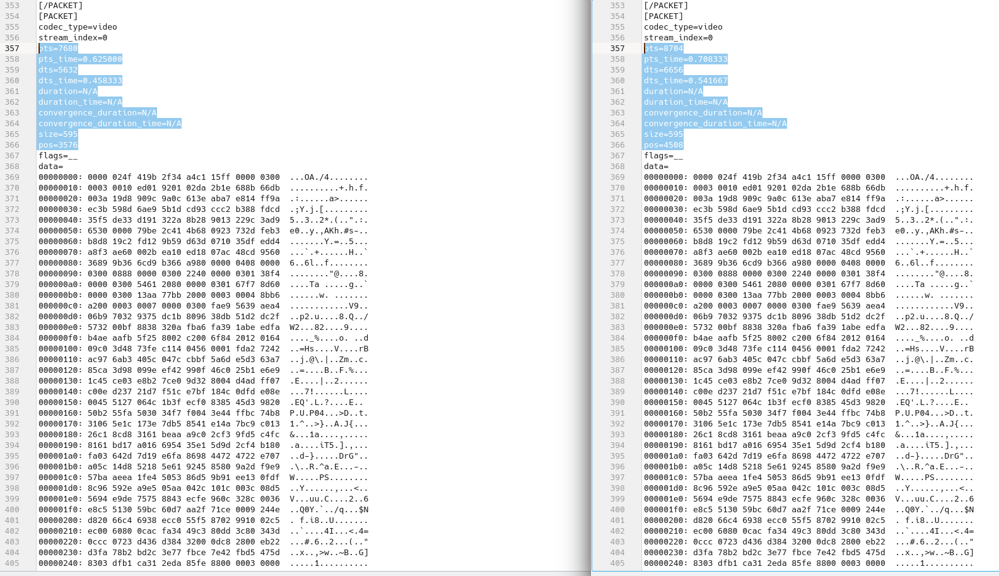
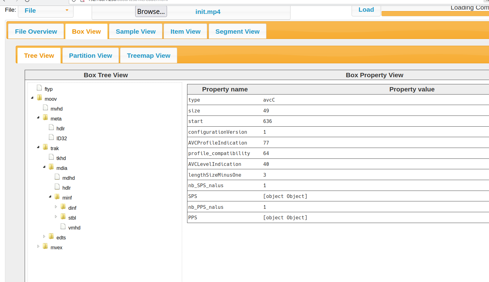
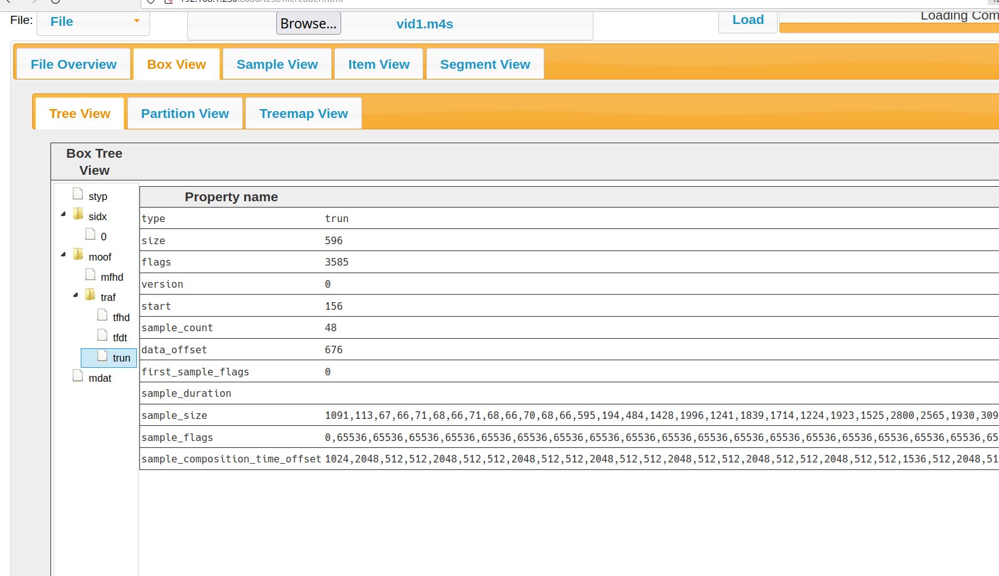

In Part01 to Part03 we have been looking at a single fmp4 file. But most of modern work on video engineering has been done on streams, with formats such as MPEG-DASH or HLS. These are also often encrypted with DRM (more on this later).

So lets "package" our file into a DASH format and deliver it with a DASH Manifest using [shaka-packager](https://github.com/shaka-project/shaka-packager).

Based on the encoding in Part01 we have packaged the stream with the following command.

```
packager 'in=sintelTrailer_fmp4_avc.mp4,stream=audio,init_segment=audioClear/init.mp4,segment_template=audioClear/aud$Number$.m4s,skip_encryption=1,drm_label=AUDIO' 'in=sintelTrailer_fmp4_avc.mp4,stream=video,init_segment=videoClear/init.mp4,segment_template=videoClear/vid$Number$.m4s,drm_label=HD' --segment_duration 2.00 --fragment_duration 2.00 --generate_static_live_mpd  --mpd_output sintelTrailerStreamClear.mpd
```

The url to this manifest that represents this packaged stream can be reached [here](./../../streams/sintelTrailerStreamClear.mpd) and can be played with a web player or VLC by going to `Media -> Open Network Stream`. Try pasting the manifest url in this [sample dash player](https://reference.dashif.org/dash.js/latest/samples/dash-if-reference-player/index.html) by dash.js and playing it, it should work on most browsers.

Other Dash manifests can point to a number of audio or video tracks, often there are multiple video tacks based on quality or multiple audio tracks of different languages.

The first segment of any track is called the init segment and it holds mp4 boxes of init information for that track. The following segments will hold the track video (or maybe audio) data. For our stream, the video [init](./../../streams/videoClear/init.mp4) and [first video segment](./../../streams/videoClear/vid1.m4s) can be reached, but ffmpeg - when built with the relevant configurable options - can use the stream directly as input.

Lets view the packet info like we did in Part02 for our new packaged dash stream.

```
ffprobe -show_packets -show_data -select_streams v http://localhost:8000/streams/sintelTrailerStreamClear.mpd > showPacketsShowDataStream.txt
```
Output
```
[PACKET]
codec_type=video
stream_index=0
pts=0
pts_time=0.000000
dts=-1024
dts_time=-0.083333
duration=N/A
duration_time=N/A
convergence_duration=N/A
convergence_duration_time=N/A
size=1091
pos=1625
flags=K_
data=
00000000: 0000 029b 0605 ffff 97dc 45e9 bde6 d948  ..........E....H
00000010: b796 2cd8 20d9 23ee ef78 3236 3420 2d20  ..,. .#..x264 -
00000020: 636f 7265 2031 3535 2072 3239 3137 2030  core 155 r2917 0
00000030: 6138 3464 3938 202d 2048 2e32 3634 2f4d  a84d98 - H.264/M
00000040: 5045 472d 3420 4156 4320 636f 6465 6320  PEG-4 AVC codec
00000050: 2d20 436f 7079 6c65 6674 2032 3030 332d  - Copyleft 2003-
00000060: 3230 3138 202d 2068 7474 703a 2f2f 7777  2018 - http://ww
00000070: 772e 7669 6465 6f6c 616e 2e6f 7267 2f78  w.videolan.org/x
00000080: 3236 342e 6874 6d6c 202d 206f 7074 696f  264.html - optio
00000090: 6e73 3a20 6361 6261 633d 3120 7265 663d  ns: cabac=1 ref=
000000a0: 3220 6465 626c 6f63 6b3d 313a 303a 3020  2 deblock=1:0:0
000000b0: 616e 616c 7973 653d 3078 313a 3078 3131  analyse=0x1:0x11
000000c0: 3120 6d65 3d68 6578 2073 7562 6d65 3d34  1 me=hex subme=4
000000d0: 2070 7379 3d30 206d 6978 6564 5f72 6566   psy=0 mixed_ref
000000e0: 3d30 206d 655f 7261 6e67 653d 3136 2063  =0 me_range=16 c
000000f0: 6872 6f6d 615f 6d65 3d31 2074 7265 6c6c  hroma_me=1 trell
00000100: 6973 3d31 2038 7838 6463 743d 3020 6371  is=1 8x8dct=0 cq
00000110: 6d3d 3020 6465 6164 7a6f 6e65 3d32 312c  m=0 deadzone=21,
00000120: 3131 2066 6173 745f 7073 6b69 703d 3120  11 fast_pskip=1
00000130: 6368 726f 6d61 5f71 705f 6f66 6673 6574  chroma_qp_offset
00000140: 3d30 2074 6872 6561 6473 3d32 3420 6c6f  =0 threads=24 lo
00000150: 6f6b 6168 6561 645f 7468 7265 6164 733d  okahead_threads=
00000160: 3620 736c 6963 6564 5f74 6872 6561 6473  6 sliced_threads
00000170: 3d30 206e 723d 3020 6465 6369 6d61 7465  =0 nr=0 decimate
00000180: 3d31 2069 6e74 6572 6c61 6365 643d 3020  =1 interlaced=0
00000190: 626c 7572 6179 5f63 6f6d 7061 743d 3020  bluray_compat=0
000001a0: 636f 6e73 7472 6169 6e65 645f 696e 7472  constrained_intr
000001b0: 613d 3020 6266 7261 6d65 733d 3220 625f  a=0 bframes=2 b_
000001c0: 7079 7261 6d69 643d 3220 625f 6164 6170  pyramid=2 b_adap
000001d0: 743d 3120 625f 6269 6173 3d30 2064 6972  t=1 b_bias=0 dir
000001e0: 6563 743d 3120 7765 6967 6874 623d 3120  ect=1 weightb=1
000001f0: 6f70 656e 5f67 6f70 3d30 2077 6569 6768  open_gop=0 weigh
00000200: 7470 3d31 206b 6579 696e 743d 3438 206b  tp=1 keyint=48 k
00000210: 6579 696e 745f 6d69 6e3d 3235 2073 6365  eyint_min=25 sce
00000220: 6e65 6375 743d 3020 696e 7472 615f 7265  necut=0 intra_re
00000230: 6672 6573 683d 3020 7263 5f6c 6f6f 6b61  fresh=0 rc_looka
00000240: 6865 6164 3d32 3020 7263 3d63 7266 206d  head=20 rc=crf m
00000250: 6274 7265 653d 3120 6372 663d 3233 2e30  btree=1 crf=23.0
00000260: 2071 636f 6d70 3d30 2e36 3020 7170 6d69   qcomp=0.60 qpmi
00000270: 6e3d 3020 7170 6d61 783d 3639 2071 7073  n=0 qpmax=69 qps
00000280: 7465 703d 3420 6970 5f72 6174 696f 3d31  tep=4 ip_ratio=1
00000290: 2e34 3020 6171 3d31 3a30 2e30 3000 8000  .40 aq=1:0.00...
000002a0: 0001 a065 8884 009f da8d e8a4 ff05 acef  ...e............
000002b0: ee9d b4d9 1fdc 8e2d f39d 01d8 71cd 7bae  .......-....q.{.
000002c0: 0000 0300 0003 0000 0300 0003 000e 1548  ...............H
000002d0: f727 763d b247 3400 0003 0000 0300 002b  .'v=.G4........+
000002e0: 2000 0024 4000 000c 2000 0005 dc00 0004   ..$@... .......
000002f0: a000 0003 03b8 0000 0420 0000 0590 0000  ......... ......
00000300: 08e0 0000 0be0 0000 1780 0000 2200 0003  ............"...
00000310: 0044 0000 0300 0003 0000 0300 0003 0000  .D..............
00000320: 0300 0003 0000 0300 0003 0000 0300 0003  ................
00000330: 0000 0300 0003 0000 0300 0003 0000 0300  ................
00000340: 0003 0000 0300 0003 0000 0300 0003 0000  ................
00000350: 0300 0003 0000 0300 0003 0000 0300 0003  ................
00000360: 0000 0300 0003 0000 0300 0003 0000 0300  ................
00000370: 0003 0000 0300 0003 0000 0300 0003 0000  ................
00000380: 0300 0003 0000 0300 0003 0000 0300 0003  ................
00000390: 0000 0300 0003 0000 0300 0003 0000 0300  ................
000003a0: 0003 0000 0300 0003 0000 0300 0003 0000  ................
000003b0: 0300 0003 0000 0300 0003 0000 0300 0003  ................
000003c0: 0000 0300 0003 0000 0300 0003 0000 0300  ................
000003d0: 0003 0000 0300 0003 0000 0300 0003 0000  ................
000003e0: 0300 0003 0000 0300 0003 0000 0300 0003  ................
000003f0: 0000 0300 0003 0000 0300 0003 0000 0300  ................
00000400: 0003 0000 0300 0003 0000 0300 0003 0000  ................
00000410: 0300 0003 0000 0300 0003 0000 0300 0003  ................
00000420: 0000 0300 0003 0000 0300 0003 0000 0300  ................
00000430: 0003 0000 0300 0003 0000 0300 0003 0000  ................
00000440: 0301 6f                                  ..o

[/PACKET]
[PACKET]
codec_type=video
stream_index=0
pts=1536
pts_time=0.125000
dts=-512
dts_time=-0.041667
duration=N/A
duration_time=N/A
convergence_duration=N/A
convergence_duration_time=N/A
size=113
pos=2716
flags=__
data=
00000000: 0000 006d 419a 236c 49ff a01f 768c ea00  ...mA.#lI...v...
00000010: 0003 0000 0300 0003 0000 0300 1665 7b6f  .............e{o
00000020: bb5a 9540 0340 d2a0 013d aa5e b925 b1d5  .Z.@.@...=.^.%..
00000030: 473e 0332 fb9a cceb 8899 5430 a709 9677  G>.2......T0...w
00000040: a04b 84ea 38f4 8761 4677 7028 c344 a537  .K..8..aFwp(.D.7
00000050: 8349 647a c109 7229 86c2 1311 3c1f 47ab  .Idz..r)....<.G.
00000060: 7b3f 0995 70e7 e188 f1e1 4cc3 f26e 19c8  {?..p.....L..n..
00000070: 40                                       @

[/PACKET]
[PACKET]
codec_type=video
stream_index=0
pts=512
pts_time=0.041667
dts=0
dts_time=0.000000
duration=N/A
duration_time=N/A
convergence_duration=N/A
convergence_duration_time=N/A
size=67
pos=2829
flags=__
data=
00000000: 0000 003f 419e 4178 8aff 0000 0300 0003  ...?A.Ax........
00000010: 0000 0300 0003 0000 0300 0003 0000 0300  ................
00000020: 0003 0000 0300 0003 0000 0300 0003 0000  ................
00000030: 0300 0003 0000 0300 0003 0000 0300 0003  ................
00000040: 0001 45                                  ..E

[/PACKET]
[PACKET]
codec_type=video
stream_index=0
pts=1024
pts_time=0.083333
dts=512
dts_time=0.041667
duration=N/A
duration_time=N/A
convergence_duration=N/A
convergence_duration_time=N/A
size=66
pos=2896
flags=__
data=
00000000: 0000 003e 019e 6244 5700 0003 0000 0300  ...>..bDW.......
00000010: 0003 0000 0300 0003 0000 0300 0003 0000  ................
00000020: 0300 0003 0000 0300 0003 0000 0300 0003  ................
00000030: 0000 0300 0003 0000 0300 0003 0000 0300  ................
00000040: 0145                                     .E

[/PACKET]
[PACKET]
codec_type=video
stream_index=0
pts=3072
pts_time=0.250000
dts=1024
dts_time=0.083333
duration=N/A
duration_time=N/A
convergence_duration=N/A
convergence_duration_time=N/A
size=71
pos=2962
flags=__
data=
00000000: 0000 0043 419a 6634 a4c1 2700 0003 0000  ...CA.f4..'.....
00000010: 0300 0003 0000 0300 0003 0000 0300 0003  ................
00000020: 0000 0300 0003 0000 0300 0003 0000 0300  ................
00000030: 0003 0000 0300 0003 0000 0300 0003 0000  ................
00000040: 0300 0003 008d 81                        .......

[/PACKET]
[PACKET]
codec_type=video
stream_index=0
pts=2048
pts_time=0.166667
dts=1536
dts_time=0.125000
duration=N/A
duration_time=N/A
convergence_duration=N/A
convergence_duration_time=N/A
size=68
pos=3033
flags=__
data=
00000000: 0000 0040 419e 8445 112c 5700 0003 0000  ...@A..E.,W.....
00000010: 0300 0003 0000 0300 0003 0000 0300 0003  ................
00000020: 0000 0300 0003 0000 0300 0003 0000 0300  ................
00000030: 0003 0000 0300 0003 0000 0300 0003 0000  ................
00000040: 0300 0145                                ...E

[/PACKET]
[PACKET]
codec_type=video
stream_index=0
pts=2560
pts_time=0.208333
dts=2048
dts_time=0.166667
duration=N/A
duration_time=N/A
convergence_duration=N/A
convergence_duration_time=N/A
size=66
pos=3101
flags=__
data=
00000000: 0000 003e 019e a544 5700 0003 0000 0300  ...>...DW.......
00000010: 0003 0000 0300 0003 0000 0300 0003 0000  ................
00000020: 0300 0003 0000 0300 0003 0000 0300 0003  ................
00000030: 0000 0300 0003 0000 0300 0003 0000 0300  ................
00000040: 0145                                     .E

[/PACKET]
[PACKET]
codec_type=video
stream_index=0
pts=4608
pts_time=0.375000
dts=2560
dts_time=0.208333
duration=N/A
duration_time=N/A
convergence_duration=N/A
convergence_duration_time=N/A
size=71
pos=3167
flags=__
data=
00000000: 0000 0043 419a a934 a4c1 2700 0003 0000  ...CA..4..'.....
00000010: 0300 0003 0000 0300 0003 0000 0300 0003  ................
00000020: 0000 0300 0003 0000 0300 0003 0000 0300  ................
00000030: 0003 0000 0300 0003 0000 0300 0003 0000  ................
00000040: 0300 0003 008d 81                        .......

[/PACKET]
[PACKET]
codec_type=video
stream_index=0
pts=3584
pts_time=0.291667
dts=3072
dts_time=0.250000
duration=N/A
duration_time=N/A
convergence_duration=N/A
convergence_duration_time=N/A
size=68
pos=3238
flags=__
data=
00000000: 0000 0040 419e c745 152c 5700 0003 0000  ...@A..E.,W.....
00000010: 0300 0003 0000 0300 0003 0000 0300 0003  ................
00000020: 0000 0300 0003 0000 0300 0003 0000 0300  ................
00000030: 0003 0000 0300 0003 0000 0300 0003 0000  ................
00000040: 0300 0145                                ...E

[/PACKET]
[PACKET]
codec_type=video
stream_index=0
pts=4096
pts_time=0.333333
dts=3584
dts_time=0.291667
duration=N/A
duration_time=N/A
convergence_duration=N/A
convergence_duration_time=N/A
size=66
pos=3306
flags=__
data=
00000000: 0000 003e 019e e844 5700 0003 0000 0300  ...>...DW.......
00000010: 0003 0000 0300 0003 0000 0300 0003 0000  ................
00000020: 0300 0003 0000 0300 0003 0000 0300 0003  ................
00000030: 0000 0300 0003 0000 0300 0003 0000 0300  ................
00000040: 0145                                     .E

[/PACKET]
[PACKET]
codec_type=video
stream_index=0
pts=6144
pts_time=0.500000
dts=4096
dts_time=0.333333
duration=N/A
duration_time=N/A
convergence_duration=N/A
convergence_duration_time=N/A
size=70
pos=3372
flags=__
data=
00000000: 0000 0042 419a ec34 a4c1 3700 0003 0000  ...BA..4..7.....
00000010: 0300 0003 0000 0300 0003 0000 0300 0003  ................
00000020: 0000 0300 0003 0000 0300 0003 0000 0300  ................
00000030: 0003 0000 0300 0003 0000 0300 0003 0000  ................
00000040: 0300 0003 0117                           ......

[/PACKET]
[PACKET]
codec_type=video
stream_index=0
pts=5120
pts_time=0.416667
dts=4608
dts_time=0.375000
duration=N/A
duration_time=N/A
convergence_duration=N/A
convergence_duration_time=N/A
size=68
pos=3442
flags=__
data=
00000000: 0000 0040 419f 0a45 152c 5700 0003 0000  ...@A..E.,W.....
00000010: 0300 0003 0000 0300 0003 0000 0300 0003  ................
00000020: 0000 0300 0003 0000 0300 0003 0000 0300  ................
00000030: 0003 0000 0300 0003 0000 0300 0003 0000  ................
00000040: 0300 0145                                ...E

[/PACKET]
[PACKET]
codec_type=video
stream_index=0
pts=5632
pts_time=0.458333
dts=5120
dts_time=0.416667
duration=N/A
duration_time=N/A
convergence_duration=N/A
convergence_duration_time=N/A
size=66
pos=3510
flags=__
data=
00000000: 0000 003e 019f 2b44 5700 0003 0000 0300  ...>..+DW.......
00000010: 0003 0000 0300 0003 0000 0300 0003 0000  ................
00000020: 0300 0003 0000 0300 0003 0000 0300 0003  ................
00000030: 0000 0300 0003 0000 0300 0003 0000 0300  ................
00000040: 0145                                     .E

[/PACKET]
[PACKET]
codec_type=video
stream_index=0
pts=7680
pts_time=0.625000
dts=5632
dts_time=0.458333
duration=N/A
duration_time=N/A
convergence_duration=N/A
convergence_duration_time=N/A
size=595
pos=3576
flags=__
data=
00000000: 0000 024f 419b 2f34 a4c1 15ff 0000 0300  ...OA./4........
00000010: 0003 0010 ed01 9201 02da 2b1e 688b 66db  ..........+.h.f.
00000020: 003a 19d8 909c 9a0c 613e aba7 e814 ff9a  .:......a>......
00000030: ec3b 598d 6ae9 5b1d cd93 ccc2 b388 fdcd  .;Y.j.[.........
00000040: 35f5 de33 d191 322a 8b28 9013 229c 3ad9  5..3..2*.(..".:.
00000050: 6530 0000 79be 2c41 4b68 0923 732d feb3  e0..y.,AKh.#s-..
00000060: b8d8 19c2 fd12 9b59 d63d 0710 35df edd4  .......Y.=..5...
00000070: a8f3 ae60 002b ea10 ed18 07ac 48cd 9560  ...`.+......H..`
00000080: 3689 9b36 6cd9 b366 a980 0000 0408 0000  6..6l..f........
00000090: 0300 0888 0000 0300 2240 0000 0301 38f4  ........"@....8.
000000a0: 0000 0300 5461 2080 0000 0301 67f7 8d60  ....Ta .....g..`
000000b0: 0000 0300 13aa 77bb 2000 0003 0004 8bb6  ......w. .......
000000c0: a200 0003 0007 0000 0300 fae9 5639 aea4  ............V9..
000000d0: 06b9 7032 9375 dc1b 8096 38db 51d2 dc2f  ..p2.u....8.Q../
000000e0: 5732 00bf 8838 320a fba6 fa39 1abe edfa  W2...82....9....
000000f0: b4ae aafb 5f25 8002 c200 6f84 2012 0164  ...._%....o. ..d
00000100: 09c0 3d48 73fe c114 0456 0001 fda2 7242  ..=Hs....V....rB
00000110: ac97 6ab3 405c 047c cbbf 5a6d e5d3 63a7  ..j.@\.|..Zm..c.
00000120: 85ca 3d98 099e ef42 990f 46c0 25b1 e6e9  ..=....B..F.%...
00000130: 1c45 ce03 e8b2 7ce0 9d32 8004 d4ad ff07  .E....|..2......
00000140: c00e d237 21d7 f51c e7bf 184c 0dfd e08e  ...7!......L....
00000150: 0045 5127 064c 1b3f ecf0 8385 45d3 9820  .EQ'.L.?....E..
00000160: 50b2 55fa 5030 34f7 f004 3e44 ffbc 74b8  P.U.P04...>D..t.
00000170: 3106 5e1c 173e 7db5 8541 e14a 7bc9 c013  1.^..>}..A.J{...
00000180: 26c1 8cd8 3161 beaa a9c0 2cf3 9fd5 c4fc  &...1a....,.....
00000190: 8161 bd17 a016 6954 35e1 5d9d 2cf4 b180  .a....iT5.].,...
000001a0: fa03 642d 7d19 e6fa 8698 4472 4722 e707  ..d-}.....DrG"..
000001b0: a05c 14d8 5218 5e61 9245 8580 9a2d f9e9  .\..R.^a.E...-..
000001c0: 57ba aeea 1fe4 5053 86d5 9b91 ee13 0fdf  W.....PS........
000001d0: 8c96 592e a9e5 05aa 042c 101c 003c 08d5  ..Y......,...<..
000001e0: 5694 e9de 7575 8843 ecfe 960c 328c 0036  V...uu.C....2..6
000001f0: e8c5 5130 59bc 60d7 aa2f 71ce 0009 244e  ..Q0Y.`../q...$N
00000200: d820 66c4 6938 ecc0 55f5 8702 9910 02c5  . f.i8..U.......
00000210: ec00 6080 0cac fa34 49c3 80dd 3c80 343d  ..`....4I...<.4=
00000220: 0ccc 0723 d436 d384 3200 0dc8 2800 eb22  ...#.6..2...(.."
00000230: d3fa 78b2 bd2c 3e77 fbce 7e42 fbd5 475d  ..x..,>w..~B..G]
00000240: 8303 dfb1 ca31 2eda 85fe 8800 0003 0000  .....1..........
00000250: 0301 e3                                  ...

[/PACKET]
[PACKET]
codec_type=video
stream_index=0
pts=6656
pts_time=0.541667
dts=6144
dts_time=0.500000
duration=N/A
duration_time=N/A
convergence_duration=N/A
convergence_duration_time=N/A
size=194
pos=4171
flags=__
data=
00000000: 0000 00be 419f 4d45 152c 5700 0003 0000  ....A.ME.,W.....
00000010: 0300 71cf 693c 8a2a 9b01 ae82 5067 8603  ..q.i<.*....Pg..
00000020: ec4f 302f b75b b08c 3a54 15dd 488e 5b4e  .O0/.[..:T..H.[N
00000030: 4a00 342f 309b 8c9d 8214 6e22 0397 0d6e  J.4/0.....n"...n
00000040: c9da fe04 ee6b 5c5c f26b 945a 5671 a00e  .....k\\.k.ZVq..
00000050: 65e9 9ad4 b2f0 0d81 ad60 c815 6a36 5d54  e........`..j6]T
00000060: ee37 e22a 6f3b 28e9 7665 b453 8607 890a  .7.*o;(.ve.S....
00000070: 128b 809d dd54 baf4 f1f1 583d 4c4b c6bb  .....T....X=LK..
00000080: b1c1 0f01 8202 42ef 1465 a8b7 3252 7289  ......B..e..2Rr.
00000090: 329f db0f 40df 2205 6b0d 6282 abe7 c6bf  2...@.".k.b.....
000000a0: c8b7 bd4b 8503 7195 d546 bc59 cf59 1e4e  ...K..q..F.Y.Y.N
000000b0: 020b b6a2 488a 7a48 001f 5000 0003 0000  ....H.zH..P.....
000000c0: 3021                                     0!

[/PACKET]
[PACKET]
codec_type=video
stream_index=0
pts=7168
pts_time=0.583333
dts=6656
dts_time=0.541667
duration=N/A
duration_time=N/A
convergence_duration=N/A
convergence_duration_time=N/A
size=484
pos=4365
flags=__
data=
00000000: 0000 01e0 019f 6e44 5700 0003 0000 0487  ......nDW.......
00000010: 872a c02a 18ad 130e e1a2 e3ed 516d 7b11  .*.*........Qm{.
00000020: 26a6 a326 e977 532b d7d8 0000 0300 0025  &..&.wS+.......%
00000030: b1f4 02e1 9bcd eb46 b738 62e7 3a3d f1bf  .......F.8b.:=..
00000040: cde1 684d b175 590e 8c9d 5b4e 830a afff  ..hM.uY...[N....
00000050: 1051 a1e7 659c 6c98 dd60 a489 1ae5 c62e  .Q..e.l..`......
00000060: 7169 abc9 0afc 49f1 3273 f92e ac84 6092  qi....I.2s....`.
00000070: 2706 4c0d 1321 7161 2ba6 ebf8 096c 3cd3  '.L..!qa+....l<.
00000080: 0ff4 b4ac e59a a978 0724 9905 8c76 3a2d  .......x.$...v:-
00000090: cf2c fd77 bfad 4789 d1b0 67ca 387a 6661  .,.w..G...g.8zfa
000000a0: 63c8 e2eb ffa7 8a19 d793 56c8 6be9 2f3c  c.........V.k./<
000000b0: d289 b819 3e45 3631 9504 6b4d d178 f4fc  ....>E61..kM.x..
000000c0: 9df8 b0a5 036a 99bf 83b0 2ac5 3c4a 8289  .....j....*.<J..
000000d0: 2050 df68 c1fc c1d2 35f0 8e2a 2732 f298   P.h....5..*'2..
000000e0: db8b 3b79 288d 6aea 7eea 27d7 f6ac e4bb  ..;y(.j.~.'.....
000000f0: e105 4c17 7df2 98ff 6476 7310 0e13 9ab0  ..L.}...dvs.....
00000100: 6232 927b 21c7 e138 c727 d7e7 d36b 2b8c  b2.{!..8.'...k+.
00000110: 8741 3dae 076d cf6a 0202 7811 9ec7 61d9  .A=..m.j..x...a.
00000120: 289b d2e4 5f0a f53d f6d7 5244 0bd9 cde6  (..._..=..RD....
00000130: 4266 fe60 faab b969 2c88 9a96 6d60 810a  Bf.`...i,...m`..
00000140: 38d8 b5da 7c45 62e0 455f 1ec7 fa7d 02ff  8...|Eb.E_...}..
00000150: 1e0c 1c9c 218d 35a7 0ed9 cf56 009d b512  ....!.5....V....
00000160: a2d8 67a4 9b65 8517 bd8a f48e 532a 5c49  ..g..e......S*\I
00000170: 67ca de53 14a8 48c2 f731 9bfa 4893 a389  g..S..H..1..H...
00000180: 1b70 42c3 52c7 3214 f6e2 cffe b650 c149  .pB.R.2......P.I
00000190: 0cb2 2e93 1ac0 b3f0 771a b420 f2e0 ffae  ........w.. ....
000001a0: 8e91 7ab6 3b3b 6302 7731 25d7 4686 bfc9  ..z.;;c.w1%.F...
000001b0: b494 40b9 7b21 be18 086d b7c8 c327 23eb  ..@.{!...m...'#.
000001c0: 013e 2198 c091 29c3 5d45 c29e 2120 b36c  .>!...).]E..! .l
000001d0: 3c61 d9ae ad1c a5e9 81e1 56b7 1000 0003  <a........V.....
000001e0: 0000 0ad9                                ....

[/PACKET]
[PACKET]
codec_type=video
stream_index=0
pts=9216
pts_time=0.750000
dts=7168
dts_time=0.583333
duration=N/A
duration_time=N/A
convergence_duration=N/A
convergence_duration_time=N/A
size=1428
pos=4849
flags=__
data=
00000000: 0000 0590 419b 7234 a436 0228 1384 5700  ....A.r4.6.(..W.
00000010: 0003 0000 0300 1d1f 0792 8c7b 44f3 d84b  ...........{D..K
00000020: e22e e72f 21ff 15b0 fe43 60b4 6d93 b9de  .../!....C`.m...
00000030: d9d3 dbce 4266 5580 f9f6 2c21 393f 07e8  ....BfU...,!9?..
00000040: ca24 3382 0084 1115 ccd8 68ce 3f7d 9a96  .$3.......h.?}..
00000050: 8e3d 6c27 0141 88a7 1fba 29c9 0e99 7317  .=l'.A....)...s.
00000060: 8d32 f21c 5390 bcef 5993 3594 0360 a074  .2..S...Y.5..`.t
00000070: 672d f1e4 b7f6 a954 09c8 62e6 3313 c612  g-.....T..b.3...
00000080: 780d f8ae c400 0760 127d cef8 bbeb c746  x......`.}.....F
00000090: 039c 9b48 713d b14d 51c0 0c48 f052 7fb7  ...Hq=.MQ..H.R..
000000a0: 3d2f a890 5646 34e8 625e 4fa9 f527 6ffa  =/..VF4.b^O..'o.
000000b0: be00 b2ab 203f c01d f841 ab10 1f74 f16c  .... ?...A...t.l
000000c0: 15ec 1e45 5747 88bd ef69 60bb 8323 ec3d  ...EWG...i`..#.=
000000d0: d970 4fad 8490 4eda 2ccb f3d4 253e 64ce  .pO...N.,...%>d.
000000e0: 7fd3 a414 c930 0003 fde0 99b2 800a 4485  .....0........D.
000000f0: f5cb 0744 d9c0 7749 4532 f31a dec6 4942  ...D..wIE2....IB
00000100: 7e0e 7c28 c4b0 a304 0042 f3ec aea3 5af4  ~.|(.....B....Z.
00000110: 424c 2e81 e714 341c 73f8 0e28 6c13 a94d  BL....4.s..(l..M
00000120: a902 e45a 6f4c 27df e96b 0562 02be 15c5  ...ZoL'..k.b....
00000130: 3d56 92a9 1ed9 1f22 f0b3 0386 a79d f707  =V....."........
00000140: 2043 a954 509b 8418 a00d cacf c770 f380   C.TP........p..
00000150: 971b 5342 29f1 5a8d 8c24 3969 537c 737e  ..SB).Z..$9iS|s~
00000160: 3a1a 1a6b 70b0 e101 d430 b5d9 d941 9d81  :..kp....0...A..
00000170: 55cb ad30 3144 ce62 42af 5412 a489 ae37  U..01D.bB.T....7
00000180: 7a24 307a ca88 6cf0 b984 0805 9f59 9d84  z$0z..l......Y..
00000190: 497b ce1a 2d0a 5a0a 28ea de85 c675 9c28  I{..-.Z.(....u.(
000001a0: f92a ba74 2a70 8710 c8f1 3e15 815b 6415  .*.t*p....>..[d.
000001b0: cb66 2c09 6ca1 3c37 f30e f687 c786 6b81  .f,.l.<7......k.
000001c0: f875 4283 849e 6065 6078 0010 9ea7 423f  .uB...`e`x....B?
000001d0: 7cf2 d715 df2c 9ab8 dee4 bd67 320c ca6a  |....,.....g2..j
000001e0: 964a 5c6d f93e 5369 6842 a598 7271 1eca  .J\m.>SihB..rq..
000001f0: ad66 378d b21f fbc2 0716 8bcc 00ff 2c0d  .f7...........,.
00000200: b015 b1f7 9d46 8b00 86b3 ff03 a791 40fe  .....F........@.
00000210: ee85 28ad ddd9 0267 a9b1 10dc 0004 a985  ..(....g........
00000220: 3b78 2f45 b2fc f3d9 a343 6816 9d51 d4e8  ;x/E.....Ch..Q..
00000230: aa09 832a 2368 000a ae4e 557a c7c9 0e17  ...*#h...NUz....
00000240: 7260 a5b7 18ef 0807 e12f 4655 cbdb f294  r`......./FU....
00000250: ad3c d61e 77f0 012d fd15 4ec3 5fc1 cc57  .<..w..-..N._..W
00000260: aaa8 c4a5 3c01 4494 c924 98d1 f1f0 1089  ....<.D..$......
00000270: 3404 510d 1cd7 0c00 c977 379c ceae 3d3d  4.Q......w7...==
00000280: 8492 61b4 21ca 8032 2174 02ad 3f9f 3a5a  ..a.!..2!t..?.:Z
00000290: 2396 2c77 c6d7 f84b 4ecf 556c 0211 7920  #.,w...KN.Ul..y
000002a0: b3c9 7997 ae4b 511e 6035 b323 ea6f 56d8  ..y..KQ.`5.#.oV.
000002b0: 42ea 4406 1314 5d2b 88d8 2960 8060 7be7  B.D...]+..)`.`{.
000002c0: fbdd 3ab7 56c0 02bc 524d e89f 8f51 c136  ..:.V...RM...Q.6
000002d0: 2344 5dfa 3da8 baba 3afd 39ca ce8f 9063  #D].=...:.9....c
000002e0: 0e9a 3812 e92f 36a8 d946 5d19 adaa 4047  ..8../6..F]...@G
000002f0: 483f 2cef 78a1 5f24 83b8 7817 307e e08d  H?,.x._$..x.0~..
00000300: a307 a3e6 c6b4 d670 27c3 8630 f963 84ef  .......p'..0.c..
00000310: 0278 1c76 8cea 74ec 2400 c8dd 1801 85f7  .x.v..t.$.......
00000320: 12f0 a5fb 4e74 26b2 270b 06be c1eb ab61  ....Nt&.'......a
00000330: f0fd a277 b0d0 b066 56cf 634c 0211 605c  ...w...fV.cL..`\
00000340: c14e c61e 089c 0e44 43bd ef60 fc91 780a  .N.....DC..`..x.
00000350: 957d 76ae a37d 1422 b2ad 1889 62b3 056e  .}v..}."....b..n
00000360: a1ef d566 2f17 c29d fc25 ddbe 698f 4382  ...f/....%..i.C.
00000370: 54d6 adc2 2667 3484 984e 192e f425 3434  T...&g4..N...%44
00000380: ffe9 4b3a 5dc3 2544 3189 d15d 7044 68e9  ..K:].%D1..]pDh.
00000390: ebff a289 0096 204b 652f a329 79c0 0000  ...... Ke/.)y...
000003a0: 8f5e 53cb 2c30 5db3 3c34 d9e3 b192 0992  .^S.,0].<4......
000003b0: 9f32 00f3 d55a 5c98 3d25 c09f 47f0 087b  .2...Z\.=%..G..{
000003c0: 4890 9e7c 2dc5 fc3e 02c9 54c0 1957 c4d0  H..|-..>..T..W..
000003d0: 018d 5ec4 b9ad 2de5 3277 896d 1394 a439  ..^...-.2w.m...9
000003e0: 106b 1883 d055 e3ac d849 cd00 cf4c e64a  .k...U...I...L.J
000003f0: 30a2 b29e c2f5 27c6 aff8 2821 f0cb ca5a  0.....'...(!...Z
00000400: 0c89 b021 94a1 c47a dedd 19ae 533a 5328  ...!...z....S:S(
00000410: 1faa 676b 9245 746e 1b7b 0351 bfa6 83d1  ..gk.Etn.{.Q....
00000420: d8b9 c96f ab72 619a b756 a759 50df 3daf  ...o.ra..V.YP.=.
00000430: 953f 03ca be6c a0c0 616a ee15 75d8 1e3b  .?...l..aj..u..;
00000440: aa31 aa59 1858 a8fd 1866 a952 617d a445  .1.Y.X...f.Ra}.E
00000450: 458a 2f82 a86d f6c9 f22a 75fa 8dbd c3d8  E./..m...*u.....
00000460: 102c bc6a 27de f2d2 7ddd 0986 da08 363a  .,.j'...}.....6:
00000470: c08d 88e5 c1bc 340a 09a1 faa5 fff3 3339  ......4.......39
00000480: 9ddc 9adc 7ca6 0b6a 5c25 572b 6a34 f2d7  ....|..j\%W+j4..
00000490: 97d4 9cd7 e80b d6dc 01c2 0e94 1a16 370a  ..............7.
000004a0: 9d63 662d fc54 a77e 5ed0 51f3 f8fc ac85  .cf-.T.~^.Q.....
000004b0: d382 4912 0057 0a36 09b4 0392 f0b7 56f4  ..I..W.6......V.
000004c0: e9b5 bc05 32fe 9497 c9eb 09fd 727d 6c14  ....2.......r}l.
000004d0: 8810 18a9 dd49 1d94 16ac 40da 3615 ea3c  .....I....@.6..<
000004e0: 1b64 7af1 5634 a464 693d 0abe 2428 8bc8  .dz.V4.di=..$(..
000004f0: a93c 1c8f d660 71e7 584a 9287 341f 776e  .<...`q.XJ..4.wn
00000500: d6a2 f040 4fa7 638f 0fbb 8d96 37de ca2f  ...@O.c.....7../
00000510: a103 d361 2202 2464 2251 4cdd 9814 55e4  ...a".$d"QL...U.
00000520: 8085 6266 92a0 6cc5 3a57 d8c6 7ab4 7a17  ..bf..l.:W..z.z.
00000530: af1c b762 c0ff 5681 2aea a143 ed28 bb9d  ...b..V.*..C.(..
00000540: a615 5791 69bb 4e13 41e0 9081 8fcd 1356  ..W.i.N.A......V
00000550: c4fb b118 12b8 342c a657 7645 f005 a967  ......4,.WvE...g
00000560: fbac 23a2 000f 90b6 2625 e09b 1cc3 9bc0  ..#.....&%......
00000570: d922 70ef 4de5 3e4d 2246 2c06 11ad 4c06  ."p.M.>M"F,...L.
00000580: 2d55 1bf1 8173 ca9a b0ba 4c00 0003 0000  -U...s....L.....
00000590: 0300 26e0                                ..&.

[/PACKET]
...
```
As expected the actual bitstream has mostly stayed the same, the `pts` and therefore `pos` values have been shifted but the nal units (and therefore the packets) have not changed size and look very similar to the old output (click to enlarge).



The images below show the init segment and first video segment in MP4Box.js. What this shows is the moov segment in the init and the following segments hold moof and mdat pairs of data. Note these two can be combined with `cat` and most players as well as ffmpeg can analyse them like they are their own mp4 file. `cat init.mp4 vid1.m4s > 2secSampleVideo.mp4 `

Init segment

First segment


It should be noted the `-show_frames` and `trace_headers` commands of Part03 will also print similar info.
Essentially, re-muxing and not re-encoding the fmp4 file should produce the same bitstream, so this was expected.
But its useful to remember you can combine the init segments with video segments to create stand alone video files as samples of a stream.


