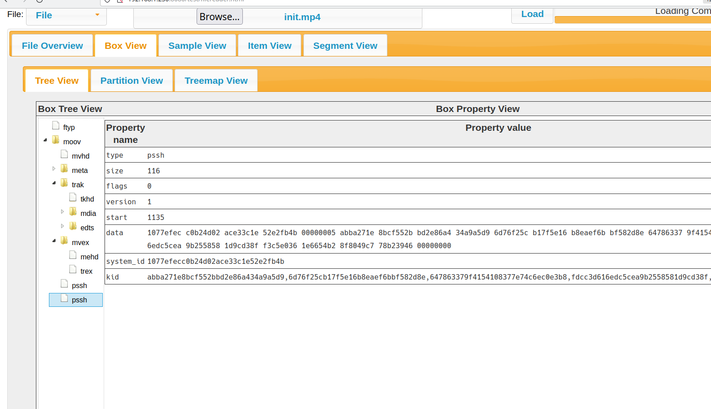
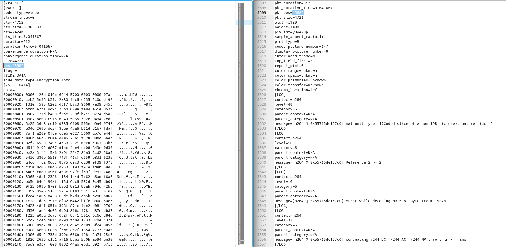
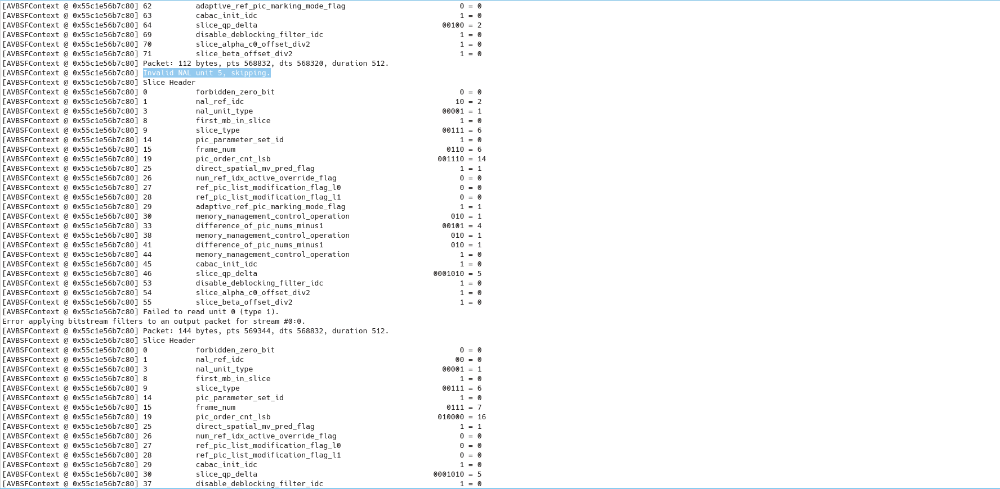
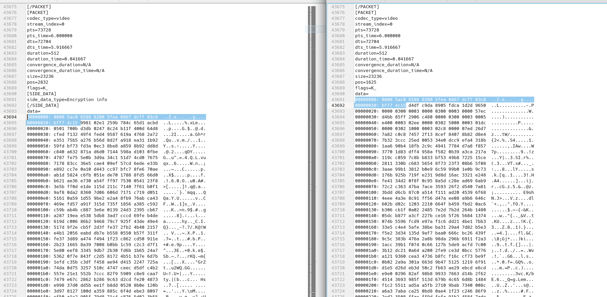

For now this is the last part planned, and we will briefly look at encrypted streams.
Looking at the shaka-packager documentation we can copy the example into the below command to package and encrypt a stream with Google's Widevine.

```
packager 'in=sintelTrailer_fmp4_avc.mp4,stream=audio,init_segment=audio/init.mp4,segment_template=audio/aud$Number$.m4s,skip_encryption=1,drm_label=AUDIO' 'in=sintelTrailer_fmp4_avc.mp4,stream=video,init_segment=video/init.mp4,segment_template=video/vid$Number$.m4s,drm_label=HD' --enable_widevine_encryption --key_server_url https://license.uat.widevine.com/cenc/getcontentkey/widevine_test --content_id 7465737420636f6e74656e74206964 --signer widevine_test --aes_signing_key 1ae8ccd0e7985cc0b6203a55855a1034afc252980e970ca90e5202689f947ab9 --aes_signing_iv d58ce954203b7c9a9a9d467f59839249 --segment_duration 2.00 --fragment_duration 2.00 --generate_static_live_mpd  --mpd_output sintelTrailerStream.mpd
```
This can be played with a license acquisition server, you are going to have to trust me that the below sample html app will play our packaged encrypted [stream](./../../streams/sintelTrailerStream.mpd).
It needs a browser that uses widevine DRM and where CORS is disabled as it is configured for testing only.
The below sample was modified from the Dash.js samples and our stream files should sit in the same directory.

```
<!doctype html>
<html lang="en">
<head>
    <meta charset="utf-8">
    <title>Widevine DRM instantiation example</title>

    <script src="/dist/dash.all.debug.js"></script>

    <!-- Bootstrap core CSS -->
    <link href="/lib/bootstrap/bootstrap.min.css" rel="stylesheet">
    <link href="/lib/main.css" rel="stylesheet">

    <style>
        video {
            width: 640px;
            height: 360px;
        }
    </style>

    <script class="code">
        function init() {
            var protData = {
                "com.widevine.alpha": {
                    "serverURL": "https://proxy.uat.widevine.com/proxy",
                    priority: 0
                }
            };
            var video,
                player,
                url = "/sintelTrailerStream.mpd";

            video = document.querySelector("video");
            player = dashjs.MediaPlayer().create();
            player.initialize(video, url, true);
            player.setProtectionData(protData);
        }

        function check() {
            if (location.protocol === 'http:' && location.hostname !== 'localhost') {
                var out = 'This page has been loaded under http. This might result in the EME APIs not being available to the player and any DRM-protected content will fail to play. ' +
                    'If you wish to test manifest URLs that require EME support, then <a href=\'https:' + window.location.href.substring(window.location.protocol.length) + '\'>reload this page under https</a>.'
                var div = document.getElementById('http-warning');
                div.innerHTML = out;
                div.style.display = ''
            }
        }
    </script>
</head>
<body>

<main>
    <div class="container py-4">
        <header class="pb-3 mb-4 border-bottom">
            
        </header>
        <div class="row">
            <div class="col-md-12">
                <div class="alert alert-danger" role="alert" style="display: none" id="http-warning">

                </div>
            </div>
        </div>
        <div class="row">
            <div class="col-md-4">
                <div class="h-100 p-5 bg-light border rounded-3">
                    <h3>Widevine DRM instantiation example</h3>
                    <p>This example shows how to use dash.js to play streams with Widevine DRM protection. </p>
                    <p>For a detailed explanation on DRM playback in dash.js checkout the
                        <a href="https://github.com/Dash-Industry-Forum/dash.js/wiki/Digital-Rights-Management-(DRM)-and-license-acquisition"
                           target="_blank">Wiki</a>.</p>
                </div>
            </div>
            <div class="col-md-8">
                <video controls="true"></video>
            </div>
        </div>
        <div class="row">
            <div class="col-md-12">
                <div id="code-output"></div>
            </div>
        </div>
        <footer class="pt-3 mt-4 text-muted border-top">
            &copy; DASH-IF
        </footer>
    </div>
</main>


<script>
    document.addEventListener('DOMContentLoaded', function () {
        check();
        init();
    });
</script>
<script src="/highlighter.js"></script>
</body>
</html>
```

Lets look at the init segment.



the pssh box (sorry not sure why shaka-packager added 2 of them) is shown here, it is also found in the manifest and provides init information for the encryption of the stream.

When we start to look at the data after running the commands from Part02 and Part03 we will initially think little has changed. Thats because the first 5-6 seconds of the stream is left clear by shaka-packager.
So if you force a player to play the encrypted stream it will start playing for the first 5-6 seconds until it breaks the stream.

The `show_frame` and `trace_headers` output shows a lot of error being printed to stderr. In the stdout errors are also printed and from experience this output can become difficult to read.




When comparing the `show_packet` output we can find the first encrypted packet is found around the 5-6 second mark.




For these encrypted packets, multiple parts can be encrypted and there can be a number of clear and encrypted subsamples in a packet. That is why when comparing the clear and encrypted packet data (beyond 6 seconds) the first few bytes may look the same, these first few parts make up the first clear sub sample, then the packet enters an encrypted sub sample.
These clear first few bytes that match are seen in the image above.

The info on sub samples is found in the [AVEncryptionInfo](https://ffmpeg.org/doxygen/4.0/structAVEncryptionInfo.html) structure that is often saved as side_data in each [AVPacket](https://ffmpeg.org/doxygen/4.0/structAVPacket.html).

```
[/PACKET]
[PACKET]
codec_type=video
stream_index=0
pts=322048
pts_time=26.208333
dts=320512
dts_time=26.083333
duration=512
duration_time=0.041667
convergence_duration=N/A
convergence_duration_time=N/A
size=18227
pos=67298
flags=__
[SIDE_DATA]
side_data_type=Encryption info
[/SIDE_DATA]
```

Unfortunately, I can't find a way to print this data with ffprobe or ffmpeg so the only way to get this data is by outputting from your own program using the ffmpeg libraries.
I won't go into details here, but the ffmpeg API allows you to extract this side data, put it into AVEncryptionInfo, then you can print it.

Something like the following snippet will extract the side data frm the packet.
```
const uint8_t* side_data = av_packet_get_side_data(pkt, AV_PKT_DATA_ENCRYPTION_INFO, &pkt->side_data->size);
AVEncryptionInfo* encInfo = av_encryption_info_get_side_data(side_data, pkt->side_data->size);
```

The below output from my quick and dirty program prints the clear and encrypted subsamples of our first encrypted packet shown in the image above.

```
pkt_pos: 2832
0 bytes_of_clear_data pos: 0
0 bytes_of_clear_data: 20
0 bytes_of_protected_data pos: 20
0 bytes_of_protected_data: 23216
```
As you can see highlighted in the comparison image above, the first 20 bytes match. This makes sense as the above output shows the first 20 bytes to be in a clear data sub-segment. Also the protected and clear data combine to match the packet size.

I'm not sure where to go from here so my blogging on video bitstreams comes to an end. I hope you learnt something from this dive into video data, it has really helped me analyse what is going on inside our video files.
Thanks for reading.

Kiyo
